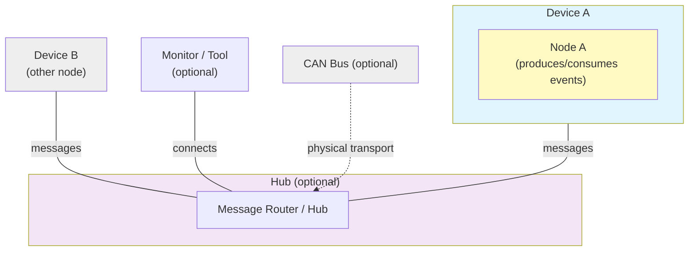

# Node

A _Node_ is the basic building block of an OpenLCB network. It's a device that can send and receive OpenLCB messages. We'll describe these messages in more detail in a later chapter.

Each node has a unique 6-byte ID that must be assigned by the manufacturer. We'll describe in a later chapter how you can get your own set of IDs to use in your products (or DIY boards).

## Transport Layers

OpenLCB is designed to work over different physical transport layers. The two main options are:

**CAN (Controller Area Network)**: The traditional transport for OpenLCB, used in most commercial LCC products. CAN uses a two-wire bus with excellent noise immunity and built-in arbitration, making it ideal for model railroad environments. It requires CAN transceiver hardware and proper bus termination.

**WiFi/TCP**: An alternative transport that uses standard WiFi networking and TCP/IP. This is particularly useful for development and learning because:
- No special hardware required beyond WiFi-capable microcontrollers
- Easy to monitor traffic using standard network tools
- Can connect to JMRI and other tools over your home network
- Simplifies initial prototyping and testing

In this book, we'll start with WiFi/TCP transport because it's more accessible for learning. Once you understand the core concepts, the principles transfer directly to CAN-based implementations. Future chapters will cover adding CAN hardware.

Both transports use the same OpenLCB protocols and message formats—only the physical layer changes.

## Network Architecture

An OpenLCB network is made up of participants with different roles. The two primary roles are:

**Nodes** — devices that produce and consume events. Each node has a unique identifier and announces itself during startup.

**Hubs** — services that route and forward messages between participants. A hub may be implemented differently depending on the transport (for example, as a network server for TCP-based transports or as a bridge to a CAN bus). Hubs are optional in some deployments; on shared physical buses messages are exchanged directly between participants.

A single device can implement both node and hub functions. Examples in later chapters show convenient development setups where one device acts in both roles, but the concepts below are transport-agnostic.

Here's a conceptual architecture diagram:

What this shows:

- **Node**: Produces and consumes events and announces itself on the network during startup.
- **Hub**: Forwards messages between connected participants and may accept connections from monitoring tools.
- **Monitor/Tool**: Observes network traffic and can send test messages.
- **Future Expansion**: Multiple nodes and transports (e.g., CAN bridges, network servers) can be integrated behind hubs.

Why this design works:

- **Separation of concerns**: The messaging protocol is transport-agnostic; nodes, hubs, and tools speak the same message formats regardless of physical layer.
- **Scalable**: Hubs enable multiple devices and tools to interconnect without changing node implementations.
- **Flexible**: Hubs can be implemented differently per transport, allowing the same protocol to work in embedded, wired, and networked environments.

Platform and transport choices (for example, why this book uses ESP32 and WiFi/TCP for early examples) are discussed in Chapter 2 (Getting Started).

