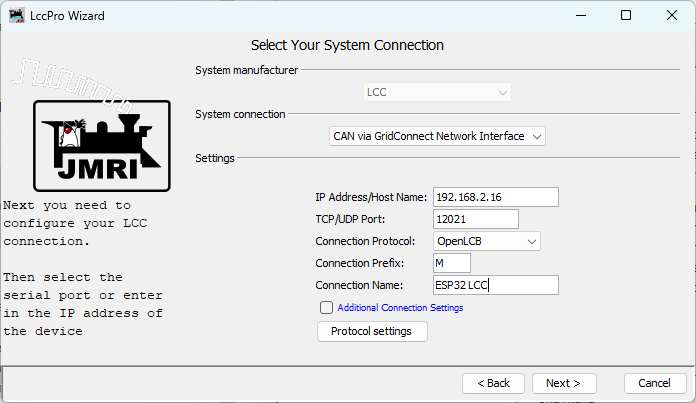
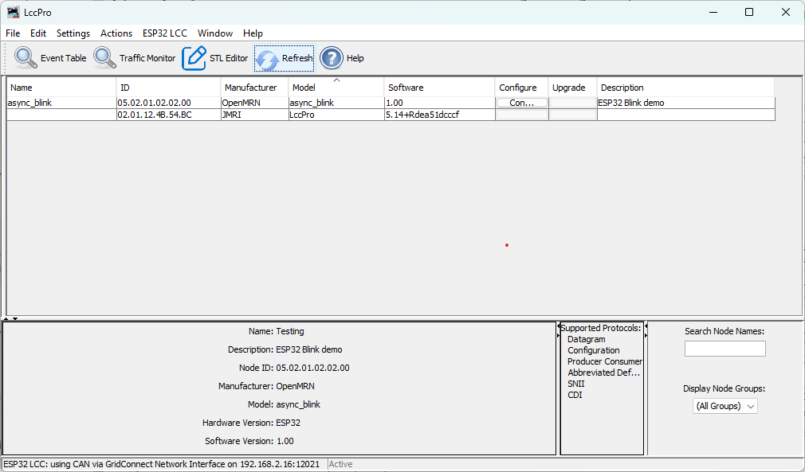

## Testing with JMRI

Now that your ESP32 is producing events, let's use JMRI (Java Model Railroad Interface) to monitor them on the network. JMRI acts as a "traffic monitor" that shows all OpenLCB messages, letting you verify your node is working correctly.

### What is JMRI?

JMRI is an open-source application suite for model railroading that includes comprehensive OpenLCB/LCC support. In JMRI 5.x, LccPro is the authoritative tool for LCC configuration and monitoring. For our purposes, we'll use JMRI to:
- Monitor all OpenLCB messages on the network via **LCC Monitor**
- See when nodes initialize (CID, RID, AMD messages)
- Observe event production and consumption
- View and configure node information via **LccPro**
- Verify your ESP32 is communicating correctly

Think of it as a "network packet sniffer" for OpenLCB.

### Installing JMRI

1. **Download JMRI**:
   - Visit [jmri.org](https://www.jmri.org/)
   - Click **Download** → Latest Production Release
   - Choose your operating system (Windows, macOS, or Linux)
   - Download and run the installer

2. **System Requirements**:
   - JMRI **5.12 or later** (LccPro requires JMRI 5.12+; earlier versions use the older DecoderPro LCC tools)
   - Java 11 or newer (usually bundled with JMRI installer)
   - Windows 7+, macOS 10.14+, or Linux with X11
   - ~500MB disk space

3. **Install JMRI**:
   - Run the installer with default options
   - On macOS, you may need to allow the app in System Preferences → Security
   - On Linux, you may need to make the script executable: `chmod +x JMRI-installer.sh`

### Configuring the LCC Connection

JMRI needs to know how to connect to your ESP32's TCP Hub on port 12021. Let's configure that connection.

1. **Launch LccPro**:
   - In JMRI, go to **ESP32 LCC → LccPro**
   - If this is the **first time** you're running LccPro and you have **no other connections**, the LccPro Wizard appears automatically (see first image below)
   - If you **already have at least one connection** from DecoderPro or PanelPro, continue to step 2

  

2. **Configure the connection settings**:
   
   **If using the Wizard** (first-time launch):
   - Enter the connection details in the Wizard form (see steps 3 below for field definitions)
   - Click **Next** to proceed
   
   **If you have existing connections**:
   - Click **Edit → Preferences** in the LccPro window
   - Click the **Connections** tab (in the left sidebar)
   - Click the **+** button (bottom left) to add a new connection

  

3. **Enter the connection settings**:
   - **System manufacturer**: Select `LCC` (this is the OpenLCB standard system name in JMRI)
   - **System connection**: Select `CAN via GridConnect Network Interface`
   - **Connection name**: Enter `ESP32 LCC` (or any descriptive name)
   - **IP Address/Host Name**: Enter the IP address displayed in your PlatformIO serial monitor window (look for the line "IP Address: 192.168.x.x" from your ESP32's startup output)
   - **TCP/UDP Port**: Enter `12021`
   - **Connection Protocol**: Select `OpenLCB`

4. **Save settings** (required for both Wizard and Preferences):
   - Click **Edit → Preferences** in the LccPro window (if not already there)
   - Click **Save** at the bottom of the Preferences window
   - JMRI will prompt to restart - click **Restart Now**

### Monitoring LCC Traffic

After JMRI restarts, let's open the message monitor to see your ESP32's events.

1. **Open the LCC Monitor**:
   - Go to **ESP32 LCC → Monitor Traffic**
   - A new window opens showing a live feed of LCC messages

2. **Observe the event production**:
   - You should see alternating event reports appearing every second
   - Each event corresponds to the events your ESP32 is producing

  

### Viewing Node Properties (SNIP Information)

You can verify that JMRI recognizes your ESP32 as a node on the network and view its SNIP (Simple Node Information Protocol) details using LccPro:

1. **Open LccPro**:
   - In JMRI, go to **ESP32 LCC → LccPro**
   - This opens the LCC configuration tool and displays the node list

2. **Find your ESP32 node**:
   - You should see a node with the ID matching your code (`050201020200`)
   - The node list displays the SNIP (Simple Node Information Protocol) data:
     - **Name**: `async_blink` (your node name from `config.h`)
     - **ID**: `050201020200` (your node's unique OpenLCB identifier)
     - **Manufacturer**: `OpenMRN`
     - **Model**: `async_blink`
     - **Software**: `1.00`
     - **Description**: The description from `SNIP_NODE_DESC`
   - This confirms the node initialized successfully with correct identity information

  

   > **Note**: The **Configure** button in LccPro is for editing the node's configuration. We'll explore that in Chapter 5.

### Understanding SNIP vs ACDI (Important!)

Now is a good time to understand the distinction between two types of node information in OpenLCB:

**SNIP (Simple Node Information Protocol)**:
- Identifies **what the device IS** (manufacturer, model, hardware/software versions)
- **Hardcoded in firmware** (in `config.h` as `SNIP_STATIC_DATA`)
- **Read-only** - cannot be changed without recompiling
- Displayed in **LccPro → Identification tab** when you view node properties
- Examples: `OpenMRN` (manufacturer), `async_blink` (model)

**ACDI (Abbreviated Configuration Description Information)**:
- Stores **layout identity** - how YOU refer to the node in your model railroad
- **Persistent in SPIFFS** (can be modified via JMRI without recompiling)
- User-editable through **LccPro**
- Includes fields like "User Name" (what you call the node) and "Description"
- Examples: `Main Station Blinker`, `Yard Controller #3`

In this v0.1 example, both are initialized from `config.h` constants. In Chapter 5, you'll learn to make ACDI values editable through JMRI using the configuration interface.

### Optional: View Events as Sensors

Want to see your ESP32's events visualized as sensor states? You can create sensors in **PanelPro** that correspond to your event IDs.

**Important**: For this section, you need to have **PanelPro** open. If you only have JMRI running:
- Select **File → Open PanelPro** to launch it

Once PanelPro is open:

1. **Open the Sensor Table**:
   - Go to **Tools → Tables → Sensors**
   - The sensor table displays any configured LCC sensors

2. **Add your first sensor**:
   - Click **Add** to create a new sensor
   - In the dialog:
     - **System Name**: Enter the hardware address for your first event ID
       - For `EVENT_ID_0` (0x0502010202000000), type: `0502010202000000`
       - JMRI will automatically add the `MS` prefix when you click Create
     - **User Name**: Enter `ESP32 Event 0` (or any descriptive name)
   - Click **Create**

3. **Repeat for the second event**:
   - Click **Add** again
   - **System Name**: Type `0502010202000001`
   - **User Name**: `ESP32 Event 1`
   - Click **Create**

4. **Watch the sensors**:
   - Return to the sensor table
   - Verify the system names are correct:
     - Event 0 should show: `MS0502010202000000`
     - Event 1 should show: `MS0502010202000001`
   - As your ESP32 produces alternating events, observe the sensor behavior:
     - **Expected behavior**: The sensors will flash ACTIVE for a brief moment, then return to INACTIVE
     - **Why the brief flash?**: JMRI uses an event timeout mechanism. When an event is received, the sensor becomes ACTIVE. If the same event isn't re-sent within the timeout window, the sensor automatically reverts to INACTIVE (a safety feature to prevent stale states if a node disappears from the network)
     - **Pattern**: Since your ESP32 alternates between EVENT_ID_0 and EVENT_ID_1 every second, you should see:
       - Second 1: Sensor 0 flashes ACTIVE, Sensor 1 stays INACTIVE
       - Second 2: Sensor 1 flashes ACTIVE, Sensor 0 stays INACTIVE
       - Second 3: Sensor 0 flashes ACTIVE, and so on...

  

This demonstrates the bidirectional nature of LCC - your JMRI sensors are consuming events produced by your ESP32!

### Configuration & JMRI: CDI Discovery

When JMRI first connects to your ESP32, it automatically discovers what configuration options are available by requesting the **CDI (Configuration Description Information)** file. This file (generated in `init_openlcb_stack()` as `/spiffs/cdi.xml`) describes:
- What segments are available (Internal settings, User info, Device-specific parameters)
- What fields can be edited in each segment
- Data types (text, numbers, enums, etc.)
- Constraints (min/max values, field lengths, etc.)

In v0.1, the CDI is generated automatically from the `ConfigDef` structure in `config.h`. Your node currently exposes:
- **SNIP Identification**: Manufacturer, model, hardware/software versions (read-only)
- **ACDI User Info**: Node name and description (editable, but changes aren't saved yet)
- **Internal Configuration**: Reserved space for future parameters

When you view node properties in **LccPro → Configure**, JMRI uses this CDI to render the appropriate dialog fields.

**In Chapter 4** (next chapter), you'll:
- Understand how configuration is stored in SPIFFS
- Learn to edit your node's name through JMRI and see changes persist
- Understand factory_reset() behavior and SNIP static vs. dynamic data
- Explore how `apply_configuration()` fits into the persistence lifecycle
- Add configurable parameters (like `EVENT_INTERVAL`) to the CDI
- Implement `apply_configuration()` to save user changes while the node is running
- Learn how to version your configuration schema for forward compatibility
- Test dynamic configuration updates through LccPro

For now, understand that your node is already **capable** of being configured via JMRI - the CDI file ensures JMRI knows what options your node supports.

### Troubleshooting JMRI Connection

**JMRI shows "Connection failed" or "No route to host"**:
- Verify the IP address matches what the ESP32 serial monitor showed
- Ensure your computer and ESP32 are on the same WiFi network
- Check firewall settings - allow Java/JMRI to access the network
- Try pinging the ESP32: `ping 192.168.1.100` (use your ESP32's IP)

**No messages appear in the monitor**:
- Click **Clear** in the monitor to reset the display
- Press RESET on the ESP32 to trigger initialization messages
- Check the connection status at the bottom of the JMRI window (should show "Connected")

**Messages appear but events don't match**:
- Verify the event IDs in your code match what you're looking for in JMRI
- Check that you didn't modify the EVENT_ID constants

**"Connection lost" after working initially**:
- ESP32 may have rebooted or lost WiFi connection
- Check the serial monitor for errors or WiFi reconnection attempts
- ESP32's IP address may have changed if DHCP lease renewed

## Troubleshooting General Issues

**Library not found during build:**
- Verify the `lib_deps` line in `platformio.ini` has no typos
- Run **PlatformIO: Clean** from the command palette (`Ctrl+Shift+P`)
- Rebuild the project

**ESP32 not detected:**
- Check USB cable (must be data cable, not charge-only)
- Install CP2102 or CH340 USB driver for your operating system
- Try a different USB port

**WiFi connection fails:**
- Verify SSID and password in code
- Check that ESP32 is within range of access point
- ESP32 only supports 2.4GHz WiFi (not 5GHz)

**JMRI not seeing events:**
- Verify JMRI is configured for TCP GridConnect connection
- Check that ESP32 and JMRI are on the same network
- Verify the TCP server address and port in ESP32 code

## What's Next

You've now built your first OpenLCB node with WiFi transport! 

In the next chapter, we'll cover configuration—how to customize your node's behavior and settings through the CDI (Configuration Description Information) interface.