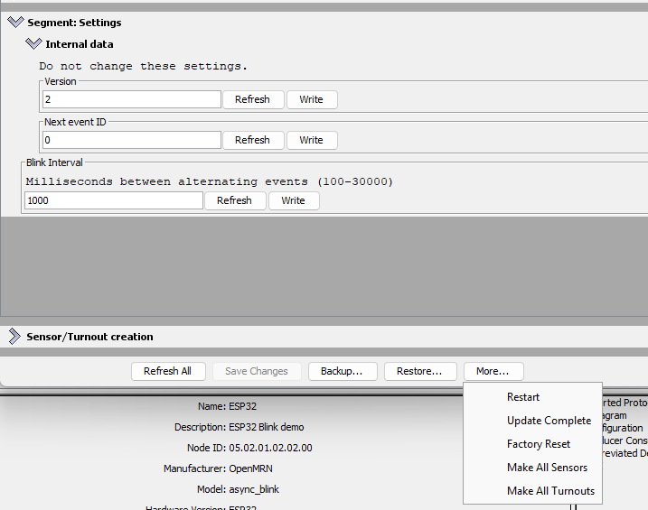
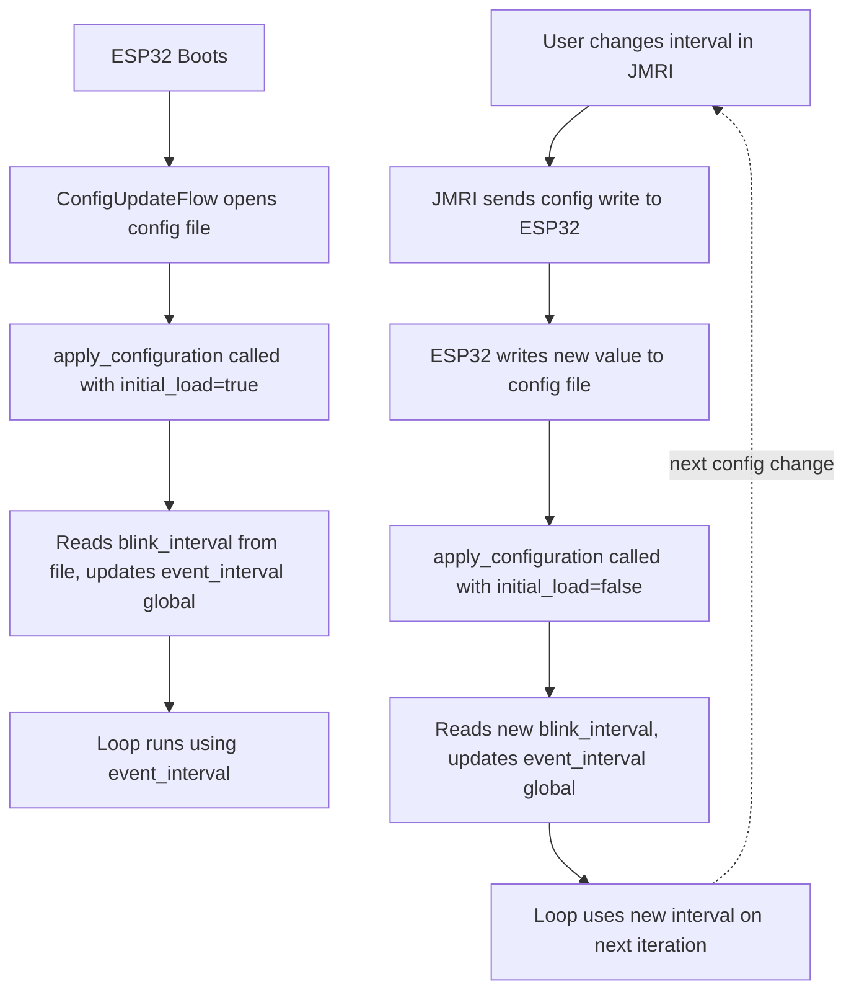

# Adding a Configurable Interval Setting

In this section, we'll extend the async_blink example from Chapter 3 to make the blink interval configurable via JMRI. This demonstrates how to:

1. Add a new configuration field to the CDI schema
2. Implement `apply_configuration()` to read the field and cache it
3. Use the cached value in your application loop
4. Test configuration changes in real-time with LccPro

## Code Changes to config.h

Starting from the Chapter 3 version, we'll add a configurable `blink_interval` field to the CDI. Because we're adding a new field to the configuration schema, we must also bump `CANONICAL_VERSION` (from 0x0001 to 0x0002). When you upload this new code, OpenMRN will detect the version mismatch and trigger a factory reset, which wipes the old config file and initializes it with the new schema.

Here's what changes:

```diff
CDI_GROUP(AsyncBlinkSegment, Segment(MemoryConfigDefs::SPACE_CONFIG), Offset(128));
CDI_GROUP_ENTRY(internal_config, InternalConfigData);
+CDI_GROUP_ENTRY(blink_interval, Uint16ConfigEntry,
+                Default(1000),
+                Min(100),
+                Max(30000),
+                Name("Blink Interval"),
+                Description("Milliseconds between alternating events (100-30000)"));
CDI_GROUP_END();
```

**What this means:**
- `Uint16ConfigEntry`: A 16-bit unsigned integer field
- `Default(1000)`: Initial value is 1000 milliseconds (1 second)
- `Min(100)`, `Max(30000)`: JMRI will enforce these limits
- `Name()` and `Description()`: Labels shown in the JMRI configuration dialog

The field is stored at offset 128+ in the configuration file (after the SNIP user data at offset 0-127).

### Bump CANONICAL_VERSION

Because we changed the configuration schema (added a new field), we must bump the version number. This tells OpenMRN that the configuration file format has changed. On the next boot, OpenMRN will detect the version mismatch and trigger a factory reset:

```diff
-static constexpr uint16_t CANONICAL_VERSION = 0x0001;
+static constexpr uint16_t CANONICAL_VERSION = 0x0002;
```

When you upload this new code:
1. OpenMRN reads the old config file's version (0x0001)
2. Compares it to the new CANONICAL_VERSION (0x0002)
3. Detects a mismatch and triggers factory reset
4. Calls your `factory_reset()` method to write defaults for the new schema
5. Calls `apply_configuration()` to load the newly-initialized config file

This prevents data corruption from partially-initialized fields. The cost is that users' old configuration is wiped (factory reset), but the new schema is guaranteed to be valid.

**Full config.h with changes:**

```cpp
#ifndef _ASYNC_BLINK_CONFIG_H_
#define _ASYNC_BLINK_CONFIG_H_

#include "openlcb/ConfigRepresentation.hxx"
#include "openlcb/MemoryConfig.hxx"

namespace openlcb {

extern const SimpleNodeStaticValues SNIP_STATIC_DATA = {
    4,               // Version
    "OpenMRN",       // Manufacturer
    "async_blink",   // Model
    "ESP32",         // Hardware version
    "1.00"           // Software version
};

static const char SNIP_NODE_NAME[] = "async_blink";
static const char SNIP_NODE_DESC[] = "ESP32 Blink demo";

/// Version number for the configuration structure
static constexpr uint16_t CANONICAL_VERSION = 0x0002;

CDI_GROUP(AsyncBlinkSegment, Segment(MemoryConfigDefs::SPACE_CONFIG), Offset(128));
CDI_GROUP_ENTRY(internal_config, InternalConfigData);
CDI_GROUP_ENTRY(blink_interval, Uint16ConfigEntry,
                Default(1000),
                Min(100),
                Max(30000),
                Name("Blink Interval"),
                Description("Milliseconds between alternating events (100-30000)"));
CDI_GROUP_END();

CDI_GROUP(ConfigDef, MainCdi());
CDI_GROUP_ENTRY(ident, Identification);
CDI_GROUP_ENTRY(acdi, Acdi);
CDI_GROUP_ENTRY(userinfo, UserInfoSegment, Name("User Info"));
CDI_GROUP_ENTRY(seg, AsyncBlinkSegment, Name("Settings"));
CDI_GROUP_END();

} // namespace openlcb

#endif // _ASYNC_BLINK_CONFIG_H_
```

## Code Changes to main.cpp

Now we'll modify `main.cpp` to:
1. Add a global cache variable for the interval
2. Update `apply_configuration()` to read the interval from the config file
3. Update `factory_reset()` to write default interval to the config file
4. Use the cached value in the loop

### Add the Cache Variable

```diff
// State variable to track which event to send
bool event_state = false;

-// Timing for event production (1 second = 1000 milliseconds)
-unsigned long last_event_time = 0;
-const unsigned long EVENT_INTERVAL = 1000;
+// Timing for event production - cached from configuration
+unsigned long last_event_time = 0;
+unsigned long event_interval = 1000;  // Default, will be read from config
```

This global `event_interval` variable will be updated whenever the configuration changes.

### Update apply_configuration()

Replace the stub `apply_configuration()` method in the `FactoryResetHelper` class:

```diff
class FactoryResetHelper : public DefaultConfigUpdateListener
{
public:
    UpdateAction apply_configuration(int fd, bool initial_load,
                                     BarrierNotifiable *done) OVERRIDE
    {
        AutoNotify n(done);
-        // In v0.1, we don't handle runtime config changes yet.
-        // Real nodes would persist changes here when the user modifies
-        // configuration through JMRI. See Chapter 5 for implementation.
+        // Read the blink interval from config file and update global variable
+        event_interval = cfg.seg().blink_interval().read(fd);
+        Serial.printf("Configuration updated: blink_interval = %lu ms\n", event_interval);
+        
         return UPDATED;
    }

    void factory_reset(int fd) override
    {
        // Called on first boot to initialize the configuration file.
        // Write initial SNIP dynamic data (node name and description).
         cfg.userinfo().name().write(fd, openlcb::SNIP_NODE_NAME);
         cfg.userinfo().description().write(fd, openlcb::SNIP_NODE_DESC);
+        
+        // Initialize application settings with defaults
+        cfg.seg().blink_interval().write(fd, 1000);  // Default 1 second
+        Serial.println("Factory reset: wrote default blink_interval = 1000 ms");
     }
} factory_reset_helper;
```

**What happens when `apply_configuration()` is called:**
- On **first boot with the new schema** (CANONICAL_VERSION bumped): OpenMRN detects the version mismatch, triggers `factory_reset()` to write defaults, then calls `apply_configuration()` to read those freshly-written defaults
- On **JMRI config change**: Reads the new interval value that JMRI just wrote to the config file
- **Always returns `UPDATED`**: Tells OpenMRN the change was successfully applied

The key sequence on first boot with schema changes: `factory_reset(fd)` is called first (writes 1000 to the file), then `apply_configuration(fd)` is called (reads 1000 from the file).

### Use the Cached Value in Loop

In the `loop()` function, change the hardcoded constant to use the cached variable:

```diff
void loop() {
  // CRITICAL: Must call openmrn.loop() frequently to process messages
  openmrn.loop();
  
-  // Check if it's time to produce an event (every 1 second)
+  // Check if it's time to produce an event
  unsigned long current_time = millis();
-  if (current_time - last_event_time >= EVENT_INTERVAL) {
+  if (current_time - last_event_time >= event_interval) {
     // Alternate event state
     event_state = !event_state;
```

The loop now uses `event_interval` (the cached variable) instead of `EVENT_INTERVAL` (the hardcoded constant). When `apply_configuration()` updates the global, the loop automatically uses the new value on the next iteration.

### Update the Setup Message

Also update the startup message to reference the configurable variable:

```diff
void setup() {
  init_serial();
  init_filesystem();
  init_network();
  init_openlcb_stack();
  init_tcp_hub();
  
  Serial.println("OpenLCB node initialization complete!");
-  Serial.println("Entering run mode - will alternate events every 1 second\n");
+  Serial.printf("Entering run mode - will alternate events every %lu ms\n", event_interval);
  
  last_event_time = millis();
}
```

## Testing with LccPro

Now that the code is modified, compile, upload to your ESP32, and test:

### Step 1: Verify Initial Boot Output

**Important**: Because we bumped `CANONICAL_VERSION` from 0x0001 to 0x0002, the first boot with this new code will trigger a factory reset. This wipes the old config file and initializes it with the new schema. You'll see factory reset messages on the serial output.

Open the Serial Monitor (or PlatformIO Monitor). You should see:

```
Initializing SPIFFS...
SPIFFS initialized successfully

Connecting to WiFi SSID: Socha_IoT
.
WiFi connected!
IP Address: 192.168.1.100

Creating CDI configuration descriptor...
[CDI] Checking /spiffs/cdi.xml...
[CDI] File /spiffs/cdi.xml appears up-to-date (len 1172 vs 1172)
[CDI] Registering CDI with stack...
Initializing OpenLCB configuration...
Factory reset: wrote default blink_interval = 1000 ms

Starting OpenLCB stack...
Starting executor thread...
OpenLCB stack initialized successfully
Configuration updated: blink_interval = 1000 ms
Starting TCP Hub on port 12021...
TCP Hub listening. JMRI can connect to tListening on port 12021, fd 48
his device on port 12021
OpenLCB node initialization complete!
Entering run mode - will alternate events every 1000 ms
Allocating new alias C41 for node 050201020200
Produced event: 0x0502010202000001 (state: 1)
```

**What to verify:**
- `Factory reset: wrote default blink_interval = 1000 ms` — Confirms version mismatch detected and factory reset triggered
- `Configuration updated: blink_interval = 1000 ms` — Confirms apply_configuration() was called and read the default value
- `Entering run mode - will alternate events every 1000 ms` — Confirms event_interval global was set from config
- `Produced event:` messages at ~1 second intervals — Confirms timing is working

If you see these messages, the configuration system is working correctly. You're ready to test changing the interval via JMRI.

### Step 2: Change Interval in LccPro

1. Connect JMRI to your ESP32 node (via TCP on port 12021)
2. Open **Tools → LCC → LccPro**
3. Find your node in the list
4. Click **Configure** (or double-click the node)
5. Find the **Settings** tab and locate **Blink Interval** field
6. Change the value (e.g., from 1000 to 2000 milliseconds)
7. Click **Write** to send the new value


### Step 3: Click Update Complete

This is the critical step! Unlike SNIP user data (Name and Description, which take effect immediately), application-specific configuration fields like blink_interval need an explicit **Update Complete** step.

Here's why: When you click **Write**, JMRI sends the new value to the ESP32 and it's saved to SPIFFS. But OpenMRN doesn't immediately call your `apply_configuration()` method. This allows you to make multiple writes in JMRI (e.g., change interval AND add other settings) before the node processes them all together.

When you click **Update Complete**, you're telling the node: "All changes are sent; now apply them." OpenMRN then calls your `apply_configuration()` method, which reads the new interval from the config file and updates your global cache variable.

Click the **Update Complete** button at the bottom of the Configure dialog.



### Step 4: Observe the Change

Check the Serial Monitor. You should see:

```
Produced event: 0x0502010202000000 (state: 0)
Produced event: 0x0502010202000001 (state: 1)
Configuration updated: blink_interval = 2000 ms
Produced event: 0x0502010202000000 (state: 0)
Produced event: 0x0502010202000001 (state: 1)
```

The node's event frequency has changed **without recompiling or rebooting**. The new interval is now cached in the global variable and will persist across power cycles (the new value is saved to SPIFFS).

### Step 5: Verify Persistence

Power off the ESP32, wait a few seconds, then power it back on. Open Serial Monitor again:

```
Creating CDI configuration descriptor...
[CDI] Checking /spiffs/cdi.xml...
[CDI] File /spiffs/cdi.xml appears up-to-date (len 1172 vs 1172)
[CDI] Registering CDI with stack...
Initializing OpenLCB configuration...

Starting OpenLCB stack...
Starting executor thread...
OpenLCB stack initialized successfully
Starting TCP Hub on port 12021...
Configuration updated: blink_interval = 2000 ms
TCP Hub listening. JMRI can connect to this device on port 12021
OpenListening on port 12021, fd 48
LCB node initialization complete!
Entering run mode - will alternate events every 2000 ms
Allocating new alias C41 for node 050201020200
Produced event: 0x0502010202000001 (state: 1)
```

**What to verify:**
- `Configuration updated: blink_interval = 2000 ms` — The new value was read from the persisted config file
- `Entering run mode - will alternate events every 2000 ms` — The cached interval reflects the new value you set

The interval persists even after power cycling!

## How This Works: The Configuration Lifecycle



The key insight: **apply_configuration() is called automatically by OpenMRN whenever configuration changes** (at boot, when JMRI updates it, or when factory reset is triggered). You don't need to manually check for changes or read the config file in your loop—the framework handles it for you.

## Summary

You now have a fully functional configurable OpenLCB node running on ESP32 with WiFi/TCP transport:

- **Configuration storage**: Values persisted to SPIFFS across power cycles
- **JMRI integration**: Seamless configuration editing via LccPro
- **Dynamic updates**: Changes applied without recompiling or rebooting
- **Versioning**: Safe schema evolution via `CANONICAL_VERSION`
- **Factory reset**: Automatic initialization of new schema fields

This completes the WiFi/TCP foundation for Chapter 3 and demonstrates configuration best practices covered in Chapter 4.

## What's Next: CAN Transport

In the next chapter, you'll replace WiFi/TCP with CAN hardware transport. This is the native transport that LCC nodes use in production systems. You'll modify the async_blink example to use CAN instead of WiFi while keeping the same configuration and event handling code.

The configuration system you've learned in this chapter—CDI, versioning, persistence—works identically regardless of transport. Only the communication layer changes.
