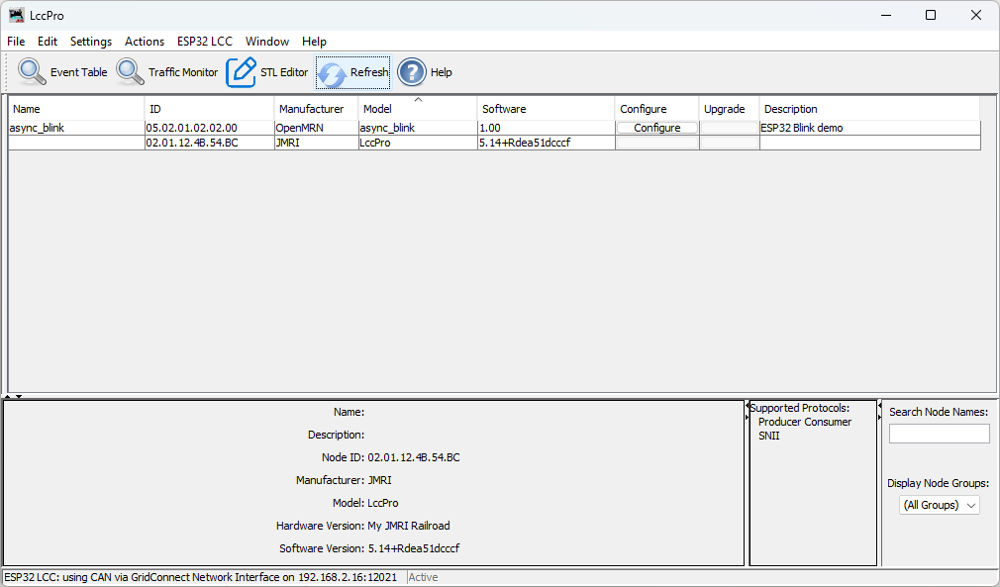
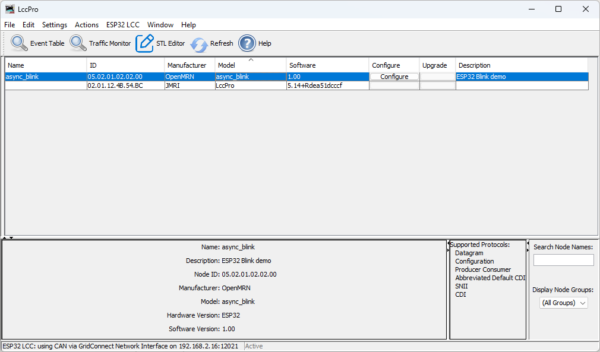
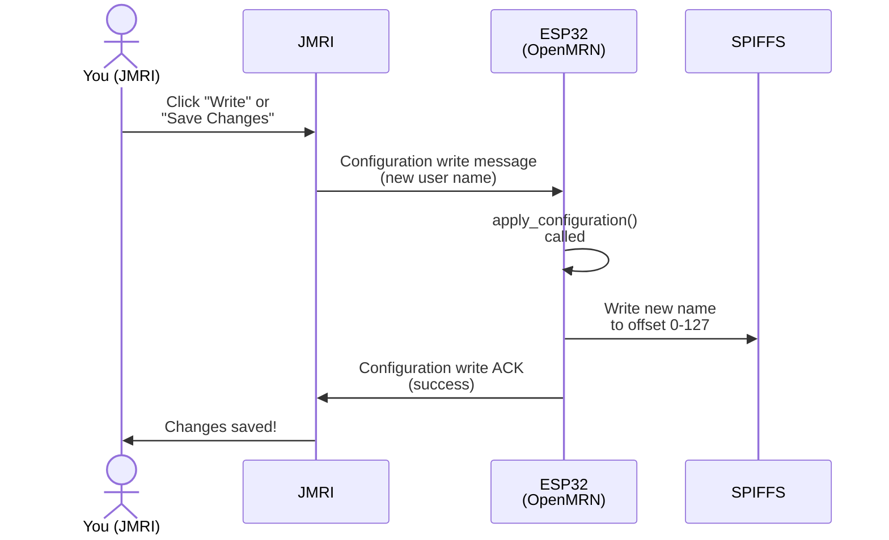

# Editing Configuration in JMRI

## Step-by-Step: Edit Node Name in LccPro

One of the most common configuration tasks is renaming a node to something meaningful (e.g., "Test Blink Node" instead of "async_blink"). Here's how it works:

### 1. Launch JMRI and Open the LccPro Tool

Start JMRI (5.12 or later) and navigate to:
```
Tools → LCC → LccPro
```

You should see a list of nodes currently on your LCC network. Your ESP32 node appears here, identified by its ACDI manufacturer and model information.



### 2. Select Your Node

In the node list, click on the node you want to configure (e.g., "async_blink").

The details panel below the list now shows information for the selected node:
- Node ID
- Static SNIP Data: Manufacturer (`OpenMRN`), Model (`async_blink`), Hardware version (`ESP32`), Software version (`1.00`)
- SNIP User Data: User name (currently `async_blink`), user description (`ESP32 Blink demo`)



### 3. Open the Configuration Editor

Click the **Configure** button (or double-click the node).

LccPro opens a dialog showing the node's CDI. You'll see tabs for different sections:
- **Identification** (read-only): Static SNIP data from firmware
- **User Info** (editable): SNIP user name and description from config file
- **Settings** (if present): Application-specific configuration


### 4. Edit the User Name

Expand the **User Info** tab.

You'll see the User Info tab with fields populated with the current values from the node (as shown in the previous step). Change the User Name to something meaningful, like `Test Blink Node`. You can also edit the description if you'd like.


### 5. Write the Changes to the Node

After editing the User Name, you have two options:

- **Write individually**: Click the **Write** button next to the User Name field to send just that change to the node
- **Write all changes**: Click the **Save Changes** button at the bottom of the dialog to write all modified fields at once

Either way, LccPro sends the new user name to the ESP32 node via OpenLCB Configuration protocol. Here's what happens behind the scenes:



### 6. Verify Persistence

Once saved, the new name persists across reboots:

1. **Immediate Check in LccPro**: Click the **Refresh** button above the node list. This tells LccPro to ask all nodes for their current information. The node list should now show the updated name `Test Blink Node` instead of `async_blink`.

2. **Power Cycle Check**: Power off the ESP32, wait a few seconds, power it back on. Reconnect JMRI to the node (or click Refresh again). The name is still `Test Blink Node`—it was saved to SPIFFS.

## What Just Happened

When you edited and saved the name, OpenMRN did three things:

1. **Received** the new value via JMRI's Configuration write protocol
2. **Wrote** it to the config file at offset 0-127 (the SNIP user data area)
3. **Confirmed** the write was successful back to JMRI

The next time the node boots, it reads this config file from SPIFFS and exposes the updated user name via SNIP protocol. The firmware itself didn't change—only the data in flash storage.

## What This Enables

This workflow shows the power of configuration:
- **No recompilation** needed to change the node name
- **Persistent** across power cycles
- **Standard protocol** (OpenLCB Configuration) that any LCC tool understands
- **Centralized** in JMRI—all nodes configured from one place

Later sections of this chapter extend this pattern to make event IDs, blink interval, and other settings configurable too. The same workflow will apply.

## Troubleshooting: Name Doesn't Save

If you edit the name in JMRI but it doesn't save:

1. **Check Connection**: Ensure JMRI is still connected to the node (green indicator in LccPro)
2. **Check Permissions**: The node's CDI must declare the User Info segment as writable. In our example, it is.
3. **Check SPIFFS**: The ESP32's SPIFFS must have free space. If SPIFFS is full, writes fail silently. Check serial output for error messages.
4. **Check apply_configuration()**: In main.cpp, ensure apply_configuration() returns `UPDATED` on success. In v0.1, it does (it returns UPDATED without making changes, since there's nothing to apply).

See Chapter 3's code-walkthrough section for details on the apply_configuration() callback.
