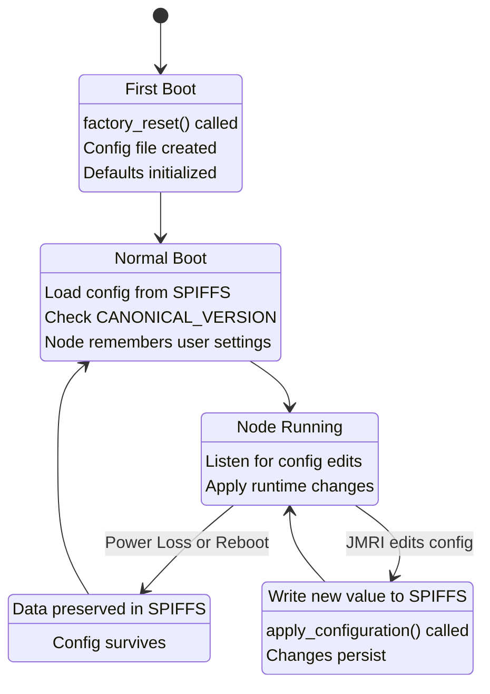

# Understanding File Persistence

## How Configuration Data Gets Written to Flash

When you edit the node name in JMRI and click Save, the data doesn't just vanish into the void. Here's the journey it takes:

### The Configuration Write Protocol

1. **JMRI sends** a Configuration Write message (OpenLCB protocol):
   ```
   "Set the User Name field to 'Kitchen Light'"
   ```

2. **ESP32 receives** the message in the OpenMRN stack's configuration handler

3. **OpenMRN calls** `apply_configuration()` callback in main.cpp:
   ```cpp
   ConfigUpdateStatus apply_configuration(
       const ConfigUpdateRequest& req) {
     // OpenMRN is giving us a chance to handle the configuration change
     return UPDATED;  // "I've handled this, it's saved"
   }
   ```

4. **SPIFFS write** happens inside OpenMRN (we don't see it, but it does):
   ```cpp
   // Internally, OpenMRN uses accessors:
   cfg.userinfo().name().write("Kitchen Light");
   // This writes directly to SPIFFS at offset 0-127
   ```

5. **SPIFFS persists** the data to flash memory using the standard FAT filesystem

6. **OpenMRN responds** to JMRI with a Configuration Write ACK:
   ```
   "Configuration updated successfully"
   ```

7. **JMRI displays** "Configuration saved" and refreshes the node details panel

### Why Does It Persist Across Resets?

SPIFFS is a **journaled filesystem** designed for embedded flash memory. When you write a byte:

1. OpenMRN calls the write accessor
2. SPIFFS marks the byte dirty and schedules a flush
3. SPIFFS actually writes to flash memory (not SRAM)
4. A CRC checksum is written to verify data integrity

When the ESP32 reboots:
1. SPIFFS is remounted
2. CRC check ensures data is valid
3. Data is read back from flash
4. Node comes online with the same name

The node name survives power loss, crashes, or intentional reboots because it's committed to persistent flash storage, not volatile RAM.

## The apply_configuration() Callback

In main.cpp, you'll see:

```cpp
ConfigUpdateStatus apply_configuration(
    const ConfigUpdateRequest& req) {
  // In v0.1, this is a no-op:
  // Configuration is saved to SPIFFS automatically by OpenMRN.
  // We don't need to do anything special.
  return UPDATED;
}
```

This callback exists for cases where:
- Your node reads a config value **once** at startup (e.g., blink interval, event IDs)
- JMRI edits that value while the node is running
- The node needs to re-read and apply the new value immediately (change blink speed, update event listeners, etc.)

**In v0.1**: There's nothing to apply at runtime. The node doesn't change behavior based on config. So `apply_configuration()` just returns `UPDATED`, meaning "the data is saved, no further action needed."

**In later sections of this chapter**: We'll implement `apply_configuration()` to actually read and apply config values. For example:
- If blink interval changes: update the timer to blink faster or slower
- If event IDs change: update event listener registrations

## Understanding the Config Accessors

The OpenMRN library provides **accessors** for config fields:

```cpp
// Example accessor pattern (not actual code):
cfg.userinfo().name().write("New Name");     // Write to config
std::string name = cfg.userinfo().name().read();  // Read from config
```

These accessors:
- Know the exact memory offset for each field (e.g., offset 0 for name)
- Handle serialization (converting C++ types to bytes)
- Trigger SPIFFS writes when data changes
- Provide type safety (no byte-level manipulation)

When you change the name via JMRI, the accessor writes the new string to offset 0-127 of the config file. When the node boots, the accessor reads it back.

## Configuration Lifecycle Diagram



- **First Boot**: `factory_reset()` runs and creates the initial config file with default values
- **Normal Boot**: Config is loaded from SPIFFS; the version is checked to ensure it's still compatible
- **Node Running**: Node listens for JMRI configuration edits and config changes
- **Power Loss/Reboot**: Data in SPIFFS survives; node comes back up with the same config
- **Config Edit**: JMRI sends a new value, `apply_configuration()` is called to save and apply it

## What Can Go Wrong?

| Problem | Symptom | Fix |
|---------|---------|-----|
| SPIFFS corruption | Config file read fails on boot | Manually trigger factory_reset() or re-flash firmware |
| Permissions issue | JMRI can read but not write config | Check CDI in config.h; ensure segment is writable |
| SPIFFS full | Writes fail silently | Delete old files or expand SPIFFS partition |
| Offset overlap | Multiple fields write to same location | Check CDI segment definitions; ensure no overlaps |

## Key Takeaway

Configuration data reaches SPIFFS through OpenMRN's accessors, which handle serialization and offset calculation. SPIFFS commits writes to persistent flash with CRC protection. When the node reboots, data is reloaded exactly as it was saved. The `apply_configuration()` callback lets your firmware react to changes while the node is running—useful for updating blink intervals or event IDs without reboot. In v0.1, we don't need to apply anything, but the callback exists for future enhancements.
