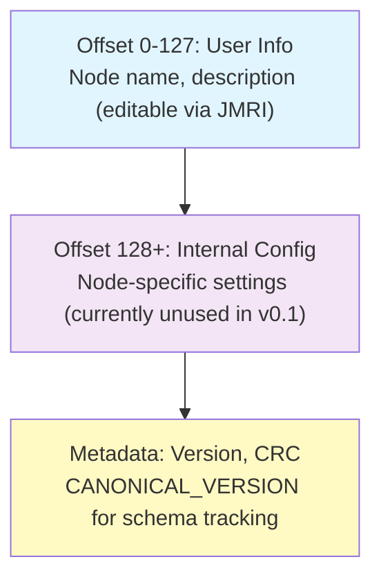

# Storage Model: Where Configuration Lives

## The Configuration File Structure

When async_blink runs on ESP32, it creates a configuration file in SPIFFS (flash storage) at `/spiffs/openlcb_config`. This file is organized by **memory offset**—different ranges of bytes store different types of data.



## Binary File Format

The `/spiffs/openlcb_config` file is **binary**, not text. This is important to understand because:

- **Offset-based layout**: Different types of data (strings, integers, metadata) live at specific byte offsets. This requires a binary format where exact byte positions matter.
- **Direct serialization**: OpenMRN's accessors serialize C++ data structures directly into binary form, padding and aligning fields as needed.
- **Not human-readable**: It's raw binary data—you can't read it as text or edit it directly.
- **CRC integrity**: Binary metadata includes checksums to detect corruption.

**Practical implication**: You must use JMRI (or a similar LCC tool) to edit configuration. This is by design—it ensures configuration remains valid and in sync with the firmware's expectations. The binary format protects against accidental corruption and keeps configuration data safe.

## Three Concepts: ACDI, SNIP, and CDI

When you see these three terms in OpenLCB documentation, here's what they mean:

### **ACDI (Automatic Configuration Description Information)**

ACDI is a **standardized data block** that stores your node's identity information:
- **Static fields**: Manufacturer ID, model, hardware/software versions (compiled into firmware)
- **Dynamic/user fields**: Node name and description (stored in SPIFFS, editable via JMRI)

Think of ACDI as your node's "business card"—it describes *what the node is*.

### **SNIP (Simple Node Information Protocol)**

SNIP is the **protocol** that allows the node to *broadcast* its ACDI data to the network. When JMRI or another tool connects and asks "who are you?" the node responds with SNIP data (pulled from ACDI).

### **CDI (Configuration Description Information)**

CDI is the **configuration schema**—a blueprint describing:
- What configuration options the node has (event IDs, intervals, etc.)
- Their types (integer, string, event ID, etc.)
- Default values and constraints

CDI tells tools *how to configure the node*, separate from identity.

### **How They Work Together**

| Concept | Purpose | Stored Where | Example |
|---------|---------|--------------|---------|
| **ACDI** | Node identity & description | SPIFFS + firmware | Manufacturer "OpenMRN", User name "Kitchen Light" |
| **SNIP** | Protocol to broadcast ACDI | (generated from ACDI at runtime) | "Who are you?" → SNIP response with ACDI |
| **CDI** | Configuration schema/blueprint | Compiled in firmware | "Node has EVENT_INTERVAL config (int, 100-10000ms)" |

The config file at `/spiffs/openlcb_config` stores:
- **User ACDI data** (offset 0-127): Node name and description
- **Node-specific config** (offset 128+): Settings like event IDs, blink interval, etc.

OpenMRNLite automatically:
- Responds to SNIP requests using ACDI
- Exposes CDI to configuration tools
- Handles persistence of both ACDI and config data

## Understanding CANONICAL_VERSION

In `config.h`, you'll see:

```cpp
static constexpr uint16_t CANONICAL_VERSION = 0x0001;
```

This version number is **not** for your application—it's for OpenMRN to track schema changes. Here's why it matters:

- **First Boot**: No config file exists yet. OpenMRN sees `CANONICAL_VERSION = 0x0001` and initializes a new config file with this version number.
- **Later Boots**: OpenMRN reads the version from the config file. If it matches `CANONICAL_VERSION`, everything is normal—use the config file as-is.
- **Version Mismatch**: If you change `CANONICAL_VERSION` in your code and recompile, OpenMRN detects a mismatch and **triggers a complete factory reset**. The entire config file is wiped except for the first 128 bytes (SNIP user data: your node name and description). Everything else at offset 128+ is reset to defaults.

We won't change CANONICAL_VERSION in this section, but it's the mechanism that lets you evolve your configuration schema safely. Later sections of this chapter explore versioning in detail.

## The CDI Segments

Recall from Chapter 3 that `config.h` defines configuration segments:

```cpp
CDI_GROUP(ConfigDef, MainCdi());
  CDI_GROUP_ENTRY(ident, Identification);      // Static SNIP data: manufacturer, model, etc.
  CDI_GROUP_ENTRY(acdi, Acdi);                 // SNIP user data: name/description (editable via JMRI)
  CDI_GROUP_ENTRY(userinfo, UserInfoSegment);  // User-editable metadata
  CDI_GROUP_ENTRY(seg, AsyncBlinkSegment);     // Internal config (offset 128+)
CDI_GROUP_END();
```

Each segment maps to a memory offset:
- **ident**: Static, firmware-based (no config file storage)
- **acdi**: Dynamic, stored at offset 0-127 of the config file
- **userinfo**: Alias for acdi, provides JMRI-friendly name/description fields
- **seg**: Internal app config, stored at offset 128+

## Why Offsets Matter

The offset-based model gives you precise control over where data lives:

```
config.h shows:
  CDI_GROUP_ENTRY(userinfo, UserInfoSegment, Name("User Info"));
  CDI_GROUP_ENTRY(seg, AsyncBlinkSegment, Offset(128));
                                           ↑
                          Explicit offset for internal config
```

This means:
- User name/description go to offset 0-127 (SNIP user data, **always preserved during factory reset**)
- Internal config starts at offset 128+ (**completely wiped on factory reset**, replaced with defaults)
- When JMRI edits the user name, it writes directly to offset 0-127
- When firmware applies_configuration(), it reads from the appropriate offsets

We'll design our own config segments in Chapter 5. For now, understand that offsets let you organize data logically and preserve some fields while resetting others.

## Key Takeaway

Configuration is organized by memory offset in a SPIFFS file. Static data (manufacturer info) lives in firmware; dynamic data (node name) lives in flash. OpenMRN tracks schema with CANONICAL_VERSION to know when to reset vs. upgrade the config file. The CDI segments map C++ structures to these memory offsets, giving JMRI a machine-readable map of what's configurable.
