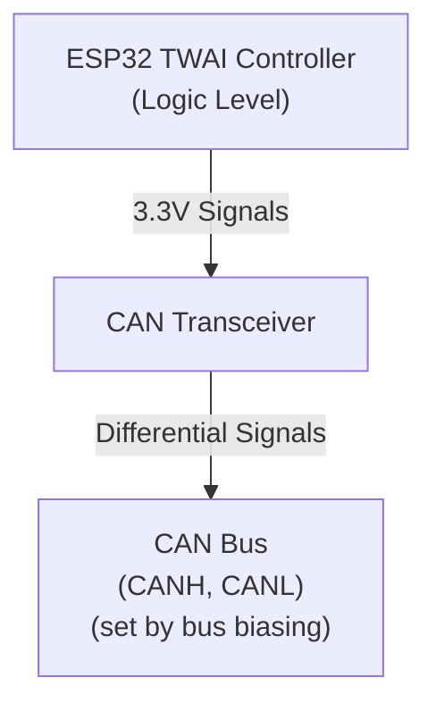

# Understanding CAN Transceivers

A **CAN transceiver** is a small IC (integrated circuit) that bridges the gap between your microcontroller's CAN controller and the physical CAN bus. It's essential—you can't connect an ESP32 directly to a CAN bus; you need a transceiver in between.

## What a CAN Transceiver Does

Your ESP32 has a built-in **CAN controller** (called **TWAI** on ESP32—that's Espressif's acronym for "Two-Wire Automotive Interface," which they use because the ESP32's implementation is a subset of the full CAN specification). This controller handles the CAN protocol logic. But the controller communicates with logic-level signals (0V/3.3V). The CAN **bus** itself uses **differential signaling** on two wires—CANH (CAN high) and CANL (CAN low)—with voltage levels established by the bus biasing and termination network.

The transceiver's job: **convert between logic levels and bus levels**.

## Dominant and Recessive: How CAN Works

> **Theory background**: For a thorough explanation of CAN's arbitration scheme and why dominant/recessive bits work, see Chapter 1's Introduction to CAN. Here we'll focus on what you need to understand to build your ESP32 CAN node.

### How CAN Encodes Bits

CAN doesn't use "high = 1, low = 0" on a single wire like normal logic. Instead, it uses **two wires** (CANH and CANL) and encodes bits as a **difference between them**:

- A **dominant bit** represents a logic **0**
- A **recessive bit** represents a logic **1**

**Key concept**: The transceiver operates in two fundamentally different modes—**high-impedance (recessive)** and **active driving (dominant)**. The bias network in your LCC infrastructure (like RR-CirKits LCC Power-Point or SPROG POWER-LCC) provides the reference voltage, but the transceiver's behavior determines what you actually measure.

#### Recessive (Idle) State

In the **recessive state**, the transceiver outputs are **high-impedance**—essentially disconnected from the bus. The transceiver isn't driving the lines at all; it has "let go" of them.

With no active driving, the **bias network** in your LCC infrastructure pulls both CANH and CANL to nearly the **same voltage**. For typical LCC infrastructure (like the RR-CirKits Power-Point or SPROG POWER-LCC), this is around 2.3V, though the exact voltage depends on the specific device. When fully settled, there's almost no differential voltage between them.

#### Dominant (Transmission) State

When any node wants to send a **dominant 0 bit**, its CAN transceiver **actively drives** both outputs:

- **CANH driver** pulls toward the transceiver's VDD supply voltage (e.g., 5.0V for MCP2551)
- **CANL driver** pulls toward GND (0V)

This creates a significant differential voltage between the two lines. However, the actual voltages you measure are **not** VDD and GND because:

1. The **bias network is still connected** and pulls both lines toward the bias voltage (~2.3V)
2. The **termination resistors** (120Ω at each end of the bus) load the drivers
3. The drivers and bias network "fight" each other, settling at intermediate voltages

#### Visualizing Proper CAN Transceiver Output

Here's what a genuine CAN transceiver looks like on an oscilloscope during actual CAN bus communication. This example uses an MCP2551 (5V transceiver), showing what you should expect from any properly functioning CAN transceiver:

In this capture:
- **CANH** (cyan trace): Rises to **~3.77V** during dominant periods
- **CANL** (yellow trace): Drops to **~1.28V** during dominant periods
- **Differential** (purple trace): Shows a clean, robust voltage swing of ~2.49V
- **Recessive voltage**: Both lines settle to **~2.30V** (set by the LCC infrastructure's bias network)

**Key characteristics of proper operation**:

1. **Strong Differential Voltage**: The ~2.49V differential provides robust signal margins for reliable communication.

2. **Symmetric Drive Capability**: Both the high-side driver (pulling CANH up) and low-side driver (pulling CANL down) work properly, creating clean transitions.

3. **Sharp Waveforms**: Notice how the transitions are crisp and digital-looking, not soft or rounded.

4. **Noise Immunity**: The large voltage swing means the signal is resistant to electrical interference—critical in noisy environments like model railroads.

The CAN receiver in your transceiver looks only at the differential voltage (CANH-CANL), not the absolute voltage on either wire. This is why CAN is so reliable in electrically noisy environments—common-mode noise that affects both wires equally cancels out when you subtract them.

## System Requirements: What You Need Beyond the Transceiver

Before we dive into selecting and purchasing a transceiver, you need to understand the complete system. Your transceiver alone can't run the bus—it needs supporting infrastructure.

### Why You Need the LCC Power-Point (or Similar Device)

Your transceiver converts between logic levels and differential signals, but it doesn't create the electrical environment those signals operate in. You need external infrastructure to provide:

- **Bias network**: Sets the idle (recessive) voltage that CANH and CANL rest at when no one is driving
- **Ground reference**: A stable common point between all nodes
- **Termination resistors** (120Ω): At each physical end of the bus to prevent signal reflections

The bias network and ground reference are provided by devices like the **RR-CirKits LCC Power-Point** or **SPROG POWER-LCC**. Without them, the bus has no defined idle state, reflections corrupt signals, and nodes disagree on what voltages mean.

This is why the oscilloscope traces above show ~2.3V as the recessive voltage—that comes from the LCC infrastructure's bias network, not from the transceiver itself.

### Ground Connection: The Third Signal Wire

Your transceiver's ground connection is just as critical as CANH and CANL. While a learning bench might work with USB providing a common ground, **a proper LCC installation requires an explicit ground wire** connecting your ESP32 to the LCC bus infrastructure.

This ground wire:
- Provides a stable common reference for all transceivers on the bus
- Ensures consistent behavior regardless of USB or power supply topology
- Maintains proper signal margins as specified by the CAN standard

**In the practical wiring sections that follow**, we'll show exactly where to connect CANH, CANL, and GND on your breadboard and LCC interface.

## Selecting Your Transceiver

Now that you understand the complete system, let's talk about choosing the right transceiver for your ESP32.

### ⚠️ Warning: Counterfeit CAN Transceivers

**Before you buy a CAN transceiver breakout board**, you need to know about a serious problem in the hobbyist electronics market: **counterfeit transceiver chips**.

Cheap breakout boards sold on Amazon, eBay, AliExpress, and similar marketplaces **commonly contain counterfeit chips**, particularly SN65HVD230 boards. These counterfeits have a characteristic defect: **missing or severely degraded high-side drivers**. While the low-side driver (pulling CANL toward GND) works reasonably well, the high-side driver fails to properly pull CANH up.

#### What Counterfeit Transceivers Look Like

Here's an oscilloscope capture from a counterfeit SN65HVD230 chip on an inexpensive breakout board:

Notice the problems:
- **CANH actually drops**: Falls to ~2.14V during dominant periods (compared to ~2.37V idle)—instead of rising, the defective high-side driver allows CANH to droop 0.23V below the bias voltage
- **CANL works somewhat**: Drops to ~1.18V (the low-side driver functions)
- **Weak differential**: Only ~0.96V instead of the minimum 1.2V required by CAN specifications. A genuine SN65HVD230 should produce 1.5-2.0V differential.
- **Soft, rounded waveforms**: The pronounced RC charging curves during recessive periods show the bias network doing ALL the work to restore voltage levels

#### Comparison: Counterfeit vs. Genuine SN65HVD230

| Chip Type              | VDD   | CANH (Dom) | CANL (Dom) | Differential | Meets Spec? |
|------------------------|-------|------------|------------|--------------|-------------|
| **Counterfeit**        | 3.3V  | ~2.14V     | ~1.18V     | ~0.96V       | ❌ No - below 1.2V minimum |
| **Genuine SN65HVD230** | 3.3V  | 2.45-3.3V  | 0.5-1.25V  | ≥1.2V (typ 1.5-2.0V) | ✅ Yes |

**SN65HVD230 Specifications** (per TI datasheet):
- CANH (dominant): 2.45V to 3.3V
- CANL (dominant): 0.5V to 1.25V  
- Differential (minimum): 1.2V

The counterfeit chip's 0.96V differential **fails to meet the minimum CAN specification** of 1.2V. A genuine SN65HVD230 has both functional high-side and low-side drivers, producing at least 1.2V differential (typically 1.5-2.0V), which provides adequate signal margins for reliable LCC communication.

#### Impact on Your LCC Network

A counterfeit transceiver with a defective high-side driver primarily affects **transmission**: When your node tries to transmit, the inadequate differential voltage may cause other nodes to misread or miss your messages entirely. This leads to communication failures, retransmissions, and unreliable node operation.

The receive circuitry (the comparator that detects differential voltage from the bus) is separate from the transmit drivers, so the counterfeit chip should still receive messages from other nodes normally. However, a node that can't reliably transmit is effectively useless on the network.

#### How to Avoid Counterfeits

1. **Buy from reputable electronics distributors**: Digi-Key, Mouser, Newark, Arrow, etc. These companies have supply chain controls to prevent counterfeits.

2. **Avoid marketplace sellers**: Amazon, eBay, AliExpress, and similar marketplaces have widespread counterfeit problems. Even sellers with good ratings may unknowingly sell counterfeits.

3. **Be skeptical of "too cheap" prices**: If a breakout board costs $1-2, it's almost certainly counterfeit. Genuine parts from authorized distributors cost more but are worth it.

4. **Test before permanent installation**: Use an oscilloscope to verify proper differential voltage. For 3.3V transceivers like SN65HVD230, expect at least 1.2V (typically 1.5-2.0V). For 5V transceivers like MCP2551, expect 2.0V or higher.

5. **Consider pre-assembled modules from known manufacturers**: Commercial LCC node breakout boards from established model railroad electronics vendors use genuine parts.

#### Common Counterfeit Models

While **SN65HVD230** is the most commonly counterfeited transceiver in the hobbyist market, any popular chip can be counterfeited. The defective high-side driver is a telltale sign—genuine chips from Texas Instruments, Microchip, NXP, and other major manufacturers have both functional drivers.

#### Practical Guidance: Choosing a Transceiver for ESP32

Now that you understand the counterfeit problem, here's how to select the right transceiver:

**Logic Level Compatibility Matters**

The ESP32's GPIO pins operate at **3.3V logic levels**. Your transceiver's TX and RX pins must match this voltage:

- **3.3V logic transceivers** (direct connection, no level shifting needed):
  - **SN65HVD230** - Excellent choice IF you buy genuine parts from reputable distributors (Digi-Key, Mouser, etc.). Avoid cheap breakout boards from Amazon/eBay/AliExpress.
  - **TJA1051/3.3** or **TJA1042** (NXP) - Good alternatives with 3.3V logic
  - **MCP2562** (Microchip) - 3.3V/5V tolerant option

- **5V logic transceivers** (requires level shifters or optoisolators):
  - **MCP2551** (Microchip) - The oscilloscope example shown earlier. Excellent performance but requires level shifting between ESP32 GPIO and transceiver TX/RX pins
  - **TJA1050** (NXP) - 5V logic, same level shifting requirement

**Bus Power vs. Logic Levels**

Note that the transceiver's **VDD supply voltage** (which determines bus drive strength) is separate from its **logic level compatibility**:
- A 3.3V logic transceiver powered at 3.3V will drive the bus with less voltage swing than a 5V-powered transceiver
- But for LCC/CAN applications, even 3.3V-powered transceivers provide adequate signal margins when using genuine chips
- The MCP2551 in the scope capture is powered at 5V for strong bus drive, but that's why it needs level shifting for ESP32

**Bottom Line for ESP32**

For simplest integration with ESP32:
1. Buy a **genuine SN65HVD230** or **TJA1051/3.3** from an authorized distributor (not marketplace sellers)
2. Power it from ESP32's 3.3V output
3. Connect TX/RX directly to ESP32 GPIO pins (no level shifting needed)
4. Test with an oscilloscope if possible to verify you got a genuine chip (differential voltage should be at least 1.5V for 3.3V-powered parts)

## Next Steps

You now understand:
- How CAN transceivers convert between logic levels and differential bus signals
- What infrastructure (bias network, ground, termination) you need
- How to identify and avoid counterfeit transceivers
- Which transceivers work best with ESP32

**Next**: We'll wire this up on a breadboard and connect to your LCC bus.
