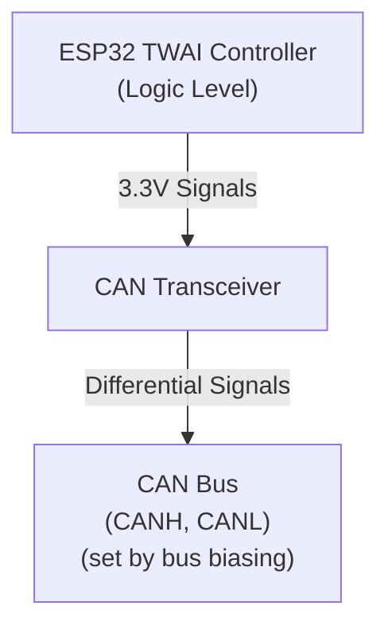

# Understanding CAN Transceivers

A **CAN transceiver** is a small IC (integrated circuit) that bridges the gap between your microcontroller's CAN controller and the physical CAN bus. It's essential—you can't connect an ESP32 directly to a CAN bus; you need a transceiver in between.

## What a CAN Transceiver Does

Your ESP32 has a built-in **CAN controller** (called **TWAI** on ESP32—that's Espressif's acronym for "Two-Wire Automotive Interface," which is their legal-safe name for CAN). This controller handles the CAN protocol logic. But the controller communicates with logic-level signals (0V/3.3V). The CAN **bus** itself uses **differential signaling** on two wires—CANH (CAN high) and CANL (CAN low)—with voltage levels established by the bus biasing and termination network.

The transceiver's job: **convert between logic levels and bus levels**.

## Dominant and Recessive: How CAN Works

> **Theory background**: For a thorough explanation of CAN's arbitration scheme and why dominant/recessive bits work, see Chapter 1's Introduction to CAN. Here we'll focus on what you need to understand to build your ESP32 CAN node.

### How CAN Encodes Bits

CAN doesn't use "high = 1, low = 0" on a single wire like normal logic. Instead, it uses **two wires** (CANH and CANL) and encodes bits as a **difference between them**:

- A **dominant bit** represents a logic **0**
- A **recessive bit** represents a logic **1**

**Key concept**: The transceiver operates in two fundamentally different modes—**high-impedance (recessive)** and **active driving (dominant)**. The bias network in your LCC infrastructure (like RR-CirKits LCC Power-Point or SPROG POWER-LCC) provides the reference voltage, but the transceiver's behavior determines what you actually measure.

#### Recessive (Idle) State

In the **recessive state**, the transceiver outputs are **high-impedance**—essentially disconnected from the bus. The transceiver isn't driving the lines at all; it has "let go" of them.

With no active driving, the **bias network** in your LCC infrastructure pulls both CANH and CANL to nearly the **same voltage**. For typical LCC infrastructure (like the RR-CirKits Power-Point or SPROG POWER-LCC), this is around 2.5V, though the exact voltage depends on the specific device. When fully settled, there's almost no differential voltage between them.

**Important**: After a dominant period, the bus doesn't instantly jump to the bias voltage. The bias network charges the bus through the cable capacitance, creating an **RC charging curve**. During short recessive periods (between bits), the voltage may not fully settle to the bias level.

#### Dominant (Transmission) State

When any node wants to send a **dominant 0 bit**, its CAN transceiver **actively drives** both outputs:

- **CANH driver** pulls toward the transceiver's VDD supply voltage (e.g., 3.3V for SN65HVD230)
- **CANL driver** pulls toward GND (0V)

This creates a significant differential voltage between the two lines. However, the actual voltages you measure are **not** VDD and GND because:

1. The **bias network is still connected** and pulls both lines toward the bias voltage (~2.5V)
2. The **termination resistors** (120Ω at each end of the bus) load the drivers
3. The drivers and bias network "fight" each other, settling at intermediate voltages

**Example: From my test setup** (SN65HVD230 transceiver with VDD=3.3V, connected to LCC infrastructure), measurements showed:

| State             | CANH   | CANL   | Differential  |
|-------------------|--------|--------|---------------|
| **Recessive (1)** | ~2.37V | ~2.37V | ~0.00V        |
| **Dominant (0)**  | ~2.14V | ~1.18V | ~0.96V        |

Note that the recessive voltage (~2.37V) is set by the LCC infrastructure's bias network, not by the transceiver. However, the exact voltages you observe—particularly during dominant periods—will vary significantly depending on your transceiver's supply voltage. What matters for reliable communication is the **differential voltage** (CANH - CANL), not the absolute voltage on either line.

#### Visualizing the Differential Signal

Here's what this looks like on an oscilloscope during actual CAN bus communication:

In this capture:
- **Yellow trace (CANL)**: Shows the low line being actively driven low during dominant periods, then charging back up during recessive periods
- **Cyan trace (CANH)**: Shows the high line behavior during the same transmission
- **Purple trace (CANH-CANL)**: The differential signal - notice how clean and digital it is!

**Key observations**:

1. **RC Charging Behavior**: Notice the curved rise at the end of each dominant pulse (when returning to recessive). This is the bias network charging the cable capacitance. The voltage doesn't instantly snap to the bias level—it gradually rises following an exponential curve.

2. **Longer vs. Shorter Recessive Periods**: During longer idle periods (left side of the capture), both lines fully settle to ~2.37V. During shorter recessive periods between bits, the voltage doesn't have time to fully charge and settles at a lower intermediate voltage.

3. **Clean Differential Signal**: While the individual CANH and CANL voltages show complex behavior (active driving, RC charging, partial settling), the **differential signal (CANH-CANL) is very clean**. This is the magic of differential signaling—noise, voltage shifts, and charging effects that affect both wires equally cancel out when you subtract them, leaving a robust digital signal.

The CAN receiver in your transceiver looks only at this differential voltage, not the absolute voltage on either wire. This is why CAN is so reliable in electrically noisy environments like model railroads and industrial settings.

#### Comparison: 3.3V vs. 5V Powered Transceivers

The transceiver's supply voltage significantly affects the bus voltage levels you'll measure. Here's a comparison showing traffic from a **RR-CirKits Tower-LCC node** (which uses a 5V-powered transceiver):

In this capture from the Tower-LCC:
- **CANH** (cyan trace): Rises to **3.43V** during dominant periods
- **CANL** (yellow trace): Drops to **1.60V** during dominant periods
- **Differential** (purple trace): Shows a much larger voltage swing (~1.83V vs. ~0.96V from the 3.3V transceiver)

**Key observation**: Notice the RC drop visible during recessive periods. Because the Tower-LCC's 5V transceiver pulls CANH higher than our 3.3V transceiver during dominant periods, you can see the bus voltage gradually settling during the recessive (idle) periods as the bias network pulls it back toward ~2.5V. This exponential decay is the cable capacitance discharging through the bias network.

**Why this matters**: The 5V-powered transceiver provides:
- **Larger voltage margins**: The ~1.83V differential is nearly twice as large as the 0.96V from a 3.3V transceiver
- **Better noise immunity**: Larger voltage swings are more resistant to electrical interference
- **Improved reliability**: More robust signaling, especially on longer bus runs or in noisy environments

If you're building a permanent LCC installation, using a **5V-powered transceiver** (like the MCP2551 or SN65HVD251) instead of a 3.3V version (SN65HVD230) will give you more robust bus performance. The ESP32 can still interface with a 5V transceiver—just use a level shifter on the TX line, or use a transceiver with 3.3V-tolerant logic inputs.

### The Transceiver's Role

Your transceiver does one essential job: **convert the ESP32's logic signals (0V/3.3V) into differential voltages on the CAN bus**.

- **Recessive (logic 1)**: Transceiver goes **high-impedance**, releasing the bus and allowing the bias network to set the voltage
- **Dominant (logic 0)**: Transceiver **actively drives** CANH toward VCC and CANL toward GND, creating a differential voltage

Everything else—the bias voltage, termination, ground reference—comes from your LCC infrastructure (such as the RR-CirKits LCC Power-Point or SPROG POWER-LCC). The transceiver's drivers work against this infrastructure during dominant periods, which is why the measured voltages are intermediate values rather than full VCC/GND.

### The Wired-AND Behavior

This dominant/recessive behavior is the foundation of CAN's arbitration—if two nodes transmit simultaneously, the one sending 0 (dominant) wins without any other node knowing a collision happened. This is covered in detail in Chapter 1.

### Why You Need the LCC Power-Point (or Similar Device)

Your transceiver alone can't run the bus. You need external infrastructure to provide:

- **Bias network**: Sets the idle (recessive) voltage that CANH and CANL rest at when no one is driving
- **Ground reference**: A stable common point between all nodes
- **Termination resistors** (120Ω): At each physical end of the bus to prevent signal reflections

The first two are provided by devices like the **RR-CirKits LCC Power-Point** or **SPROG POWER-LCC**. Without them, the bus has no defined idle state, reflections corrupt signals, and nodes disagree on what voltages mean.

**In this section**, we focus on connecting the three signal wires—CANH, CANL, and GND—from your ESP32 to the LCC infrastructure. The infrastructure handles the rest.

### Ground Connection: The Third Signal Wire

Your transceiver's ground connection is just as critical as CANH and CANL. While a learning bench might work with USB providing a common ground, **a proper LCC installation requires an explicit ground wire** connecting your ESP32 to the LCC bus infrastructure.

This ground wire:
- Provides a stable common reference for all transceivers on the bus
- Ensures consistent behavior regardless of USB or power supply topology
- Maintains proper signal margins as specified by the CAN standard

The next section shows exactly where to connect this wire on your breadboard and LCC interface.

**Next**: We'll wire this up on a breadboard and connect to your LCC bus.
