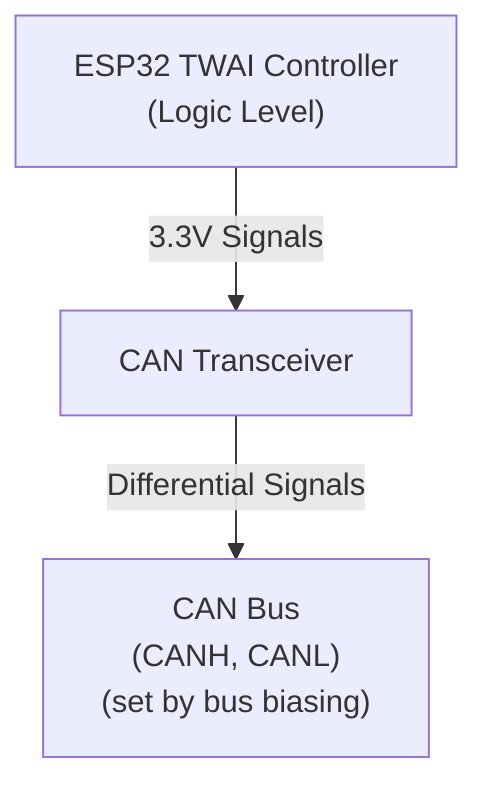

# Understanding CAN Transceivers

A **CAN transceiver** is a small IC (integrated circuit) that bridges the gap between your microcontroller's CAN controller and the physical CAN bus. It's essential—you can't connect an ESP32 directly to a CAN bus; you need a transceiver in between.

## What a CAN Transceiver Does

Your ESP32 has a built-in **CAN controller** (called **TWAI** on ESP32—that's Espressif's acronym for "Two-Wire Automotive Interface," which is their legal-safe name for CAN). This controller handles the CAN protocol logic. But the controller communicates with logic-level signals (0V/3.3V). The CAN **bus** itself uses **differential signaling** on two wires—CANH (CAN high) and CANL (CAN low)—with voltage levels established by the bus biasing and termination network.

The transceiver's job: **convert between logic levels and bus levels**.

## Dominant and Recessive: How CAN Works

> **Theory background**: For a thorough explanation of CAN's arbitration scheme and why dominant/recessive bits work, see Chapter 1's Introduction to CAN. Here we'll focus on what you need to understand to build your ESP32 CAN node.

### How CAN Encodes Bits

CAN doesn't use "high = 1, low = 0" on a single wire like normal logic. Instead, it uses **two wires** (CANH and CANL) and encodes bits as a **difference between them**:

- A **dominant bit** represents a logic **0**
- A **recessive bit** represents a logic **1**

**Key concept**: The CAN bus's idle (recessive) voltage is set by external infrastructure—in LCC, by a device like the RR-CirKits LCC Power-Point—not by your transceiver. Your transceiver only *nudges* the bus around that idle level.

#### Recessive (Idle) State

In the **recessive (idle) state**, no node is actively driving the bus. Both CANH and CANL sit at nearly the **same voltage**, defined by the bias network in your LCC infrastructure. The exact idle voltage depends on what device provides the bias.

#### Dominant (Transmission) State

When any node wants to send a **dominant 0 bit**, its CAN transceiver briefly **creates a small voltage difference** between the two wires:

- **CANH is nudged up** above the idle level
- **CANL is nudged down** below the idle level

**Example: From my test setup** (with a transceiver connected to an LCC Power-Point and RR-CirKits infrastructure), measurements showed:

| State | CANH | CANL | Differential |
|-------|------|------|---------------|
| **Recessive (1)** | ~2.25V | ~2.12V | ~0.13V |
| **Dominant (0)** | ~1.68V | ~1.08V | ~0.60V |

The exact voltages you observe will depend on your specific infrastructure and transceiver. The key principle remains: **the idle voltage is set by the bias network**, and **the transceiver creates the differential around that point**.

### The Transceiver's Role

Your transceiver does one essential job: **convert the ESP32's logic signals (0V/3.3V) into small differential voltages on the CAN bus**. It pushes CANH and CANL apart to send a dominant bit, then releases them to send a recessive bit. Everything else—the bias voltage, termination, ground reference—comes from your LCC infrastructure (the Power-Point and RR-CirKits devices).

### The Wired-AND Behavior

This dominant/recessive behavior is the foundation of CAN's arbitration—if two nodes transmit simultaneously, the one sending 0 (dominant) wins without any other node knowing a collision happened. This is covered in detail in Chapter 1.

### Why You Need the LCC Power-Point (or Similar Device)

Your transceiver alone can't run the bus. You need external infrastructure to provide:

- **Bias network**: Sets the idle (recessive) voltage that CANH and CANL rest at when no one is driving
- **Ground reference**: A stable common point between all nodes
- **Termination resistors** (120Ω): At each physical end of the bus to prevent signal reflections

The first two are provided by devices like the **RR-CirKits LCC Power-Point**. Without them, the bus has no defined idle state, reflections corrupt signals, and nodes disagree on what voltages mean.

**In this section**, we focus on connecting the three signal wires—CANH, CANL, and GND—from your ESP32 to the LCC infrastructure. The infrastructure handles the rest.

### Ground Connection: The Third Signal Wire

Your transceiver's ground connection is just as critical as CANH and CANL. While a learning bench might work with USB providing a common ground, **a proper LCC installation requires an explicit ground wire** connecting your ESP32 to the LCC bus infrastructure.

This ground wire:
- Provides a stable common reference for all transceivers on the bus
- Ensures consistent behavior regardless of USB or power supply topology
- Maintains proper signal margins as specified by the CAN standard

The next section shows exactly where to connect this wire on your breadboard and LCC interface.

**Next**: We'll wire this up on a breadboard and connect to your LCC bus.
