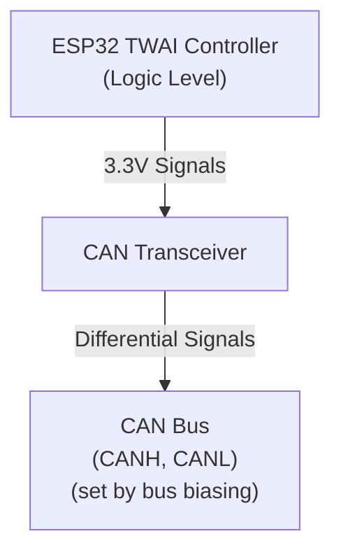

# Understanding CAN Transceivers

A **CAN transceiver** is a small IC (integrated circuit) that bridges the gap between your microcontroller's CAN controller and the physical CAN bus. It's essential—you can't connect an ESP32 directly to a CAN bus; you need a transceiver in between.

## What a CAN Transceiver Does

Your ESP32 has a built-in **CAN controller** (called **TWAI** on ESP32—that's Espressif's acronym for "Two-Wire Automotive Interface," which they use because the ESP32's implementation is a subset of the full CAN specification). This controller handles the CAN protocol logic. But the controller communicates with logic-level signals (0V/3.3V). The CAN **bus** itself uses **differential signaling** on two wires—CANH (CAN high) and CANL (CAN low)—with voltage levels established by the bus biasing and termination network.

The transceiver's job: **convert between logic levels and bus levels**.

## Dominant and Recessive: How CAN Works

> **Theory background**: For a thorough explanation of CAN's arbitration scheme and why dominant/recessive bits work, see Chapter 1's Introduction to CAN. Here we'll focus on what you need to understand to build your ESP32 CAN node.

### How CAN Encodes Bits

CAN doesn't use "high = 1, low = 0" on a single wire like normal logic. Instead, it uses **two wires** (CANH and CANL) and encodes bits as a **difference between them**:

- A **dominant bit** represents a logic **0**
- A **recessive bit** represents a logic **1**

**Key concept**: The transceiver operates in two fundamentally different modes—**high-impedance (recessive)** and **active driving (dominant)**. The bias network in your LCC infrastructure (like RR-CirKits LCC Power-Point or SPROG POWER-LCC) provides the reference voltage, but the transceiver's behavior determines what you actually measure.

#### Recessive (Idle) State

In the **recessive state**, the transceiver outputs are **high-impedance**—essentially disconnected from the bus. The transceiver isn't driving the lines at all; it has "let go" of them.

With no active driving, the **bias network** in your LCC infrastructure pulls both CANH and CANL to nearly the **same voltage**. For typical LCC infrastructure (like the RR-CirKits Power-Point or SPROG POWER-LCC), this is around 2.5V, though the exact voltage depends on the specific device. When fully settled, there's almost no differential voltage between them.

#### Dominant (Transmission) State

When any node wants to send a **dominant 0 bit**, its CAN transceiver **actively drives** both outputs:

- **CANH driver** pulls toward the transceiver's VDD supply voltage (e.g., 3.3V for SN65HVD230)
- **CANL driver** pulls toward GND (0V)

This creates a significant differential voltage between the two lines. However, the actual voltages you measure are **not** VDD and GND because:

1. The **bias network is still connected** and pulls both lines toward the bias voltage (~2.5V)
2. The **termination resistors** (120Ω at each end of the bus) load the drivers
3. The drivers and bias network "fight" each other, settling at intermediate voltages

#### Visualizing the Differential Signal: 3.3V Transceiver

Here's what the 3.3V SN65HVD230 looks like on an oscilloscope during actual CAN bus communication:

In this capture:
- **Yellow trace (CANL)**: Shows the low line being actively driven low during dominant periods, then charging back up during recessive periods
- **Cyan trace (CANH)**: Shows the high line behavior during the same transmission
- **Purple trace (CANH-CANL)**: The differential signal - notice how clean and digital it is!

**Key observations**:

1. **Smaller Voltage Swing**: The differential voltage (~0.96V) is relatively modest. This is what caused confusion for some—the waveforms look somewhat "soft" compared to what you might expect from a digital signal.

2. **RC Charging Behavior and Incomplete Settling**: Notice the curved rise at the end of each dominant pulse (when returning to recessive)—this is the bias network charging the cable capacitance. The voltage doesn't instantly snap to the bias level; it gradually rises following an exponential curve. More importantly, during shorter recessive periods between bits, the voltage may not have time to fully settle back to the idle level, leaving the bus partially charged. As we'll see in the next section, this behavior is related to the transceiver's limited drive capability.

3. **Clean Differential Signal**: While the individual CANH and CANL voltages show complex behavior (active driving, RC charging, partial settling), the **differential signal (CANH-CANL) is very clean**. This is the magic of differential signaling—noise, voltage shifts, and charging effects that affect both wires equally cancel out when you subtract them, leaving a robust digital signal.

The CAN receiver in your transceiver looks only at this differential voltage, not the absolute voltage on either wire. This is why CAN is so reliable in electrically noisy environments like model railroads and industrial settings.

#### Comparing Different Transceiver Voltages

Now that I've shown what a 3.3V-powered transceiver produces, the question becomes: can we do better? Let me compare measurements from my test setups with different transceiver supplies:

| Transceiver      | VDD   | CANH (Dom) | CANL (Dom) | Differential | CANH (Rec) | CANL (Rec) |
|------------------|-------|------------|------------|--------------|------------|------------|
| **SN65HVD230**   | 3.3V  | ~2.14V     | ~1.18V     | ~0.96V       | ~2.37V     | ~2.37V     |
| **MCP2551**      | 5.0V  | ~3.77V     | ~1.28V     | ~2.49V       | ~2.50V     | ~2.50V     |

The key insight: the **recessive voltage is always set by the LCC infrastructure's bias network** (~2.50V in both cases). The difference between 3.3V and 5V transceivers isn't the idle voltage—it's what happens during dominant periods. The 3.3V transceiver's weaker drivers try to pull CANH high (toward 3.3V) and CANL low (toward GND), but the bias network pulls back, limiting CANH to only ~2.14V. The 5V transceiver's stronger drivers can overcome the bias network's resistance much better, pulling CANH all the way to ~3.77V while pulling CANL down to ~1.28V, creating a much larger differential voltage. The bias network and termination resistors resist all active driving, but the transceiver's VDD supply voltage determines how hard it can push back against that resistance.

#### Visualizing the Differential Signal: 5V Transceiver

Here's the practical payoff. When I switched to a 5V-powered transceiver like the MCP2551, the waveforms became dramatically clearer:

Compare this to the 3.3V capture above—the difference is striking. In this capture:
- **CANH** (cyan trace): Rises to **~3.77V** during dominant periods
- **CANL** (yellow trace): Drops to **~1.28V** during dominant periods
- **Differential** (purple trace): Shows a much larger, cleaner voltage swing (~2.49V vs. ~0.96V from the 3.3V transceiver)

**Key advantages**:

1. **Much Larger Voltage Swing**: The nearly 2.5x larger differential voltage (2.49V vs. 0.96V) makes the signal far more robust and easier for receivers to detect reliably.

2. **Better Noise Immunity**: Larger voltage margins mean the signal is far more resistant to electrical interference—critical in noisy environments like model railroads.

3. **Cleaner Waveforms**: Notice how sharp and digital the transitions are. The larger voltage swing and stronger drivers result in waveforms that look like classic digital signals rather than analog-like curves.

4. **Improved Reliability**: This is why 5V transceivers are standard in professional CAN installations—the extra voltage swing translates directly to more reliable communication, especially on longer bus runs.

#### Real-World Comparison: Commercial LCC Nodes

To show what I observed from existing LCC infrastructure, here's a capture from actual message traffic between a **RR-CirKits Buffer-USB node** and a **Tower-LCC node**. This shows real CAN bus activity: a write command I sent from the computer to the Tower-LCC via the Buffer-USB.

**Important context**: This particular capture was taken while my test node was still using a 3.3V SN65HVD230 transceiver. The waveforms are noticeably messier compared to when all nodes use 5V transceivers.

> **Impact of Weak Transceivers on the Entire Bus**: When I switched my test node to a 5V MCP2551, the transformation was dramatic: not only did my node's output become crisp and clean, but the Tower-LCC's signal also became equally clean. This reveals an important principle: **the quality of one node's transceiver affects signal quality for the entire bus**, not just that node's local output. A weak transceiver on any node degrades margins for everyone; upgrading that one node improves the whole network.

#### Practical Guidance: Choosing a Transceiver

Now that you understand why 5V transceivers produce better waveforms, you have options:

- **SN65HVD230 (3.3V)**: Lower cost, but you'll see the "soft" waveforms described earlier. Good for learning, not ideal for production.
- **MCP2551 (5V)**: Better performance with cleaner waveforms and 2.5x larger differential voltage. You can power it directly from the ESP32's VIN pin without a separate power supply. Recommended for any permanent installation.

The next section shows the detailed wiring for both options, including how to connect the MCP2551 to get 5V operation.

### The Transceiver's Role

Your transceiver does one essential job: **convert the ESP32's logic signals (0V/3.3V) into differential voltages on the CAN bus**.

- **Recessive (logic 1)**: Transceiver goes **high-impedance**, releasing the bus and allowing the bias network to set the voltage
- **Dominant (logic 0)**: Transceiver **actively drives** CANH toward VCC and CANL toward GND, creating a differential voltage

Everything else—the bias voltage, termination, ground reference—comes from your LCC infrastructure (such as the RR-CirKits LCC Power-Point or SPROG POWER-LCC). The transceiver's drivers work against this infrastructure during dominant periods, which is why the measured voltages are intermediate values rather than full VCC/GND.

### The Wired-AND Behavior

This dominant/recessive behavior is the foundation of CAN's arbitration—if two nodes transmit simultaneously, the one sending 0 (dominant) wins without any other node knowing a collision happened. This is covered in detail in Chapter 1.

### Why You Need the LCC Power-Point (or Similar Device)

Your transceiver alone can't run the bus. You need external infrastructure to provide:

- **Bias network**: Sets the idle (recessive) voltage that CANH and CANL rest at when no one is driving
- **Ground reference**: A stable common point between all nodes
- **Termination resistors** (120Ω): At each physical end of the bus to prevent signal reflections

The first two are provided by devices like the **RR-CirKits LCC Power-Point** or **SPROG POWER-LCC**. Without them, the bus has no defined idle state, reflections corrupt signals, and nodes disagree on what voltages mean.

**In this section**, we focus on connecting the three signal wires—CANH, CANL, and GND—from your ESP32 to the LCC infrastructure. The infrastructure handles the rest.

### Ground Connection: The Third Signal Wire

Your transceiver's ground connection is just as critical as CANH and CANL. While a learning bench might work with USB providing a common ground, **a proper LCC installation requires an explicit ground wire** connecting your ESP32 to the LCC bus infrastructure.

This ground wire:
- Provides a stable common reference for all transceivers on the bus
- Ensures consistent behavior regardless of USB or power supply topology
- Maintains proper signal margins as specified by the CAN standard

The next section shows exactly where to connect this wire on your breadboard and LCC interface.

**Next**: We'll wire this up on a breadboard and connect to your LCC bus.
