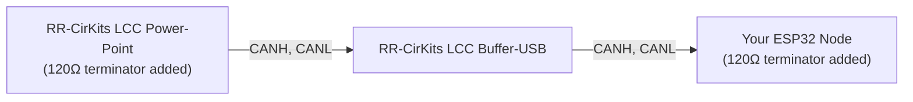

# Hardware Wiring: CAN Transceiver Breakout Setup

This section walks you through physically wiring an ESP32 to a CAN transceiver breakout board, ready to connect to your LCC network.

## What You'll Need

- **ESP32 DevKit** (same as Chapter 3)
- **CAN Transceiver Breakout Board** (SN65HVD230 or MCP2551 based, with 6-pin header)
- **RJ-45 breakout board** (for connecting to your LCC bus via Cat-5e/Cat-6 cabling)
- **Jumper wires** (22 AWG, solid core) — a set of 6 for ESP32 to CAN breakout, plus 3 from CAN breakout to RJ-45 breakout

## Breakout Board Header Pinout

CAN transceiver breakout boards provide a standard 6-pin header interface:

| Pin | Function | ESP32 Connection |
|-----|----------|------------------|
| VCC (Power) | Power | See below |
| GND | Ground | GND rail |
| CRX (CAN RX) | Receive signal | GPIO4 |
| CTX (CAN TX) | Transmit signal | GPIO5 |
| CANH | CAN high line | To RJ-45 breakout |
| CANL | CAN low line | To RJ-45 breakout |

### Power Connection Depends on Your Transceiver

**SN65HVD230 (3.3V transceiver)**:
- VCC connects to **3.3V rail**

**MCP2551 (5V transceiver)**:
- VCC connects to **ESP32 VIN pin** (which provides ~5V from USB or external power)
- This gives you the performance benefits of a 5V transceiver without needing a separate power supply
- The ESP32 can handle 5V on its RX line; most MCP2551 breakouts have 3.3V-tolerant inputs on TX, so no level shifter is needed

Either choice works fine—the MCP2551 just requires this one extra connection to VIN instead of 3.3V.

## Wiring

The CAN transceiver breakout board connects directly to your ESP32 with six jumper wires, then to an RJ-45 breakout board for your LCC bus connection.

**Visual reference:**

**Note**: This breadboard diagram shows the wiring for an **SN65HVD230 breakout board** (VCC to 3.3V rail). If you're using an **MCP2551**, the only difference is that its VCC wire goes to **ESP32 VIN** instead of 3.3V; all other connections remain the same.

**CAN Transceiver to RJ-45 Breakout (LCC Bus)**:

| CAN Transceiver | RJ-45 Breakout Pin | LCC Signal |
|-----------------|-------------------|-----------|
| CANL | Pin 1 | CANL |
| CANH | Pin 2 | CANH |
| GND | Pin 3 | CAN_GND |
| GND | Pin 6 | CAN_SHIELD |

**Ground connection**: For learning, you can rely on USB providing a common ground. For a production or multi-device setup, also connect the breakout's GND to both the LCC bus GND (RJ-45 Pin 3) and CAN_SHIELD (RJ-45 Pin 6) via the same RJ-45 connector.

## Bus Topology and Termination

The CAN bus is a **linear topology** (not a star). Devices are chained in a line, with termination at the physical ends:

**Critical**: Terminating resistors go at the *physical ends* of the bus, not in the middle. You need exactly one 120Ω terminator at each end. Extra termination in the middle causes signal reflections and errors.

### Which Transceiver Breakout Board to Choose?

| Breakout Board | Built-in Termination | Voltage | Best For |
|---|---|---|---|
| **SN65HVD230** | Yes (built-in 120Ω) | 3.3V | Learning or prototyping |
| **MCP2551** | Yes (built-in 120Ω) | 5V | Production; better signal quality and noise immunity |

Both breakout boards include a 120Ω termination resistor (the bare transceiver chips don't have this). So you don't need to add external resistors. The main difference is power supply and waveform quality—the MCP2551's 5V operation produces much cleaner signals (as shown in the previous section) and is recommended for any permanent installation.

**Important note for production**: These breakout boards are designed for learning and simple setups. For a proper multi-node production installation, your node should **not** have a built-in termination resistor. Instead, use a design with dual RJ-45 jacks connected together (pass-through), allowing you to daisy-chain nodes along the bus. Place a single 120Ω terminator only at each physical end of the bus, not on intermediate nodes. This ensures clean signal integrity across the entire network.

**Next**: Let's modify the code to use CAN instead of WiFi.
