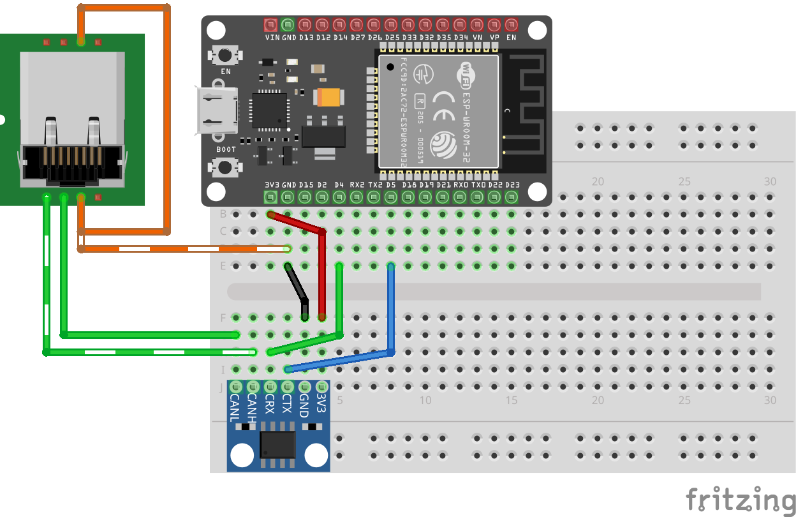
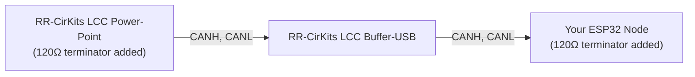

# Hardware Wiring: CAN Transceiver Breakout Setup

This section walks you through physically wiring an ESP32 to a CAN transceiver breakout board, ready to connect to your LCC network.

## What You'll Need

- **ESP32 DevKit** (same as Chapter 3)
- **CAN Transceiver Breakout Board** (SN65HVD230 or MCP2551 based, with 6-pin header)
- **RJ-45 breakout board** (for connecting to your LCC bus via Cat-5e/Cat-6 cabling)
- **Jumper wires** (22 AWG, solid core) — a set of 6 for ESP32 to CAN breakout, plus 3 from CAN breakout to RJ-45 breakout

## Breakout Board Header Pinout

CAN transceiver breakout boards provide a standard 6-pin header interface:

| Pin | Function | ESP32 Connection |
|-----|----------|------------------|
| VCC (3.3V) | Power | 3.3V rail |
| GND | Ground | GND rail |
| CRX (CAN RX) | Receive signal | GPIO4 |
| CTX (CAN TX) | Transmit signal | GPIO5 |
| CANH | CAN high line | To RJ-45 breakout |
| CANL | CAN low line | To RJ-45 breakout |

## Wiring

The CAN transceiver breakout board connects directly to your ESP32 with six jumper wires, then to an RJ-45 breakout board for your LCC bus connection.

**Visual reference:**

**CAN Transceiver to RJ-45 Breakout (LCC Bus)**:

| CAN Transceiver | RJ-45 Breakout Pin | LCC Signal |
|-----------------|-------------------|-----------|
| CANL | Pin 1 | CANL |
| CANH | Pin 2 | CANH |
| GND | Pin 3 | CAN_GND |
| GND | Pin 6 | CAN_SHIELD |

**Ground connection**: For learning, you can rely on USB providing a common ground. For a production or multi-device setup, also connect the breakout's GND to both the LCC bus GND (RJ-45 Pin 3) and CAN_SHIELD (RJ-45 Pin 6) via the same RJ-45 connector.

## Bus Topology and Termination

The CAN bus is a **linear topology** (not a star). Devices are chained in a line, with termination at the physical ends:

**Critical**: Terminating resistors go at the *physical ends* of the bus, not in the middle. You need exactly one 120Ω terminator at each end. Extra termination in the middle causes signal reflections and errors.

### Which Transceiver Includes Termination?

| Transceiver | Built-in Termination | When to Use |
|-------------|----------------------|------------|
| **SN65HVD230** | No (external 120Ω required) | You're adding nodes in the *middle* of a bus |
| **MCP2551** | Yes (built-in 120Ω) | You're a *single node* at the end of a bus |

**For this section**: If your ESP32 is a standalone node (one transceiver on the bus), the **MCP2551** saves you the hassle of adding a resistor. If you're building a multi-node setup later, the **SN65HVD230** gives you full control. Either choice works fine—pick what suits your immediate needs.

**Important**: Never put multiple transceivers with termination on the same bus (whether built-in or external). Termination belongs only at the *physical ends*.

**Next**: Let's modify the code to use CAN instead of WiFi.
