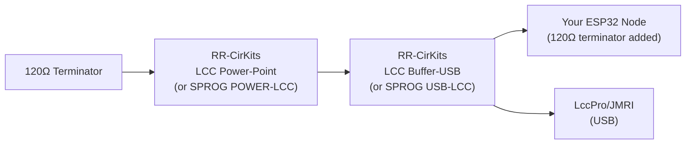
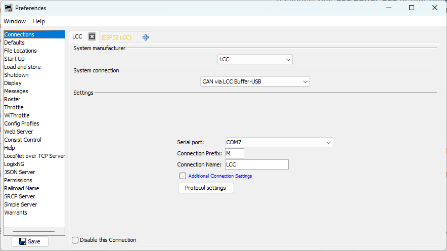
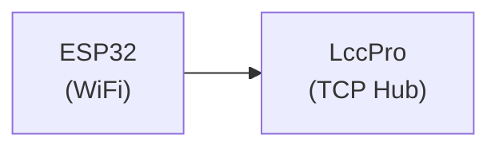
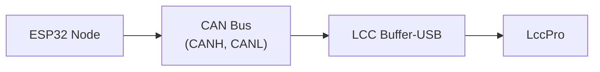

# Configuring JMRI for CAN: Using a CAN Bus Interface Module

In Chapter 3, JMRI connected to your ESP32 node via a TCP Hub on port 12021 (WiFi). Now that your node is on a CAN bus, JMRI needs a different path to reach it: through a **CAN bus interface module** (such as RR-CirKits LCC Buffer-USB, SPROG USB-LCC, PEAK PCAN-USB, or similar) connected to the same CAN bus.

## Hardware Setup

Before configuring JMRI, make sure your physical setup is in place and looks something like the following:



The interface module acts as a "gateway" that translates between the CAN bus and JMRI's protocol. Examples include RR-CirKits LCC Buffer-USB, SPROG USB-LCC, PEAK PCAN-USB, or any other CAN interface compatible with JMRI. Note that 120Ω terminators are required at the physical ends of the CAN bus.

## Disabling the WiFi Connection from Chapter 3

If you still have your Chapter 3 WiFi-based node running, you'll want to disable or remove that JMRI connection:

### In JMRI

1. **Preferences** → **Connections**
2. Find the connection entry for your "ESP32 LCC" connection from Chapter 3
3. Check **Disable this Connection** to disable it (or delete it if you're not going back)
4. Click **Save**

This prevents JMRI from trying to connect to the old WiFi-based node, which won't be responding anymore.

## Adding the CAN Bus Interface Connection

### Step 1: Physical Connection

1. Connect your **LCC Buffer-USB** (or **SPROG USB-LCC**) to your computer via USB
2. In **Device Manager** (Windows) or **System Information** (Mac/Linux), note which **COM port** or **serial device** the Buffer appears on
   - Windows: `COM3`, `COM4`, etc.
   - Linux: `/dev/ttyUSB0`, `/dev/ttyUSB1`, etc.
   - Mac: `/dev/tty.usbserial-*`

### Step 2: Create a New JMRI Connection

1. **Edit** → **Preferences** in LccPro
2. Click **Connections**
2. Click the **+** sign to the right to add a connection
3. **System manufacturer**: Select **"LCC"**
4. **System connection**: Select **"CAN via LCC Buffer-USB"**, **"CAN via SPROG USB-LCC"**, or the appropriate device name for your interface
5. **Serial port**: Select the COM port where your interface appeared (from Step 1)



### Step 3: Save and Restart

1. Click **Save**
2. LccPro will re-start

## Verifying the Connection

Once configured and JMRI restarts with LccPro, you should see the node list appear automatically:

1. **Look for your node**: You should see your ESP32 node with ID `05.02.01.02.02.00` listed in the main JMRI window

2. **Check traffic**: Watch for activity in the Traffic Monitor window
   - You should see LCC messages being received from your node
   - Event traffic should be visible

3. **Click on your node** in the node list and its information will appear in the panel below:
   - Node ID
   - Manufacturer info (OpenMRN, model async_blink, etc.)
   - SNIP data (name and description you set in configuration)

You can also monitor the serial output from your ESP32 (as shown in Chapter 3) to observe the periodic TWAI status messages:

```
ESP-TWAI: RX:0 (pending:0,overrun:0,discard:0,missed:0,lost:0) TX:16 (pending:16,suc:0,fail:16) Bus (arb-loss:0,err:14642,state:Running)
```

These messages show CAN bus health and activity. We'll cover their interpretation in detail in the next section.

## Network Architecture Comparison

You've now successfully switched from WiFi to CAN transport. The node looks identical to the WiFi version from Chapter 3—same Node ID (`050201020200`), same SNIP data, same event IDs (`000000` and `000001`)—because the application code hasn't changed. Only the physical transport layer has changed from TCP to CAN.

### Chapter 3: WiFi/TCP



**Pros**: Simple, single connection  
**Cons**: Limited to one node per TCP Hub; WiFi reliability issues in noisy environments

### Chapter 5: CAN



**Pros**: Multiple nodes on same bus; deterministic protocol; standard for OpenLCB  
**Cons**: Requires CAN transceiver hardware and proper termination

## Troubleshooting Connection Issues

### No Nodes Appear

- **Check USB cable**: Make sure it's properly connected and that you're using a data cable (not power-only)
- **Check LccPro connection**: Verify the LCC connection is listed in **Edit → Preferences... → Connections**
- **Check buffer activity**: Look at the activity lights on the LCC Buffer-USB to see if there is LCC activity
- **Check CAN bus**: Verify your ESP32 node is powered and running (check serial monitor output)
- **Reset the ESP32**: If the network activity LEDs on the LCC Buffer are not flashing, push the reset button on your ESP32 to restart the node and reinitialize the CAN bus

### Node Appears but No Properties

- The Buffer may not be seeing the node on the CAN bus yet
- Check your breadboard wiring: GPIO4/GPIO5 connected correctly? Power and ground?
- Verify CANH/CANL are properly connected between your node and the Buffer
- Try clicking on the node to refresh its information in the details panel

### Node Disappears When You Upload New Code

This is normal—uploading resets the ESP32, which takes a moment to boot and re-initialize. Wait 5–10 seconds and the node should re-appear in LccPro. You can also click the **Refresh** button in LccPro to refresh the node list immediately.

## Verification Checklist

If something doesn't match the above:

- [ ] **Node doesn't appear in JMRI**: Check Buffer-USB connection and JMRI configuration in this section
- [ ] **High error count persists**: Check breadboard GPIO/power connections and CAN bus termination (Section 6)
- [ ] **Events not producing**: Check serial monitor output; node should print "Produced event" every 2 seconds
- [ ] **SNIP data missing or wrong**: Check Chapter 4 configuration; factory reset if needed
- [ ] **Configuration changes not persisting**: Same as above; verify SPIFFS is working

## Summary

Your CAN-based OpenLCB node is now complete and verified. You've successfully:

1. ✅ Wired a CAN transceiver to your ESP32
2. ✅ Modified the code to use TWAI instead of WiFi
3. ✅ Configured JMRI to connect via RR-CirKits buffer
4. ✅ Verified event production on the CAN bus
5. ✅ Confirmed your node appears in JMRI with correct SNIP data

**The hard part was the hardware wiring. The software transformation from WiFi to CAN was just a few lines of code.** This demonstrates the power of good software architecture—your OpenLCB application is transport-independent, allowing you to swap physical layers without changing the business logic.

**Next**: The following section covers TWAI bus diagnostics and interpreting the status messages you see in the serial monitor. It's optional—if you're confident your CAN bus is working, feel free to skip ahead to the next chapter on using the ESP32's I/O pins.

**Next Chapter**: [Using the ESP32's I/O](../06-io/overview.md)
