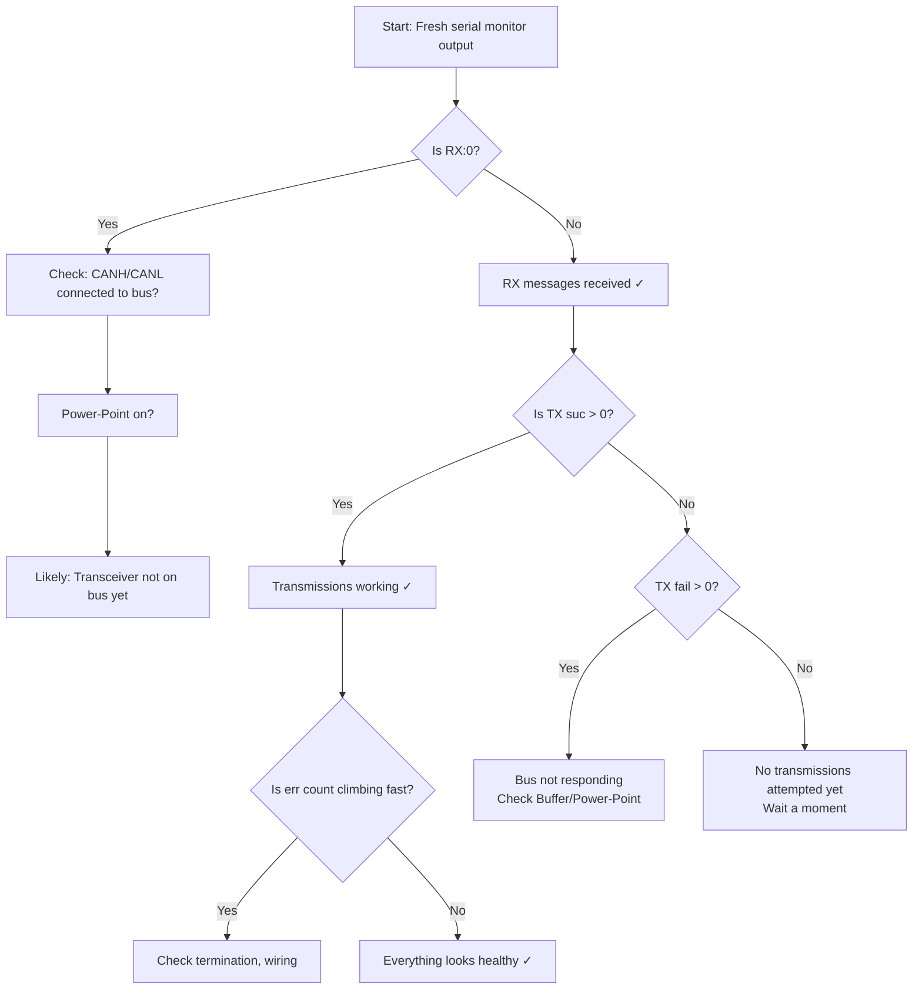

# TWAI Bus Diagnostics and Troubleshooting

> **Skip this section?** If you're not interested in the details of ESP-TWAI message interpretation, you can jump to the next section for a quicker path forward.

As your ESP32 runs, it periodically prints **TWAI status messages** to the serial monitor. These messages tell you how the CAN bus is performing and help diagnose wiring or connection issues.

## Understanding TWAI Status Output

A typical TWAI status line looks like this:

```
ESP-TWAI: RX:42 (pending:0,overrun:0,discard:0,missed:0,lost:0) TX:156 (pending:0,suc:156,fail:0) Bus (arb-loss:0,err:0,state:Running)
```

Let's break this down into sections:

### RX Statistics (Received Messages)

```
RX:42 (pending:0, overrun:0, discard:0, missed:0, lost:0)
```

- **RX:42** — Total CAN messages successfully received so far
- **pending** — Messages waiting to be processed (should be 0 if keep up)
- **overrun** — Messages lost because the receiver buffer filled (bad if > 0; indicates you're receiving faster than you can process)
- **discard** — Messages intentionally dropped (typically 0 for our use case)
- **missed** — CAN frames that arrived but were never read (indicates software latency)
- **lost** — Messages lost due to hardware buffer overflow (very bad; indicates severe timing issues)

**Healthy RX**: All zero or very low pending count, overrun and lost at 0.

### TX Statistics (Transmitted Messages)

```
TX:156 (pending:0, suc:156, fail:0)
```

- **TX:156** — Total CAN messages transmitted
- **pending** — Messages queued but not yet sent (should be 0 under normal conditions)
- **suc:156** — Successfully transmitted frames (acknowledged by the bus)
- **fail:0** — Frames that failed to transmit

**Healthy TX**: `fail` should be 0 (or very low). If `fail` is high, the bus is not responding to your transmissions.

### Bus Status

```
Bus (arb-loss:0, err:0, state:Running)
```

- **arb-loss** — Arbitration losses (you tried to transmit but another node had priority). Normal and okay in multi-node networks.
- **err** — Bus errors (bad wiring, termination issues, electrical noise). Should be 0 or very low.
- **state** — CAN controller state:
  - `Running` — Healthy, actively on the bus
  - `Error-Active` — Minor errors but still transmitting
  - `Error-Passive` — Many errors; not transmitting reliably
  - `Bus-Off` — Fatal errors; controller shut down

**Healthy state**: `Running` with `err:0`.

## Common Scenarios and Diagnostics

### Scenario 1: Everything Looks Good

```
ESP-TWAI: RX:42 (pending:0,overrun:0,discard:0,missed:0,lost:0) TX:156 (pending:0,suc:156,fail:0) Bus (arb-loss:0,err:0,state:Running)
```

**Meaning**: Your CAN bus is working perfectly!

- ✅ Messages are being received and transmitted
- ✅ No errors or overflows
- ✅ Bus is in good health

**Action**: Proceed with JMRI configuration and network testing.

### Scenario 2: High TX Fail Count, RX:0

```
ESP-TWAI: RX:0 (pending:0,overrun:0,discard:0,missed:0,lost:0) TX:16 (pending:16,suc:0,fail:16) Bus (arb-loss:0,err:14642,state:Running)
```

**Meaning**: You're transmitting messages, but **the bus isn't responding**. All transmissions are failing.

**Likely causes**:
- CAN transceiver not connected to the bus (CANH/CANL wires missing or loose)
- No device on the other end of the bus to acknowledge frames
- RR-CirKits modules not powered
- Wrong GPIO pins (though you'd see a different error earlier)

**Diagnostics checklist**:
- [ ] CANH and CANL physically connected to RR-CirKits Buffer?
- [ ] Buffer powered on and USB connected to computer?
- [ ] LCC Power-Point powered on (provides 12V to the bus)?
- [ ] Breadboard connections to GPIO4/GPIO5 solid?
- [ ] Terminating resistors in place (one 120Ω at each bus end)?

**Fix**: Verify your breadboard wiring and CAN bus connections step-by-step.

### Scenario 3: Climbing Error Count, No TX Failure

```
ESP-TWAI: RX:0 (pending:0,overrun:0,discard:0,missed:0,lost:0) TX:42 (pending:0,suc:42,fail:0) Bus (arb-loss:0,err:1823,state:Running)
```

**Meaning**: You're transmitting successfully, but the **error count is rising rapidly**.

**Likely causes**:
- Wiring issues (CANH/CANL shorted, loose connections, incorrect transceiver pins)
- Termination problem (missing one of the two 120Ω resistors, or double-terminated)
- Electrical noise interfering with the signal
- CAN signal not reaching the transceiver correctly

**Diagnostics checklist**:
- [ ] Are CANH and CANL shorted together anywhere?
- [ ] Is the 120Ω resistor between CANH and CANL (SN65HVD230 only)?
- [ ] Do you have exactly **one 120Ω termination at each end** of the bus? Not zero, not two per end.
- [ ] Are the CANH/CANL wires twisted together and away from power lines?
- [ ] Did you use the correct GPIO pins (4 for RX, 5 for TX)?

**Quick test**: Try temporarily removing any termination resistor you added and see if error count drops. If so, you likely have double-termination.

### Scenario 4: RX Messages but TX Issues

```
ESP-TWAI: RX:128 (pending:0,overrun:0,discard:0,missed:0,lost:0) TX:8 (pending:4,suc:2,fail:2) Bus (arb-loss:2,err:0,state:Running)
```

**Meaning**: Your node is receiving messages fine, but **transmissions are inconsistent**.

**Likely causes**:
- CAN bus is congested (many devices transmitting)
- GPIO5 (TXD) connection is loose or poor quality
- Transceiver VCC or GND connection is marginal

**Diagnostics checklist**:
- [ ] GPIO5 jumper wire firmly inserted and not bent?
- [ ] Breadboard power (VCC/GND) clean and stable?
- [ ] Other nodes on the bus active? (If yes, arbitration is expected.)

**Action**: Check GPIO5 connection first; if that's solid, it's likely normal CAN bus contention.

### Scenario 5: RX Overrun

```
ESP-TWAI: RX:512 (pending:42,overrun:18,discard:0,missed:0,lost:0) TX:0 (pending:0,suc:0,fail:0) Bus (arb-loss:0,err:0,state:Running)
```

**Meaning**: The **RX buffer is filling faster than your software can process messages**.

**Likely causes**:
- Another device is flooding the bus with messages
- Your node's event processing is blocking too long
- CAN message rate is too high for the ESP32 to keep up

**This is rare for typical LCC networks.**

**Action**: Check if other nodes on the bus are producing excessive traffic. If not, review your application code for blocking operations in `loop()`.

## Quick Diagnostic Flowchart



## A Note on Harmless High Error Counts

If your node is isolated (not connected to the RR-CirKits Buffer-USB yet), you might see high error counts. This is expected behavior:

- Your node tries to transmit
- No other device acknowledges the frame
- TWAI marks it as a bus error
- Error counter climbs

**This is not a problem**—it means your node is *trying* to communicate, and the hardware is working. Once you connect to the Buffer-USB (which will acknowledge frames), the error count will stabilize.

**Next Chapter**: [Using the ESP32's I/O](../06-io/overview.md)
