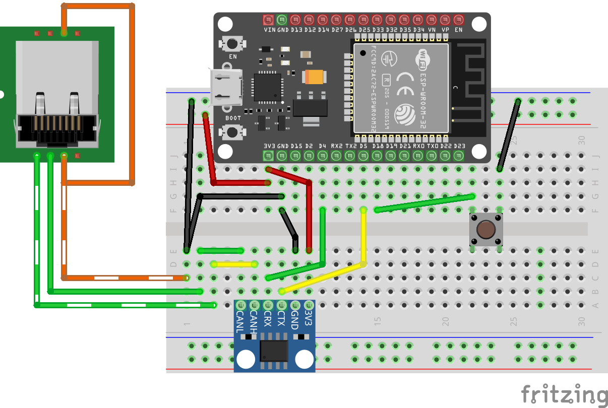
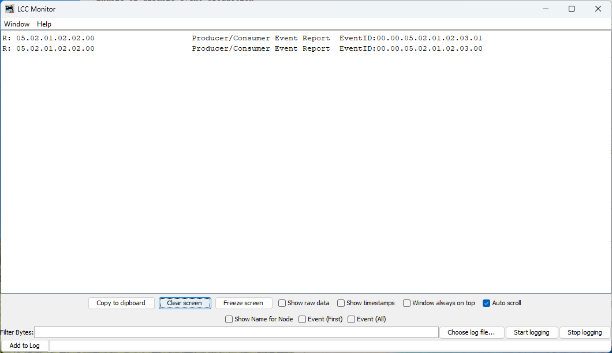
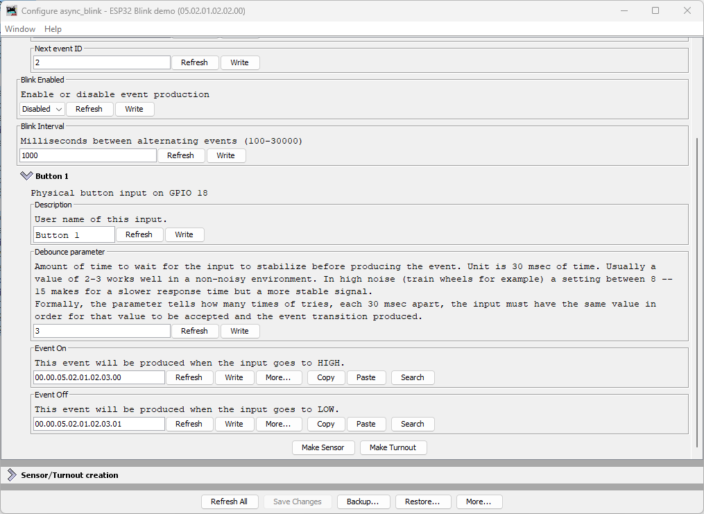

# Adding a Physical Button Input

Now that you have a configurable OpenLCB node with CAN transport, let's add physical hardware interaction. We'll start with a pushbutton input that produces OpenLCB events when pressed and released.

## What You'll Build

In this section, you'll:
- Wire a pushbutton to GPIO 18
- Configure a `ConfiguredProducer` to monitor the button state
- Use `RefreshLoop` for efficient 33Hz polling with hardware debounce
- See the button produce unique event IDs when pressed and released
- Configure the button's behavior through JMRI/LccPro

## Additional Hardware Required

For this section, you'll need:
- **1× Tactile pushbutton switch** (normally-open, momentary contact)
- **Jumper wires** (you already have these from Chapter 5)

**Note:** The ESP32 has internal pull-up resistors, so you don't need external resistors for button inputs. We'll use pull-up (rather than pull-down) configuration—see the "Active-Low vs Active-High" section below for why.

## Hardware Setup

### Breadboard Wiring

  
*Figure: ESP32 with CAN transceiver and pushbutton on breadboard*

Connect the button as follows:
1. **One side of button** → GPIO 18
2. **Other side of button** → GND

That's it! The ESP32's internal pull-up resistor will keep GPIO 18 HIGH when the button is not pressed.

### How It Works

- **Button released (unpressed):** Internal pull-up resistor pulls GPIO 18 HIGH (3.3V) → produces "Event On"
- **Button pressed:** Direct connection to GND pulls GPIO 18 LOW (0V) → produces "Event Off"

This is called **active-low** logic: pressing the button creates the LOW state. 

**Note:** This may seem reversed—you might expect pressing a button to produce "Event On" rather than "Event Off". We'll explain why we use this pull-up configuration (and why we don't use pull-down to make it more intuitive) in the "Active-Low vs Active-High" section below.

## Understanding the Code Changes

We'll add three key components to make the button work:

### 1. GPIO Pin Definition (before OpenMRN stack initialization)

```diff
+// Define GPIO pin for button input (active-low with internal pull-up)
+// When button is pressed, pin reads LOW (0); when released, reads HIGH (1)
+GPIO_PIN(BUTTON, GpioInputPU, 18);
+
+// GPIO initializer - sets up all GPIO pins before OpenMRN stack starts
+typedef GpioInitializer<BUTTON_Pin> GpioInit;
```

**Key points:**
- `GpioInputPU` enables the internal pull-up resistor (see "Active-Low vs Active-High" section for why we use pull-up)
- The pin must be initialized **before** the OpenMRN stack starts
- `GpioInit::hw_init()` will be called in `setup()` before `openmrn.begin()`

### 2. Configuration in config.h

Add a `ProducerConfig` entry to the CDI segment:

```diff
 CDI_GROUP_ENTRY(blink_interval, Uint16ConfigEntry,
                 Default(1000),
                 Min(100),
                 Max(30000),
                 Name("Blink Interval"),
                 Description("Milliseconds between alternating events (100-30000)"));
+CDI_GROUP_ENTRY(button, ProducerConfig,
+                Name("Button 1"),
+                Description("Physical button input on GPIO 18"));
 CDI_GROUP_END();
```

This creates a configuration section for the button with:
- **Description:** User-editable label for this input
- **Event On:** Event ID produced when button is released (pin goes HIGH)
- **Event Off:** Event ID produced when button is pressed (pin goes LOW)
- **Debounce:** Number of polling cycles the input must remain stable

### 3. Producer and Refresh Loop

```diff
 } factory_reset_helper;
 
+// Button producer - monitors GPIO 18 and produces events on state changes
+// Uses RefreshLoop for 33Hz polling (debounce handled by ConfiguredProducer)
+openlcb::ConfiguredProducer button_producer(
+    openmrn.stack()->node(), cfg.seg().button(), BUTTON_Pin());
+
+// RefreshLoop - polls button at 33Hz and handles debouncing
+openlcb::RefreshLoop button_refresh_loop(openmrn.stack()->node(),
+    {button_producer.polling()});
+
 void init_serial() {
```

**How it works:**
- `RefreshLoop` polls the button at 33Hz (~30ms per cycle)
- Each poll calls `button_producer.polling()` which:
  1. Reads the current GPIO state
  2. Compares it to the previous state
  3. If different for `debounce` consecutive cycles → state change confirmed
  4. Produces the appropriate event (On or Off)

### 4. Factory Reset Updates

Initialize the button configuration with default values:

```diff
 void factory_reset(int fd) override
 {
     // Initialize SNIP dynamic data on first boot
     // This data is displayed by JMRI in the node properties dialog
     cfg.userinfo().name().write(fd, openlcb::SNIP_NODE_NAME);
     cfg.userinfo().description().write(fd, openlcb::SNIP_NODE_DESC);
     
     // Initialize application settings with defaults
     cfg.seg().blink_enabled().write(fd, 1);      // Default enabled
     cfg.seg().blink_interval().write(fd, 1000);  // Default 1 second
     
+    // Initialize button producer configuration
+    // Event IDs use NODE_ID base with unique offsets to avoid collision
+    cfg.seg().button().description().write(fd, "Button 1");
+    cfg.seg().button().event_on().write(fd, NODE_ID + 0x0100);   // Released (HIGH)
+    cfg.seg().button().event_off().write(fd, NODE_ID + 0x0101);  // Pressed (LOW)
+    CDI_FACTORY_RESET(cfg.seg().button().debounce);  // Default: 3 (90ms at 33Hz)
+    
     Serial.println("Factory reset: wrote defaults (blink_enabled=Enabled, blink_interval=1000 ms)");
+    Serial.printf("Button events: ON=0x%016llX, OFF=0x%016llX\n", 
+                  NODE_ID + 0x0100, NODE_ID + 0x0101);
 }
```

**Event ID strategy:**
- Base all event IDs on `NODE_ID` to ensure uniqueness

We use offset `+0x0100` for button ON (released) and `+0x0101` for button OFF (pressed). The higher offset provides visual separation from async_blink events and makes button events easy to identify in event IDs. This is just one approach—use whatever offset scheme works for your node.

### 5. Setup() Initialization

Add GPIO initialization before starting the OpenMRN stack:

```diff
 void setup() {
   init_serial();
   init_filesystem();
   
+  // Initialize GPIO pins before OpenMRN stack starts
+  // This ensures pins are in known state before producers/consumers access them
+  GpioInit::hw_init();
+  Serial.println("GPIO initialized: Button on GPIO 18 (active-low with pull-up)");
+  
   can_driver.hw_init();
   init_openlcb_stack();
   openmrn.add_can_port_select("/dev/twai/twai0");
```

**Critical:** GPIO must be initialized **before** `openmrn.begin()` so the producer has a valid pin state to read.

## Complete Working Code

> The complete working code at this point is available on GitHub:
>
> - **PlatformIO version:** [code/platformio/chapter6/v2_button/](https://github.com/openlcb/OpenLCB_Technical_Introduction/tree/master/code/platformio/chapter6/v2_button/)
> - **Arduino IDE version:** [code/arduino/chapter6/v2_button/](https://github.com/openlcb/OpenLCB_Technical_Introduction/tree/master/code/arduino/chapter6/v2_button/)

You can download or clone the repository and open either version to get the exact code with the button input implemented.

## Building and Flashing

### Update CANONICAL_VERSION

Since we're adding a new configuration field, increment the version number in [config.h](d:\src\github\LCC\test\async_blink_esp32\include\config.h):

```diff
 /// Version number for the configuration structure
-static constexpr uint16_t CANONICAL_VERSION = 0x0003;
+static constexpr uint16_t CANONICAL_VERSION = 0x0004;
```

This triggers a factory reset on first boot, initializing the new button configuration.

### Build, Flash, and Monitor

Use PlatformIO's "Upload and Monitor" task:

1. Click the PlatformIO icon in the left sidebar
2. Expand **async_blink_esp32 → esp32doit-devkit-v1 → General**
3. Click **Upload and Monitor**

### Expected Serial Output

```
=== OpenLCB async_blink ESP32 Example ===
Node ID: 0x050201020200
Event 0: 0x0502010202000000
Event 1: 0x0502010202000001

Initializing SPIFFS...
SPIFFS initialized successfully
GPIO initialized: Button on GPIO 18 (active-low with pull-up)
ESP-TWAI: Configuring TWAI (TX:5, RX:4, EXT-CLK:-1, BUS-CTRL:-1)

Creating CDI configuration descriptor...
[CDI] Checking /spiffs/cdi.xml...
[CDI] File /spiffs/cdi.xml is not up-to-date
[CDI] Updating /spiffs/cdi.xml (len 2509)
[CDI] Registering CDI with stack...
Initializing OpenLCB configuration...
Factory reset: wrote defaults (blink_enabled=Enabled, blink_interval=1000 ms)
Button events: ON=0x0000050201020300, OFF=0x0000050201020301

Starting OpenLCB stack...
Starting executor thread...
OpenLCB stack initialized successfully
ESP-TWAI: Starting TWAI driver on:twai0 mode:3ffb42a8 (non-blocking) fd:0
OpenLCB node initialization complete!
Configuration updated: blink_enabled = Enabled, blink_interval = 1000 ms
Entering run mode - will alternate events every 1000 ms
Allocating new alias C41 for node 050201020200
```

**Key observations:**
- Factory reset detected (triggered by `CANONICAL_VERSION` change)
- Button events calculated:
  - ON (released): `0x0000050201020300` (NODE_ID + 0x0100)
  - OFF (pressed): `0x0000050201020301` (NODE_ID + 0x0101)
- Node acquires alias `C41` on the CAN bus

## Testing the Button

### Monitoring Events in LccPro

Open the Traffic Monitor to see button events in real-time:

1. In LccPro, click the **Traffic Monitor** button
2. **Press and release the button**:

  
*Figure: Button produces two distinct events - one for press, one for release*

**What you see:**

Each button press/release cycle produces **two events**:
1. **Button pressed:** `Produce Event: 00.00.05.02.01.02.03.01` (Event Off)
2. **Button released:** `Produce Event: 00.00.05.02.01.02.03.00` (Event On)

**Note the naming:**
- "Event **On**" occurs when GPIO goes **HIGH** (button **released**)
- "Event **Off**" occurs when GPIO goes **LOW** (button **pressed**)

This naming can be counterintuitive at first, but it's consistent with the **electrical state of the GPIO pin**, not the physical button action. We'll explain why later.

### Viewing Button Configuration (Requires Restart)

**Important:** To view the updated button configuration in LccPro, you **must** restart the application to clear its cached CDI. The cache persists even if you refresh or close/reopen the Configure dialog.

**After restarting,** open the Configure dialog for your node:

1. In LccPro, find your node: `async_blink - ESP32 Blink demo (05.02.01.02.02.00)`
2. Right-click → **Configure**
3. Scroll down to the **Button 1** section

  
*Figure: LccPro Configure dialog showing Button 1 configuration*

**What you see:**

| Field | Default Value | Description |
|-------|---------------|-------------|
| **Description** | `Button 1` | User-editable name for this input |
| **Debounce parameter** | `3` | Number of 30ms cycles (90ms total) before state change confirmed |
| **Event On** | `00.00.05.02.01.02.03.00` | Produced when button is **released** (GPIO HIGH) |
| **Event Off** | `00.00.05.02.01.02.03.01` | Produced when button is **pressed** (GPIO LOW) |

### Understanding Debounce

The debounce parameter controls how many consecutive polling cycles the input must remain stable before the event is produced. At 33Hz polling:

- **Debounce = 3** (default): 3 cycles × 30ms = **90ms stabilization time**
- **Debounce = 2**: 2 cycles × 30ms = **60ms** (faster but less noise-immune)
- **Debounce = 8**: 8 cycles × 30ms = **240ms** (very stable, good for noisy environments)

**Typical values:**
- **2-3:** Good for clean pushbuttons in quiet environments
- **8-15:** Recommended for train layouts with electrical noise from motors

## Node Event IDs

Our node now produces multiple event IDs:

| Event | Offset | Full Event ID | Purpose |
|-------|--------|---------------|---------|
| Async Blink 0 | `+0x00` | `05.02.01.02.02.00.00.00` | Alternating event (state 0) |
| Async Blink 1 | `+0x01` | `05.02.01.02.02.00.00.01` | Alternating event (state 1) |
| Button 1 ON | `+0x0100` | `00.00.05.02.01.02.03.00` | Button released (HIGH) |
| Button 1 OFF | `+0x0101` | `00.00.05.02.01.02.03.01` | Button pressed (LOW) |

## Understanding Active-Low vs Active-High

The button in this example uses **active-low** logic:
- Physical button **released** → GPIO pin **HIGH** (3.3V via pull-up) → "Event On"
- Physical button **pressed** → GPIO pin **LOW** (0V to GND) → "Event Off"

### Why Not Active-High (Pull-Down)?

You might reasonably ask: wouldn't it be more intuitive if pressing the button produced "Event On" instead of "Event Off"? With active-high logic using a pull-down resistor, you could wire the button to 3.3V instead of GND:

- Physical button **released** → GPIO pin **LOW** (0V via pull-down) → "Event Off"
- Physical button **pressed** → GPIO pin **HIGH** (3.3V) → "Event On"

This would align the physical action (pressing) with the logical "On" state. **And the ESP32 does have internal pull-down resistors** (`GpioInputPD`) that would make this possible.

### The OpenMRN/OpenMRNLite Bug

Unfortunately (as of December 2025), there's a **bug in OpenMRN's ESP32 GPIO implementation** that prevents using pull-down resistors on most pins. In the file `Esp32Gpio.hxx`, there's a static assertion to prevent enabling pull-down on GPIO pins 0, 5, and 15 (which have hardware pull-ups on most ESP32 boards):

```cpp
// GPIO 0, 5 and 15 typically have pull-up resistors.
static_assert(!PDEN ||
              (PDEN && (PIN_NUM != 0 && PIN_NUM != 5 && PIN_NUM == 15)),
              //                                           ^^
              // BUG: Should be != 15, not == 15
              "GPIO 0, 5, 15 typically have built-in pull-up resistors, "
              "enabling pull-down is not possible.");
```

**The bug:** The condition says `PIN_NUM == 15` when it should say `PIN_NUM != 15`. This reversed logic means:
- **Intended:** Block pull-down on pins 0, 5, and 15
- **Actual:** Block pull-down on **all pins except 15**

When you try to use `GpioInputPD` on GPIO 18, you get a compile error:

```
error: static assertion failed: GPIO 0, 5, 15 typically have built-in 
pull-up resistors, enabling pull-down is not possible.
```

This bug exists in both **OpenMRNLite** (the Arduino library) and the current **master branch of OpenMRN** (as of December 2025).

### Why Use Pull-Up Anyway?

Even without the bug, **active-low with pull-up is the standard pattern** for pushbuttons in embedded systems:

1. **Noise immunity:** Pull-up resistor provides a defined HIGH state when the button is open (not pressed)
2. **Simplicity:** Button connects GPIO directly to GND—no need to route 3.3V to the button
3. **Safety:** If a wire comes loose, the pin floats HIGH (safe idle state) rather than floating LOW
4. **Industry convention:** Most schematics and examples use active-low buttons

So while the inverted logic (pressed = "off") feels backwards at first, it's actually the **preferred approach** independent of the OpenMRN bug.

**Bottom line:** We use `GpioInputPU` (pull-up) both because of the bug and because it's best practice for button inputs.

## Common Issues and Troubleshooting

### Button events not appearing in JMRI/LccPro

**Symptom:** Traffic Monitor shows async_blink events but no button events.

**Fixes:**
1. **Verify wiring:** One button pin to GPIO 18, other to GND
2. **Check CDI cache:** Did you restart JMRI/LccPro after flashing?
3. **Test serial output:** Does it show "GPIO initialized: Button on GPIO 18"?
4. **Verify factory reset:** Check for "Button events: ON=..." in serial output

### Button produces events continuously or erratically

**Symptom:** Traffic Monitor floods with button events without touching the button.

**Possible causes:**
1. **Loose connection:** Check breadboard contacts and jumper wires
2. **Wrong pull-up/pull-down:** Ensure you used `GpioInputPU` (pull-**up**), not `GpioInputPD`
3. **Electrical noise:** Try increasing debounce from 3 to 8 or higher
4. **Floating pin:** Verify GND connection is solid

### Wrong event IDs in JMRI

**Symptom:** Button events show different IDs than expected.

**Fixes:**
1. **Factory reset required:** Delete `/spiffs/openlcb_config` and `/spiffs/cdi.xml`, then reboot
2. **Node ID mismatch:** Verify `NODE_ID` in code matches what JMRI shows
3. **Manual configuration:** Someone may have changed Event On/Off in JMRI - restore defaults

## What's Next

You've successfully added a physical input to your OpenLCB node! The button can now:
- ✅ Produce unique events when pressed and released
- ✅ Be configured through JMRI/LccPro (description, debounce, event IDs)
- ✅ Operate reliably with hardware debouncing

In the next section, we'll add **LED outputs** using `ConfiguredConsumer` so your node can **respond to events** from other nodes on the network—creating true two-way communication.

## Complete Code Files

For reference, here are the complete updated files:

### config.h (excerpt - button section)

```diff
 /// Version number for the configuration structure
-/// NOTE: Incremented to 0x0003 when adding blink_enabled and reserved space
-static constexpr uint16_t CANONICAL_VERSION = 0x0003;
+/// NOTE: Incremented to 0x0004 when adding button configuration
+static constexpr uint16_t CANONICAL_VERSION = 0x0004;
 
 /// Minimal configuration segment with application settings
 CDI_GROUP(AsyncBlinkSegment, Segment(MemoryConfigDefs::SPACE_CONFIG), Offset(128));
 CDI_GROUP_ENTRY(internal_config, InternalConfigData);
 CDI_GROUP_ENTRY(blink_enabled, Uint8ConfigEntry,
                 Default(1),
                 Min(0), Max(1),
                 MapValues(BOOLEAN_MAP),
                 Name("Blink Enabled"),
                 Description("Enable or disable event production"));
 CDI_GROUP_ENTRY(blink_interval, Uint16ConfigEntry,
                 Default(1000),
                 Min(100),
                 Max(30000),
                 Name("Blink Interval"),
                 Description("Milliseconds between alternating events (100-30000)"));
+CDI_GROUP_ENTRY(button, ProducerConfig,
+                Name("Button 1"),
+                Description("Physical button input on GPIO 18"));
 CDI_GROUP_END();
```

### main.cpp (key additions)

```diff
 // ConfigDef comes from config.h and defines the configuration layout
 static constexpr openlcb::ConfigDef cfg(0);
 
+// Define GPIO pin for button input (active-low with internal pull-up)
+// When button is pressed, pin reads LOW (0); when released, reads HIGH (1)
+GPIO_PIN(BUTTON, GpioInputPU, 18);
+
+// GPIO initializer - sets up all GPIO pins before OpenMRN stack starts
+typedef GpioInitializer<BUTTON_Pin> GpioInit;
+
 // OpenLCB configuration - required by OpenMRNLite
 namespace openlcb {
 
...

 } factory_reset_helper;
 
+// Button producer - monitors GPIO 18 and produces events on state changes
+openlcb::ConfiguredProducer button_producer(
+    openmrn.stack()->node(), cfg.seg().button(), BUTTON_Pin());
+
+// RefreshLoop - polls button at 33Hz and handles debouncing
+openlcb::RefreshLoop button_refresh_loop(openmrn.stack()->node(),
+    {button_producer.polling()});
+
 void init_serial() {
 
...

     cfg.seg().blink_enabled().write(fd, 1);      // Default enabled
     cfg.seg().blink_interval().write(fd, 1000);  // Default 1 second
     
+    // Initialize button producer configuration
+    cfg.seg().button().description().write(fd, "Button 1");
+    cfg.seg().button().event_on().write(fd, NODE_ID + 0x0100);
+    cfg.seg().button().event_off().write(fd, NODE_ID + 0x0101);
+    CDI_FACTORY_RESET(cfg.seg().button().debounce);
+    Serial.printf("Button events: ON=0x%016llX, OFF=0x%016llX\n", 
+                  NODE_ID + 0x0100, NODE_ID + 0x0101);
+
     Serial.println("Factory reset: wrote defaults...");
 
...

 void setup() {
   init_serial();
   init_filesystem();
   
+  GpioInit::hw_init();
+  Serial.println("GPIO initialized: Button on GPIO 18 (active-low with pull-up)");
+  
   can_driver.hw_init();
   init_openlcb_stack();
```
