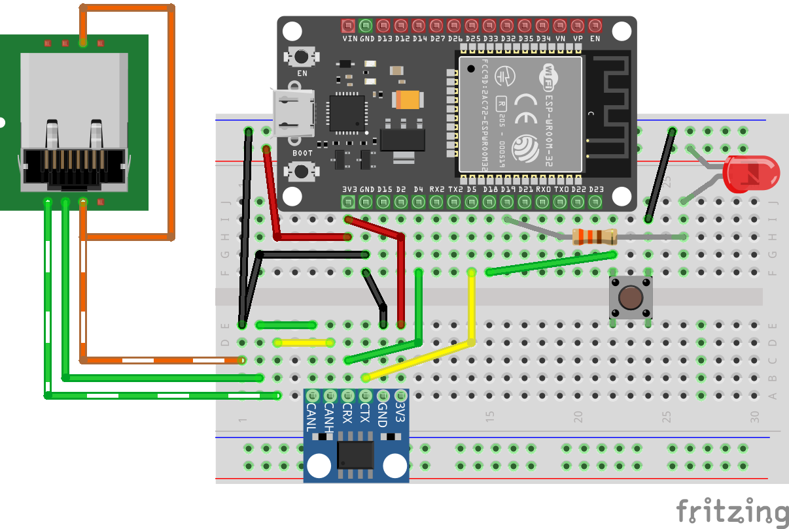
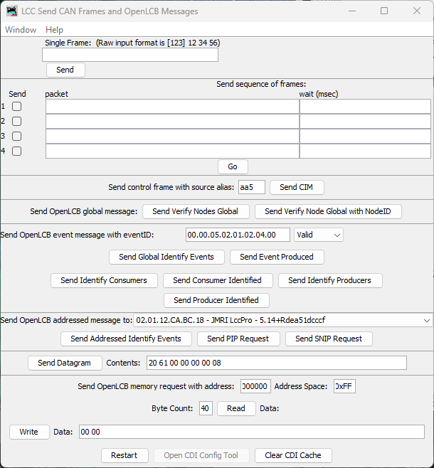
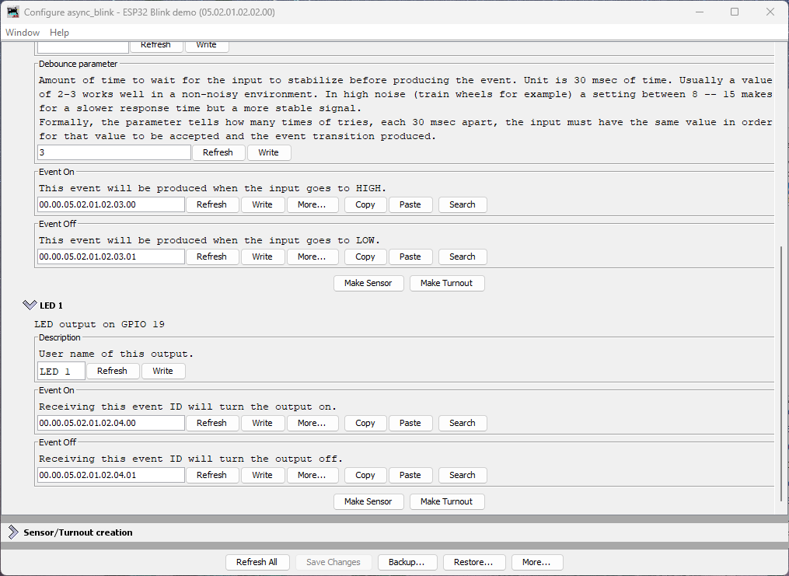

# Adding an LED Output

Now that you have a working button input that produces events, let's add an LED output that consumes events. This demonstrates the core producer/consumer model of OpenLCB: producers send events, consumers respond to them.

## What You'll Build

In this section, you'll:
- Wire an LED to GPIO 19
- Configure a `ConfiguredConsumer` to control the LED based on events
- Test the LED manually using LccPro's Send Frame feature
- Link the button's events to the LED's actions, creating an interactive button-LED pair

## Additional Hardware Required

For this section, you'll need:
- **1× LED** (any color, standard 5mm or 3mm)
- **1× Current-limiting resistor** (220Ω to 1kΩ recommended)
- **Jumper wires** (you already have these)

**Resistor value guide:**
- **220Ω**: Brighter LED, safe for most 20mA LEDs
- **470Ω**: Medium brightness, good general-purpose value
- **1kΩ**: Dimmer but very safe, good for high-efficiency LEDs

## Hardware Setup

### Breadboard Wiring


*Figure: ESP32 with CAN transceiver, button, and LED on breadboard*

Connect the LED as follows:
1. **GPIO 19** → **Resistor** → **LED anode (+, longer leg)**
2. **LED cathode (-, shorter leg)** → **GND**

**Important:** Always use a current-limiting resistor with LEDs. Without it, the LED will draw excessive current and may damage the ESP32's GPIO pin or the LED itself.

### How It Works

This is an **active-high** configuration:
- GPIO 19 **HIGH** (3.3V) → Current flows through resistor and LED → LED **on**
- GPIO 19 **LOW** (0V) → No current flow → LED **off**

Unlike the button (which uses active-low logic due to pull-up resistors), LEDs are simpler: setting the pin HIGH turns them on, setting it LOW turns them off.

## Understanding the Code Changes

We'll add three components to make the LED work:

### 1. GPIO Pin Definition

```diff
 // Define GPIO pin for button input (active-low with internal pull-up)
 // When button is pressed, pin reads LOW (0); when released, reads HIGH (1)
 GPIO_PIN(BUTTON, GpioInputPU, 18);
 
+// Define GPIO pin for LED output (active-high)
+// When event ON received, LED turns on (HIGH); when event OFF received, LED turns off (LOW)
+GPIO_PIN(LED, GpioOutputSafeLow, 19);
+
 // GPIO initializer - sets up all GPIO pins before OpenMRN stack starts
-typedef GpioInitializer<BUTTON_Pin> GpioInit;
+typedef GpioInitializer<BUTTON_Pin, LED_Pin> GpioInit;
```

**Key points:**
- `GpioOutputSafeLow` initializes the pin as an output, starting in the LOW (off) state
- The LED pin is added to the `GpioInitializer` list
- OpenMRNLite will manage the LED state—we don't manually control it

### 2. Configuration in config.h

Add `ConfiguredConsumer` include and a `ConsumerConfig` entry:

```diff
 #include "openlcb/ConfigRepresentation.hxx"
 #include "openlcb/ConfiguredProducer.hxx"
+#include "openlcb/ConfiguredConsumer.hxx"
 #include "openlcb/MemoryConfig.hxx"
```

```diff
 /// Version number for the configuration structure
-static constexpr uint16_t CANONICAL_VERSION = 0x0004;
+static constexpr uint16_t CANONICAL_VERSION = 0x0005;
```

```diff
 CDI_GROUP_ENTRY(button, ProducerConfig,
                 Name("Button 1"),
                 Description("Physical button input on GPIO 18"));
+CDI_GROUP_ENTRY(led, ConsumerConfig,
+                Name("LED 1"),
+                Description("LED output on GPIO 19"));
 CDI_GROUP_END();
```

This creates a configuration section for the LED with:
- **Description:** User-editable label for this output
- **Event On:** Event ID that turns the LED on
- **Event Off:** Event ID that turns the LED off

### 3. Consumer Instance

```diff
 // Button producer - monitors GPIO 18 and produces events on state changes
 // Uses RefreshLoop for 33Hz polling (debounce handled by ConfiguredProducer)
 openlcb::ConfiguredProducer button_producer(
     openmrn.stack()->node(), cfg.seg().button(), BUTTON_Pin());
 
+// LED consumer - listens for events and controls GPIO 19
+openlcb::ConfiguredConsumer led_consumer(
+    openmrn.stack()->node(), cfg.seg().led(), LED_Pin());
+
 // RefreshLoop - polls button at 33Hz and handles debouncing
 openlcb::RefreshLoop button_refresh_loop(openmrn.stack()->node(),
     {button_producer.polling()});
```

**How it works:**
- `ConfiguredConsumer` automatically registers with the OpenMRN event system
- When any node on the network produces a matching event:
  1. OpenMRN routes the event to the consumer
  2. Consumer compares event ID to configured ON/OFF events
  3. If match found → sets GPIO pin to appropriate state
- No polling required—event-driven design

### 4. Factory Reset Updates

Initialize the LED configuration with default values:

```diff
     // Initialize button producer configuration
     // Event IDs use NODE_ID base with unique offsets to avoid collision
     cfg.seg().button().description().write(fd, "Button 1");
     cfg.seg().button().event_on().write(fd, NODE_ID + 0x0100);   // Released (HIGH)
     cfg.seg().button().event_off().write(fd, NODE_ID + 0x0101);  // Pressed (LOW)
     CDI_FACTORY_RESET(cfg.seg().button().debounce);  // Default: 3 (90ms at 33Hz)
     
+    // Initialize LED consumer configuration
+    cfg.seg().led().description().write(fd, "LED 1");
+    cfg.seg().led().event_on().write(fd, NODE_ID + 0x0200);   // Turn LED on
+    cfg.seg().led().event_off().write(fd, NODE_ID + 0x0201);  // Turn LED off
+    
     Serial.println("Factory reset: wrote defaults (blink_enabled=Enabled, blink_interval=1000 ms)");
     Serial.printf("Button events: ON=0x%016llX, OFF=0x%016llX\n", 
                   NODE_ID + 0x0100, NODE_ID + 0x0101);
+    Serial.printf("LED events: ON=0x%016llX, OFF=0x%016llX\n", 
+                  NODE_ID + 0x0200, NODE_ID + 0x0201);
 }
```

**Event ID strategy:**
- LED uses offset `+0x0200` and `+0x0201` to keep it distinct from button events (`+0x0100`/`+0x0101`)
- This makes it easy to identify which events control which I/O when looking at traffic

## Building and Flashing

### Update CANONICAL_VERSION

We've already incremented the version to `0x0005` in the code above. This triggers a factory reset on first boot, initializing the LED configuration.

### Build, Flash, and Monitor

Use PlatformIO's **Upload and Monitor** task as before.

### Expected Serial Output

```
=== OpenLCB async_blink ESP32 Example ===
Node ID: 0x050201020200
Event 0: 0x0502010202000000
Event 1: 0x0502010202000001

Initializing SPIFFS...
SPIFFS initialized successfully
GPIO initialized: Button on GPIO 18 (active-low with pull-up), LED on GPIO 19 (active-high)
ESP-TWAI: Configuring TWAI (TX:5, RX:4, EXT-CLK:-1, BUS-CTRL:-1)

Creating CDI configuration descriptor...
[CDI] Updating /spiffs/cdi.xml (len 2748)
Initializing OpenLCB configuration...
Factory reset: wrote defaults (blink_enabled=Enabled, blink_interval=1000 ms)
Button events: ON=0x0000050201020300, OFF=0x0000050201020301
LED events: ON=0x0000050201020400, OFF=0x0000050201020401

Starting OpenLCB stack...
OpenLCB node initialization complete!
```

**Key observations:**
- Factory reset detected (version changed from 0x0004 to 0x0005)
- LED events initialized:
  - ON: `0x0000050201020400` (NODE_ID + 0x0200)
  - OFF: `0x0000050201020401` (NODE_ID + 0x0201)

## Testing the LED

We'll test the LED in two ways:
1. **Manual testing** with LccPro's Send Frame feature (verifies the LED consumer works)
2. **Configuration** to link the button's events to the LED's actions (creates interactive behavior)

### Method 1: Manual Testing with Send Frame

This procedure uses LccPro to send events manually, confirming your LED responds correctly before linking it to the button.

#### Steps

1. Open **JMRI** and launch **LccPro**
2. In the menu bar, choose **LCC → Send Frame**

   
   
   *Figure: LccPro Send Frame dialog*

3. Locate the section titled **Send OpenLCB event message with eventID**
4. In the **eventID** field, enter your LED's ON event in dot-separated hex format:
   ```
   00.00.05.02.01.02.04.00
   ```
5. In the **Status** dropdown, select **Valid**
   - "Valid" means "this event is being produced/asserted by a producer"
6. Click the button labeled **Send Event Produced**

**What happens:**
- LccPro broadcasts a Producer/Consumer Event Report with your event ID
- Your node's LED consumer receives it
- LED turns **on**

7. Now test the OFF event. Enter:
   ```
   00.00.05.02.01.02.04.01
   ```
8. Status: **Valid** → Click **Send Event Produced**
9. LED turns **off**

**Success criteria:**
- ✅ LED turns on when you send the ON event
- ✅ LED turns off when you send the OFF event
- ✅ LED responds immediately (within ~100ms)

If the LED doesn't respond, check:
- Wiring (resistor, LED polarity)
- Event IDs match exactly (check serial output for actual values)
- Node is online (visible in LccPro node list)

### Method 2: Linking Button to LED

Once you've confirmed the LED responds to events, you can configure it to respond to your button's producer events. This creates true interactive behavior: press the button, LED changes state.

Because both the button and LED are part of the same node, you can wire them together entirely inside that node's **Configure** dialog by copying the button's producer event IDs and pasting them into the LED's consumer event fields.

#### Steps

1. In LccPro, click the **Configure** button for your node in the node list

     

   *Figure: Node Configure dialog showing Button 1 and LED 1 sections*

**What you see:**
- **Button 1** section with Event On and Event Off fields (each has a **Copy** button)
- **LED 1** section with Event On and Event Off fields (each has a **Paste** button)

#### Understanding Button Event Naming

The button's event naming refers to the **electrical state of the GPIO pin**, not the physical button action:

- **Event On**: Produced when GPIO goes **HIGH** (button **released**)
- **Event Off**: Produced when GPIO goes **LOW** (button **pressed**)

This is due to the active-low pull-up wiring we used in the button section.

#### Connecting Button to LED (Pressed = LED On)

To make pressing the button turn the LED **on**, we need to map:
- Button's "Event **Off**" (pressed) → LED's "Event **On**" (turn on)
- Button's "Event **On**" (released) → LED's "Event **Off**" (turn off)

**Steps:**

4. In the **Button 1** section, click **Copy** next to the **Event Off** field
   - This copies the button's "pressed" event ID to the clipboard

5. In the **LED 1** section, click **Paste** next to the LED's **Event On** field
   - This tells the LED to turn **on** when the button is pressed

6. Return to the **Button 1** section, click **Copy** next to the **Event On** field
   - This copies the button's "released" event ID

7. In the **LED 1** section, click **Paste** next to the LED's **Event Off** field
   - This tells the LED to turn **off** when the button is released

8. Click **Write** next to each changed field (or use **Save Changes** at the bottom)

#### What This Mapping Does

You've just configured:
- **Button pressed** (produces Event Off `...03.01`) → **LED turns on**
- **Button released** (produces Event On `...03.00`) → **LED turns off**

This creates **momentary button behavior** with the expected physical action: pressing the button turns on the LED.

#### Testing Interactive Behavior

1. **Press the button** → LED turns **on**
2. **Release the button** → LED turns **off**

#### Experimenting Further

Now that you understand the basics, try these exercises to deepen your understanding:

**Restore Original Event IDs:**
If you want to restore the LED's original event IDs (without reflashing firmware), click the **More...** button in the Configure dialog and select **Factory Reset**. This will restore all configuration values to their defaults, including the LED's event IDs.

**Try Different Event Sources:**
Instead of mapping the button to the LED, try mapping the async_blink events to control the LED. These events are hardcoded in the firmware (not configurable via JMRI):
- Async Blink Event 0: `05.02.01.02.02.00.00.00`
- Async Blink Event 1: `05.02.01.02.02.00.00.01`

You can map them to the LED:
- Copy Event 0 to LED's Event Off
- Copy Event 1 to LED's Event On
- The LED will now blink in sync with the alternating events (if blink is enabled)

This demonstrates that consumers can respond to *any* producer on the network—the LED doesn't "know" or "care" whether events come from a button, a timer, or another node entirely.

#### Why Copy/Paste Instead of Automatic Linking?

You might wonder why OpenLCB requires manually copying event IDs rather than just selecting "connect to Button 1." This is because:

- **Event IDs are the fundamental unit** of OpenLCB—all communication is event-based
- **Flexibility**: Your LED could respond to events from *any* producer on the network, not just your local button
- **Multiple consumers**: One button can control many LEDs, servos, relays, etc.
- **Cross-node wiring**: Events work identically whether the producer and consumer are in the same node or across the layout

The copy/paste workflow in the Configure dialog is simply a convenience for the common case of wiring two I/O points within the same node.

## Understanding ConfiguredConsumer

The `ConfiguredConsumer` class provides event-driven GPIO control:

**How it works internally:**
1. During initialization, consumer registers its event IDs with OpenMRN's event system
2. When **any** node on the network produces an event:
   - OpenMRN checks all registered consumers (when `openmrn.loop()` is called)
   - If event ID matches consumer's ON event → calls consumer's `set(true)` method
   - If event ID matches consumer's OFF event → calls consumer's `set(false)` method
3. Consumer's `set()` method updates the GPIO pin state

**Key characteristics:**
- **Event-driven GPIO control:** Consumer doesn't poll the GPIO pin; it only sets it when events arrive
- **Requires openmrn.loop():** OpenMRNLite is single-threaded, so `openmrn.loop()` must be called frequently to process incoming CAN/network messages and dispatch events to consumers
- **Network-agnostic:** Works with any producer on the network (local or remote)
- **Configurable:** Event IDs can be changed via JMRI without reflashing firmware

**Comparison to ConfiguredProducer:**

| Feature | ConfiguredProducer | ConfiguredConsumer |
|---------|--------------------|--------------------|
| **Direction** | GPIO → Events | Events → GPIO |
| **GPIO Polling** | Yes (via RefreshLoop at 33Hz) | No (only sets GPIO when event received) |
| **Network Processing** | Requires openmrn.loop() | Requires openmrn.loop() |
| **Debounce** | Yes (configurable) | N/A |
| **Use cases** | Buttons, sensors, detectors | LEDs, relays, servos |

**Note on openmrn.loop():** In the full OpenMRN implementation (used on platforms with RTOS like FreeRTOS), event processing happens in separate threads. In OpenMRNLite (Arduino), everything is single-threaded, so `openmrn.loop()` must be called frequently in your main `loop()` function to process incoming messages—this is true for both producers and consumers.

## Node Event IDs Summary

Your node now handles multiple event IDs:

| Event | Offset | Full Event ID | Purpose | Type |
|-------|--------|---------------|---------|------|
| Async Blink 0 | `+0x00` | `05.02.01.02.02.00.00.00` | Alternating event (state 0) | Producer |
| Async Blink 1 | `+0x01` | `05.02.01.02.02.00.00.01` | Alternating event (state 1) | Producer |
| Button 1 ON | `+0x0100` | `00.00.05.02.01.02.03.00` | Button released (HIGH) | Producer |
| Button 1 OFF | `+0x0101` | `00.00.05.02.01.02.03.01` | Button pressed (LOW) | Producer |
| LED 1 ON | `+0x0200` | `00.00.05.02.01.02.04.00` | Turn LED on | Consumer |
| LED 1 OFF | `+0x0201` | `00.00.05.02.01.02.04.01` | Turn LED off | Consumer |

## Common Issues and Troubleshooting

### LED doesn't respond to Send Frame events

**Symptom:** Sending events via LccPro has no effect on LED.

**Fixes:**
1. **Check wiring:** Verify resistor is in series, LED polarity is correct (long leg to resistor)
2. **Verify event IDs:** Use serial monitor output to confirm actual event IDs
3. **Check GPIO pin:** Ensure no conflict with other peripherals (WiFi, etc.)
4. **Test GPIO manually:** Temporarily add `LED_Pin::set(true)` in setup() to verify wiring

### LED works with Send Frame but not with button

**Symptom:** Manual events work, but button press doesn't control LED.

**Fixes:**
1. **Verify mapping:** Open LccPro Configure Nodes → Consumers tab, confirm button events are mapped
2. **Check button producer:** Verify button events appear in Traffic Monitor when pressed
3. **Restart LccPro:** Clear CDI cache after any firmware changes
4. **Write to Node:** Ensure you clicked "Write to Node" after configuring

### LED behavior is inverted (pressed = on instead of off)

**Symptom:** LED turns on when you want it off, and vice versa.

**Not actually a problem!** This is due to active-low button logic. See "Why is it inverted?" above for solutions.

### LED stays on or flickers randomly

**Symptom:** LED doesn't turn off cleanly or flickers.

**Possible causes:**
1. **No current-limiting resistor:** LED drawing too much current, damaging GPIO
2. **Loose wiring:** Check breadboard connections
3. **Wrong event mapping:** Two producers sending conflicting events
4. **Electrical noise:** Try adding 0.1µF capacitor between GPIO 19 and GND

## What's Next

You've now built a complete interactive OpenLCB I/O node with:
- ✅ Button input producing events
- ✅ LED output consuming events
- ✅ Configuration via LccPro
- ✅ Manual testing with Send Frame
- ✅ Button-to-LED mapping for interactive behavior

This is the foundation of all OpenLCB control panels, layout automation, and accessory control. Every turnout, signal, detector, and indicator uses this same producer/consumer pattern—just scaled up.

In the next section, we'll explore how to **scale to multiple buttons and LEDs** efficiently using OpenMRNLite's `RepeatedGroup` pattern and `MultiConfiguredConsumer` for memory optimization.

## Complete Code Files

For reference, here are the key code changes:

### config.h (LED consumer addition)

```diff
 #include "openlcb/ConfigRepresentation.hxx"
 #include "openlcb/ConfiguredProducer.hxx"
+#include "openlcb/ConfiguredConsumer.hxx"
 #include "openlcb/MemoryConfig.hxx"
 
...

 /// Version number for the configuration structure
-/// NOTE: Incremented to 0x0004 when adding button configuration
-static constexpr uint16_t CANONICAL_VERSION = 0x0004;
+/// NOTE: Incremented to 0x0005 when adding LED consumer
+static constexpr uint16_t CANONICAL_VERSION = 0x0005;
 
...

 CDI_GROUP_ENTRY(button, ProducerConfig,
                 Name("Button 1"),
                 Description("Physical button input on GPIO 18"));
+CDI_GROUP_ENTRY(led, ConsumerConfig,
+                Name("LED 1"),
+                Description("LED output on GPIO 19"));
 CDI_GROUP_END();
```

### main.cpp (LED consumer implementation)

```diff
 GPIO_PIN(BUTTON, GpioInputPU, 18);
 
+// Define GPIO pin for LED output (active-high)
+GPIO_PIN(LED, GpioOutputSafeLow, 19);
+
 // GPIO initializer - sets up all GPIO pins before OpenMRN stack starts
-typedef GpioInitializer<BUTTON_Pin> GpioInit;
+typedef GpioInitializer<BUTTON_Pin, LED_Pin> GpioInit;
 
...

 openlcb::ConfiguredProducer button_producer(
     openmrn.stack()->node(), cfg.seg().button(), BUTTON_Pin());
 
+// LED consumer - listens for events and controls GPIO 19
+openlcb::ConfiguredConsumer led_consumer(
+    openmrn.stack()->node(), cfg.seg().led(), LED_Pin());
+
 openlcb::RefreshLoop button_refresh_loop(openmrn.stack()->node(),
     {button_producer.polling()});
 
...

     cfg.seg().button().event_off().write(fd, NODE_ID + 0x0101);
     CDI_FACTORY_RESET(cfg.seg().button().debounce);
     
+    // Initialize LED consumer configuration
+    cfg.seg().led().description().write(fd, "LED 1");
+    cfg.seg().led().event_on().write(fd, NODE_ID + 0x0200);
+    cfg.seg().led().event_off().write(fd, NODE_ID + 0x0201);
+    
     Serial.println("Factory reset: wrote defaults...");
     Serial.printf("Button events: ON=0x%016llX, OFF=0x%016llX\n", 
                   NODE_ID + 0x0100, NODE_ID + 0x0101);
+    Serial.printf("LED events: ON=0x%016llX, OFF=0x%016llX\n", 
+                  NODE_ID + 0x0200, NODE_ID + 0x0201);
```
