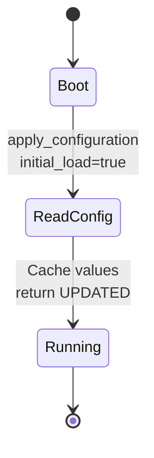
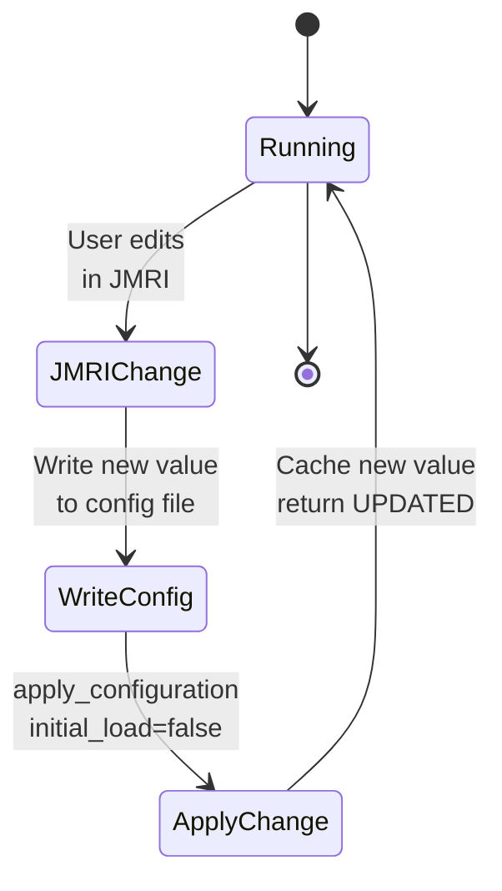
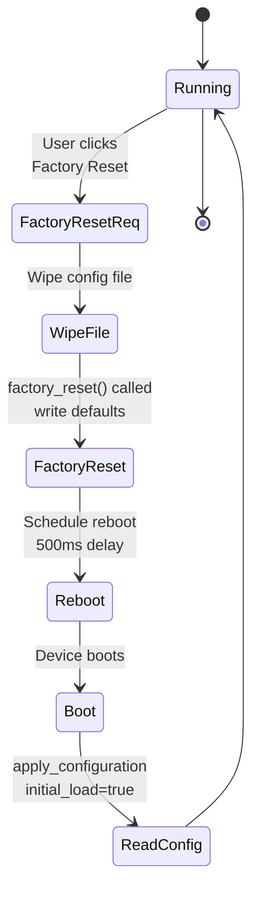

# Understanding Configuration Updates and Versioning

After implementing the blink interval setting in the previous section, let's explore the conceptual mechanisms that make configuration work reliably.

## The apply_configuration() Lifecycle

The `apply_configuration()` method in your node is called automatically by OpenMRN in three distinct scenarios. Understanding when and why it's called helps you design robust configuration handling.

### Scenario 1: First Boot (initial_load=true)



**What happens:**
- Device powers on, `setup()` runs
- ConfigUpdateFlow opens config file (creates new file with zeros if it doesn't exist)
- `apply_configuration(fd, initial_load=true, ...)` called
- You read defaults from config file and cache them in global variables

### Scenario 2: JMRI Configuration Change (initial_load=false)



**What happens:**
- User edits a setting in JMRI and clicks "Write"
- JMRI sends datagram to ESP32 with new value
- ESP32 writes value to config file at the appropriate offset
- User clicks "Update Complete" 
- OpenMRN calls `apply_configuration(fd, initial_load=false, ...)`
- You read the new value from file and update your cache

### Scenario 3: Factory Reset



**What happens:**
- User clicks "Factory Reset" in JMRI
- OpenMRN wipes entire config file to zeros
- Your `factory_reset(fd)` method is called
- You write all default values to file
- Device automatically reboots after 500ms
- On next boot, `apply_configuration()` runs as usual with defaults

**Code example:**
```cpp
UpdateAction apply_configuration(int fd, bool initial_load, ...) {
    event_interval = cfg.seg().blink_interval().read(fd);
    Serial.printf("Configuration loaded: blink_interval = %lu ms\n", event_interval);
    return UPDATED;
}
```

**Important detail**: On first boot, OpenMRN automatically calls `factory_reset()` before `apply_configuration()`. This means:
1. `factory_reset(fd)` writes all defaults to the file
2. `apply_configuration(fd, initial_load=true, ...)` then reads those freshly-written defaults

So you always get your defaults on first boot—never zeros.

**Key point**: File update happens before `apply_configuration()` is called. By the time your method runs, the new value is already in SPIFFS. You read it from file and cache it in globals.

## CANONICAL_VERSION and Schema Evolution

In your `config.h`, you have:

```cpp
static constexpr uint16_t CANONICAL_VERSION = 0x0001;
```

This version number tracks your configuration schema, not your application version. Here's why it matters:

### What Happens on Version Match

```
Boot:
  OpenMRN reads version from config file (0x0001)
  Compares to CANONICAL_VERSION in code (0x0001)
  ✓ Match! Use config file as-is
  apply_configuration() called with existing data
```

### What Happens on Version Mismatch

```
Boot:
  OpenMRN reads version from config file (0x0001)
  Compares to CANONICAL_VERSION in code (0x0002)  // ← You incremented the version!
  ✗ Mismatch!
  Triggers complete factory reset:
    - Wipes entire config file
    - Calls your factory_reset(fd)
    - You write new schema with defaults
    - Device reboots
    - apply_configuration() runs with fresh defaults
```

**Why do this?**

Imagine you add a new configuration field:

```cpp
// v0.0001
CDI_GROUP(AsyncBlinkSegment, ...);
  CDI_GROUP_ENTRY(internal_config, InternalConfigData);
  CDI_GROUP_ENTRY(blink_interval, Uint16ConfigEntry, Default(1000));
CDI_GROUP_END();

// Later, v0.0002 (added new field)
CDI_GROUP(AsyncBlinkSegment, ...);
  CDI_GROUP_ENTRY(internal_config, InternalConfigData);
  CDI_GROUP_ENTRY(blink_interval, Uint16ConfigEntry, Default(1000));
  CDI_GROUP_ENTRY(blink_delay, Uint16ConfigEntry, Default(100));  // ← NEW!
CDI_GROUP_END();
```

The old config file only has data for `blink_interval`. The new field `blink_delay` has no data in the old file. OpenMRN can't know what default to use or where the data should be. So it **wipes the file and starts fresh**, writing both fields with their defaults.

This is conservative but safe: you never have partially-initialized fields. The cost is that users lose custom settings (node names, etc.) when you bump the version.

## Reserved Space Technique

To evolve your configuration without losing user customization, use reserved space:

```cpp
CDI_GROUP(AsyncBlinkSegment, Segment(MemoryConfigDefs::SPACE_CONFIG), Offset(128));
CDI_GROUP_ENTRY(internal_config, InternalConfigData);
CDI_GROUP_ENTRY(blink_interval, Uint16ConfigEntry, Default(1000));

// Reserve space for future fields (don't bump version when adding them)
CDI_GROUP_ENTRY(reserved_1, Uint16ConfigEntry, Default(0));
CDI_GROUP_ENTRY(reserved_2, Uint32ConfigEntry, Default(0));
// If you later add a real field, move it from reserved space
// This avoids a version bump and factory reset!
CDI_GROUP_END();
```

**How it works:**
1. On first boot, `reserved_1` and `reserved_2` initialize to 0 and are saved to SPIFFS
2. When you later add a real field (e.g., `blink_delay`), you don't bump CANONICAL_VERSION
3. On next boot, old config file is still valid (same version)
4. Old data: blink_interval=1000, reserved_1=0, reserved_2=0
5. New code reads it as: blink_interval=1000, blink_delay=0 (zero is the default)
6. ✓ No factory reset!

**Trade-off**: You waste a bit of SPIFFS space on reserved fields, but you preserve user customizations (like their node name) during schema evolution.

## Memory Layout and Offset Ranges

```
Config File (SPIFFS)
┌─────────────────────────────────────────┐
│ Offset 0-127: SNIP User Data            │
│ - Node name (max 63 chars)              │
│ - Description (max 63 chars)            │
│                                         │
│ ⚠️  Completely wiped on factory reset   │
│    AND on CANONICAL_VERSION bump        │
└─────────────────────────────────────────┘
┌─────────────────────────────────────────┐
│ Offset 128+: Application Config         │
│ - blink_interval (Uint16, 2 bytes)      │
│ - reserved_1 (Uint16, 2 bytes)          │
│ - reserved_2 (Uint32, 4 bytes)          │
│                                         │
│ ⚠️  Completely wiped on factory reset   │
│    AND on CANONICAL_VERSION bump        │
└─────────────────────────────────────────┘
```

For details on how these offsets are defined in code, see Chapter 4's "Storage Model" section.

## Versioning Best Practices

### When to Bump CANONICAL_VERSION

- Adding a new field that changes the binary layout
- Removing a field (changes what data means at each offset)
- Changing a field's type or size
- **Cost**: Users lose all customizations (factory reset triggered)

**Example:**
```cpp
// v0x0001
CDI_GROUP_ENTRY(blink_interval, Uint16ConfigEntry, ...);

// v0x0002 (bumped because field type changed)
CDI_GROUP_ENTRY(blink_interval, Uint32ConfigEntry, ...);  // Size increased!
```

Without bumping the version, the old file's 2-byte value would be read as a 4-byte value, causing data corruption.

### When to NOT Bump CANONICAL_VERSION

- Adding a field that reuses reserved space
- Changing a default value in the CDI (doesn't affect persisted data)
- Changing the description or name of a field
- Adding more reserved space

**Example:**
```cpp
// v0x0001 (original)
CDI_GROUP_ENTRY(blink_interval, Uint16ConfigEntry, Default(1000));
CDI_GROUP_ENTRY(reserved_1, Uint16ConfigEntry, Default(0));

// v0x0001 (still same version!)
CDI_GROUP_ENTRY(blink_interval, Uint16ConfigEntry, Default(1000));
CDI_GROUP_ENTRY(blink_delay, Uint16ConfigEntry, Default(100));  // Uses reserved space
```

Users' custom node names and existing `blink_interval` values are preserved. New nodes get the default `blink_delay` of 100.

## Factory Reset Behavior

When factory reset is triggered (via JMRI, or via version mismatch):

1. **Config file is wiped**: All data deleted (offsets 0-127 and 128+)
2. **factory_reset() called**: You re-initialize with defaults
3. **Device reboots**: After 500ms
4. **On next boot**: apply_configuration() reads your defaults

**What persists?**
- Firmware (obviously)
- SPIFFS filesystem itself

**What doesn't?**
- All configuration data (user customizations, saved settings, everything)

This is by design—factory reset means "reset to factory defaults."

## Best Practices Summary

| Practice | Why | Example |
|----------|-----|---------|
| **Cache config in globals** | Loop can't do file I/O every iteration (too slow) | `unsigned long event_interval = 1000;` |
| **Implement apply_configuration()** | Called on boot and JMRI changes; ensures cache stays in sync | `event_interval = cfg.seg().blink_interval().read(fd);` |
| **Implement factory_reset()** | Writes defaults to config file on first boot and on factory reset | `cfg.seg().blink_interval().write(fd, 1000);` |
| **Return UPDATED in apply_configuration()** | Tells OpenMRN the change was successful | `return UPDATED;` |
| **Use reserved space** | Avoid version bumps; preserve user customizations during evolution | Add `reserved_X` fields; reuse them for new settings later |
| **Bump version only for layout changes** | Minimize factory resets | Only change CANONICAL_VERSION if offsets/types change |
| **Document your schema** | Next developer (or future you) understands the layout | Add comments explaining each field |

## Next Steps

Now that you understand the mechanics:

1. **Add validation**: Check if `apply_configuration()` to reject invalid values before caching them
2. **Add multiple settings**: Extend the blink_interval example with more configurable parameters
3. **Explore versioning**: Safely add new fields using reserved space without triggering factory resets
4. **See Chapter 4's "Storage Model"** for deeper dive into binary layout, ACDI/SNIP/CDI concepts, and offset organization
