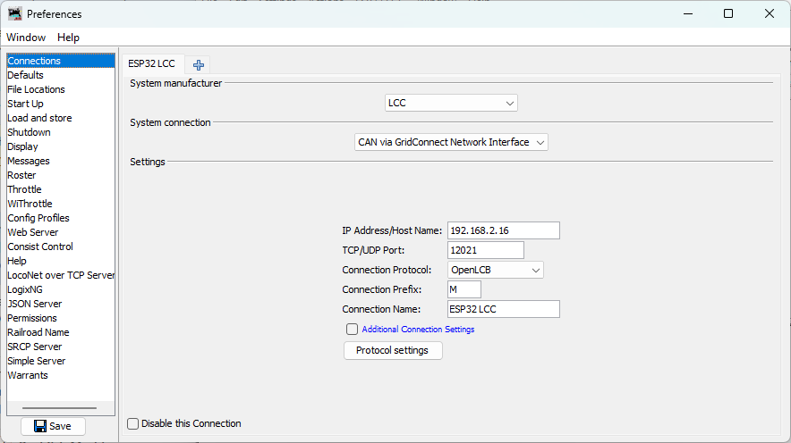
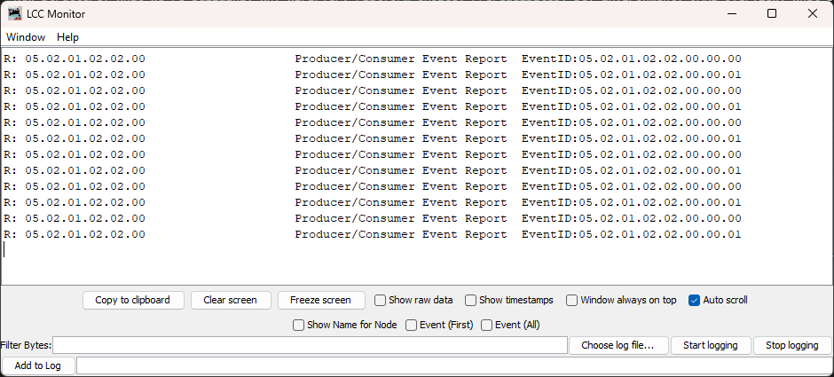
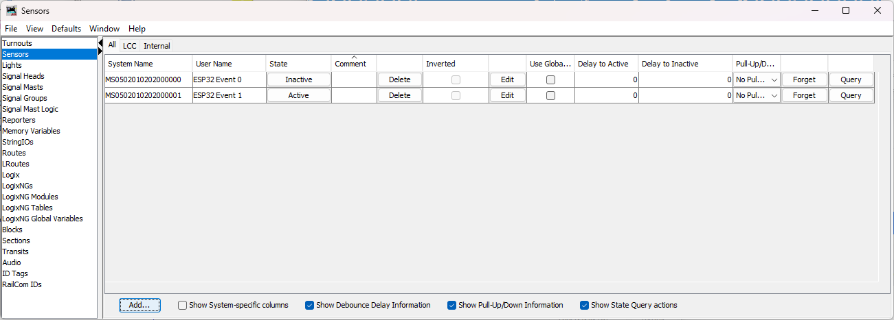

# ESP32 with Arduino & PlatformIO

This chapter covers everything needed to build and deploy an OpenLCB node on an ESP32 microcontroller using Arduino and PlatformIO. We'll create a working example that you can modify for your own applications.

## Overview

The ESP32 is a powerful, affordable microcontroller with built-in WiFi connectivity, making it ideal for learning OpenLCB concepts. In this chapter, we'll build a complete OpenLCB node that simultaneously runs the node protocol stack and hosts a TCP Hub—allowing JMRI to monitor and control your node over WiFi.

As described in the "Network Architecture" section of Chapter 2, your ESP32 will act as both:
- An **OpenLCB node** that produces and consumes events
- A **TCP Hub** listening on port 12021 for JMRI connections

We'll be using the **OpenMRN-Lite library**, which is the Arduino version of OpenMRN. If you're curious about why OpenMRN-Lite specifically, or what it can (and can't) do, see Chapter 2.5 ("OpenMRN-Lite Architecture & Capabilities") for a deeper dive. For now, know that it's the right tool for the job and it has everything we need to build real, functional OpenLCB nodes.

We'll build this in two phases:
1. **Software-only**: Create a node that produces and consumes events via JMRI (no physical hardware needed yet)
2. **Hardware integration** (optional): Add a physical button and LED to your breadboard

This approach lets you start learning immediately while waiting for breadboard components to arrive.

## ESP32 Board Selection

Before installing software, you'll want to order an ESP32 development board. This section helps you choose the right board for this tutorial.

The ESP32 family includes many board variants. For this tutorial, we recommend boards with sufficient GPIO pins, USB programming support, and built-in CAN capability for future chapters.

### Recommended Board: ESP32 DevKit V1

**ESP32 DevKit V1 / ESP32-WROOM-32** (Xtensa architecture)
- Most common and affordable ESP32 development board
- 30+ GPIO pins available (plenty for expansion)
- Built-in USB-to-serial converter (CP2102 or CH340)
- 4MB flash memory (sufficient for OpenMRNLite applications)
- Built-in CAN controller (TWAI) for future CAN chapters
- **Best OpenMRNLite compatibility** - fully tested and supported
- Available from multiple manufacturers (Espressif, DOIT, etc.)
- Cost: $5-10 USD

This is the board we'll use throughout the tutorial.

### Alternative Boards

**ESP32-DevKitC**
- Official Espressif development board
- Similar pinout to DevKit V1
- Excellent documentation and support
- Slightly more expensive but guaranteed quality

**ESP32-S3** (Xtensa architecture)
- Newer variant with USB-OTG support
- More memory and GPIO options
- Built-in CAN controller
- Good OpenMRNLite support

### Boards to Avoid (for now)

**ESP32-C3** (RISC-V architecture)
- Different CPU architecture (RISC-V vs Xtensa)
- OpenMRNLite has compatibility issues with ESP32-C3
- Missing required ESP-IDF headers in Arduino framework
- Wait for future OpenMRNLite updates before using

### What You Need Now

To get started with the software-only version:
- **Just the ESP32 board** with USB cable

For the hardware integration phase (optional, later):
- Solderless breadboard
- Tactile pushbutton
- LED (any color)
- 220Ω resistor
- Jumper wires

### Purchasing

ESP32 boards are available from:
- **Amazon** / **eBay**: Search "ESP32 DevKit" (verify reviews)
- **AliExpress** / **Banggood**: Direct from manufacturers (longer shipping)
- **Adafruit** / **SparkFun**: Higher quality, better support, higher cost
- **DigiKey** / **Mouser**: For bulk or commercial projects

**Order your board now**, then continue with the software setup while you wait for delivery.

## PlatformIO Installation & Setup

PlatformIO is a professional embedded development platform that provides a unified build system, library management, and debugging tools. It integrates with VS Code to create a powerful development environment.

### Installing VS Code

If you don't already have Visual Studio Code installed:

1. Download VS Code from [code.visualstudio.com](https://code.visualstudio.com/)
2. Run the installer for your operating system (Windows, macOS, or Linux)
3. Follow the installation wizard with default options
4. Launch VS Code after installation completes

### Installing PlatformIO Extension

1. Open VS Code
2. Click the Extensions icon in the left sidebar (or press `Ctrl+Shift+X` / `Cmd+Shift+X`)
3. Search for "PlatformIO IDE"
4. Click **Install** on the "PlatformIO IDE" extension by PlatformIO
5. Wait for the installation to complete (this may take several minutes as it downloads toolchains)
6. Restart VS Code when prompted

After restarting, you should see a new PlatformIO icon (alien head) in the left sidebar.

> **Note**: The ESP32 platform and toolchain will be installed automatically when you create your first project. PlatformIO handles all the toolchain downloads and configuration for you.

## Creating Your First Project: async_blink_esp32

Now we'll create the actual project we'll be working with throughout this chapter. Instead of creating a throwaway test project, we'll jump straight into building our OpenLCB node.

### Create the Project

1. Click the PlatformIO icon in the left sidebar
2. Select **New Project** from Quick Access
3. Enter project name: **async_blink_esp32**
4. For Board, search and select **DOIT ESP32 DEVKIT V1** (or `esp32doit-devkit-v1`)
5. Framework should automatically select **Arduino**
6. Click **Finish**

PlatformIO will:
- Create the project structure
- Download the ESP32 platform and toolchain (first time only, may take several minutes)
- Set up the Arduino framework
- Create a basic `src/main.cpp` file

### Understanding the Project Structure

After creation, you'll see this structure:

```
async_blink_esp32/
├── platformio.ini     # Project configuration
├── src/
│   └── main.cpp       # Your application code (we'll replace this)
├── lib/               # Project-specific libraries
├── include/           # Header files
└── test/              # Unit tests (optional)
```

The `platformio.ini` file should look like this:

```ini
[env:esp32doit-devkit-v1]
platform = espressif32
board = esp32doit-devkit-v1
framework = arduino
monitor_speed = 115200
```

**Note**: The `monitor_speed = 115200` setting configures the serial monitor baud rate to match what our code will use. Without this, the serial output will appear as garbled characters.

## Adding OpenMRNLite to Your Project

OpenMRNLite is the lightweight version of OpenMRN designed for Arduino-compatible platforms. It provides all the core LCC/OpenLCB functionality without the full complexity of the OpenMRN framework.

### Installation via platformio.ini

Open the `platformio.ini` file in your `async_blink_esp32` project and add OpenMRNLite to the library dependencies:

```ini
[env:esp32doit-devkit-v1]
platform = espressif32
board = esp32doit-devkit-v1
framework = arduino
lib_deps = openmrn/OpenMRNLite@2.0.0
monitor_speed = 115200
```

Save the file. That's it! PlatformIO will automatically download OpenMRNLite from the registry when you build the project.

**About monitor_speed**: This setting ensures the serial monitor uses 115200 baud, matching the `Serial.begin(115200)` call in our code. Without this, you'll see garbled output instead of readable text.

**Why version 2.0.0?**
- Version 2.0.0 is fully compatible with PlatformIO's current ESP32 platform
- Later versions (2.2.x+) require newer ESP-IDF features not yet available in PlatformIO
- All core OpenLCB functionality is present in v2.0.0

> **About PlatformIO and Arduino-ESP32 versions**
>
> You may notice that PlatformIO uses Arduino-ESP32 v2.0.17 while the Arduino IDE can install v3.x. This isn't a bug — it's intentional:
>
> - **PlatformIO prioritizes stability** over bleeding-edge features. They thoroughly test each framework version across hundreds of boards, toolchains, and debuggers before releasing.
> - **Arduino-ESP32 3.x introduced major breaking changes** in the build system, partition handling, WiFi stack, and more. PlatformIO waits for these to stabilize before adoption.
> - **Small team, massive ecosystem**: PlatformIO maintains ESP32, STM32, RP2040, AVR, and many other platforms with a much smaller team than Espressif has for Arduino-ESP32 alone.
>
> This is why we use OpenMRNLite v2.0.0 — it's designed for the stable Arduino-ESP32 2.x that PlatformIO provides. You're trading cutting-edge features for rock-solid reliability, which is perfect for learning OpenLCB fundamentals.

### Verification

Let's verify everything is working by building the project:

1. In VS Code, click the PlatformIO icon in the left sidebar
2. Under **PROJECT TASKS** → **esp32doit-devkit-v1**, click **Build**
3. PlatformIO will:
   - Download OpenMRNLite (first time only)
   - Compile the default `main.cpp`
   - Display build output

4. Look for **SUCCESS** at the end of the output

> **Note**: The first build will take longer as PlatformIO downloads the library and compiles it. Subsequent builds are much faster.

If the build succeeds, OpenMRNLite is installed correctly and you're ready to write code!

## Writing the async_blink_esp32 Code

Now we'll create the actual OpenLCB node that produces alternating events. This demonstrates the core OpenLCB protocol behavior you learned in Chapter 1 (node initialization and event production) without requiring physical hardware.

### Creating the Configuration Header

OpenMRNLite requires a configuration structure (CDI - Configuration Description Information) even for simple nodes. We'll create a minimal config.h file.

Create the file `include/config.h` with this content:

```cpp
#ifndef _ASYNC_BLINK_CONFIG_H_
#define _ASYNC_BLINK_CONFIG_H_

#include "openlcb/ConfigRepresentation.hxx"
#include "openlcb/MemoryConfig.hxx"

namespace openlcb {

/// SNIP Static Data - Manufacturer information (read-only, compiled into firmware)
extern const SimpleNodeStaticValues SNIP_STATIC_DATA = {
    4,               // Version
    "OpenMRN",       // Manufacturer
    "async_blink",   // Model
    "ESP32",         // Hardware version
    "1.00"           // Software version
};

/// SNIP Dynamic Data - User-editable node name and description
/// These are stored in the config file and can be read/written via JMRI
static const char SNIP_NODE_NAME[] = "async_blink";
static const char SNIP_NODE_DESC[] = "ESP32 Blink demo";

/// Version number for the configuration structure
static constexpr uint16_t CANONICAL_VERSION = 0x0001;

/// Minimal configuration segment with just internal config
CDI_GROUP(AsyncBlinkSegment, Segment(MemoryConfigDefs::SPACE_CONFIG), Offset(128));
CDI_GROUP_ENTRY(internal_config, InternalConfigData);
CDI_GROUP_END();

/// The main CDI structure
CDI_GROUP(ConfigDef, MainCdi());
CDI_GROUP_ENTRY(ident, Identification);
CDI_GROUP_ENTRY(acdi, Acdi);
CDI_GROUP_ENTRY(userinfo, UserInfoSegment, Name("User Info"));
CDI_GROUP_ENTRY(seg, AsyncBlinkSegment, Name("Settings"));
CDI_GROUP_END();

} // namespace openlcb

#endif // _ASYNC_BLINK_CONFIG_H_
```

**What this does**: Defines the CDI (Configuration Description Information) structure that OpenMRNLite uses to expose node configuration to JMRI. The configuration includes:
- **SNIP Static Data**: Read-only manufacturer, model, and version information (compiled into firmware)
- **SNIP Dynamic Data**: User-editable node name and description stored in the config file (visible in JMRI node properties)
- **Acdi and UserInfo**: Standard OpenLCB configuration segments
- **AsyncBlinkSegment**: Internal configuration area for this node (currently minimal, but available for future expansion)

> In this v0.1 example, configuration is read-only (hardcoded). We'll make it editable in a future chapter using SPIFFS persistence.

### The Complete Main Code

Now replace the contents of `src/main.cpp` with the following code:

```cpp
/** \copyright
 * Copyright (c) 2024, OpenLCB Technical Introduction
 * All rights reserved.
 *
 * Example code for educational purposes demonstrating OpenLCB node startup
 * and event handling on ESP32 using WiFi/TCP transport.
 *
 * \file main.cpp
 *
 * Simple async_blink example for ESP32 with WiFi - produces two alternating
 * events every second, demonstrating OpenLCB node initialization and event
 * production without requiring physical GPIO hardware.
 */

#include <Arduino.h>
#include <WiFi.h>
#include <SPIFFS.h>
#include <OpenMRNLite.h>
#include "utils/GcTcpHub.hxx"

#include "config.h"

// WiFi credentials - CHANGE THESE to match your network
const char* ssid = "YourWiFiSSID";
const char* password = "YourWiFiPassword";

// OpenLCB Node ID - must be unique on your network
// This ID is in the reserved range for experimental use
static constexpr uint64_t NODE_ID = 0x050201020200ULL;

// Event IDs that will be alternated
// These match the desktop async_blink example
static const uint64_t EVENT_ID_0 = 0x0502010202000000ULL;
static const uint64_t EVENT_ID_1 = 0x0502010202000001ULL;

// Create the OpenMRN stack object
OpenMRN openmrn(NODE_ID);

// TCP Hub for JMRI connectivity
GcTcpHub* tcp_hub = nullptr;

// ConfigDef comes from config.h and defines the configuration layout
static constexpr openlcb::ConfigDef cfg(0);

// OpenLCB configuration - required by OpenMRNLite
namespace openlcb {
  // Name of CDI.xml to generate dynamically
  const char CDI_FILENAME[] = "/spiffs/cdi.xml";
  
  // This will stop openlcb from exporting the CDI memory space upon start
  const char CDI_DATA[] = "";
  
  // Path to the config file and its size
  const char* const CONFIG_FILENAME = "/spiffs/openlcb_config";
  const size_t CONFIG_FILE_SIZE = cfg.seg().size() + cfg.seg().offset();
  
  // SNIP (Simple Node Information Protocol) dynamic data storage
  const char* const SNIP_DYNAMIC_FILENAME = CONFIG_FILENAME;
}

// State variable to track which event to send
bool event_state = false;

// Timing for event production (1 second = 1000 milliseconds)
unsigned long last_event_time = 0;
const unsigned long EVENT_INTERVAL = 1000;

/**
 * Configuration update listener for factory reset and config persistence.
 * 
 * factory_reset() is called by OpenMRN on first boot to initialize SNIP dynamic
 * data (node name and description). After boot, if you modify the config through
 * JMRI, apply_configuration() would handle persistence (not implemented for v0.1).
 */
class FactoryResetHelper : public DefaultConfigUpdateListener
{
public:
    UpdateAction apply_configuration(int fd, bool initial_load,
                                     BarrierNotifiable *done) OVERRIDE
    {
        AutoNotify n(done);
        // In v0.1, config is read-only. Real nodes would save changes here.
        return UPDATED;
    }

    void factory_reset(int fd) override
    {
        // Initialize SNIP dynamic data on first boot
        // This data is displayed by JMRI in the node properties dialog
        cfg.userinfo().name().write(fd, openlcb::SNIP_NODE_NAME);
        cfg.userinfo().description().write(fd, openlcb::SNIP_NODE_DESC);
    }
} factory_reset_helper;

/**
 * Initialize Serial communication and print startup banner.
 */
void init_serial() {
  Serial.begin(115200);
  delay(500);  // Give serial time to initialize
  
  Serial.println("\n\n=== OpenLCB async_blink ESP32 Example ===");
  Serial.printf("Node ID: 0x%012llX\n", NODE_ID);
  Serial.printf("Event 0: 0x%016llX\n", EVENT_ID_0);
  Serial.printf("Event 1: 0x%016llX\n", EVENT_ID_1);
}

/**
 * Initialize SPIFFS filesystem for configuration storage.
 */
void init_filesystem() {
  Serial.println("\nInitializing SPIFFS...");
  if (!SPIFFS.begin(true)) {  // true = format if mount fails
    Serial.println("SPIFFS mount failed! Halting.");
    while (1) { delay(1000); }  // Stop here if filesystem fails
  }
  Serial.println("SPIFFS initialized successfully");
}

/**
 * Connect to WiFi network.
 */
void init_network() {
  Serial.printf("\nConnecting to WiFi SSID: %s\n", ssid);
  WiFi.begin(ssid, password);
  
  // Wait for WiFi connection
  while (WiFi.status() != WL_CONNECTED) {
    delay(500);
    Serial.print(".");
  }
  
  Serial.println("\nWiFi connected!");
  Serial.printf("IP Address: %s\n", WiFi.localIP().toString().c_str());
}

/**
 * Initialize OpenMRN stack and configuration.
 * This creates the config file and starts the stack.
 * FactoryResetHelper automatically initializes SNIP data on first boot.
 */
void init_openlcb_stack() {
  // Create the CDI.xml dynamically
  // CDI describes what configuration options are available
  Serial.println("\nCreating CDI configuration descriptor...");
  openmrn.create_config_descriptor_xml(cfg, openlcb::CDI_FILENAME);
  
  // Create the config file if it doesn't exist
  // OpenMRNLite requires this even for simple nodes
  Serial.println("Initializing OpenLCB configuration...");
  openmrn.stack()->create_config_file_if_needed(cfg.seg().internal_config(),
                                                  openlcb::CANONICAL_VERSION,
                                                  openlcb::CONFIG_FILE_SIZE);

  // Start the OpenMRN stack
  // This initiates the OpenLCB node initialization sequence:
  // 1. Check ID (CID) - verifies Node ID is unique
  // 2. Reserve ID (RID) - claims the Node ID
  // 3. Announce Membership (AMD) - announces node to network
  // 4. Initialization Complete - node enters normal operation
  Serial.println("\nStarting OpenLCB stack...");
  openmrn.begin();
  
  // Start the executor thread for background processing
  // REQUIRED for TCP Hub to accept connections
  Serial.println("Starting executor thread...");
  openmrn.start_executor_thread();
}

/**
 * Initialize TCP Hub for JMRI connectivity.
 */
void init_tcp_hub() {
  Serial.println("Starting TCP Hub on port 12021...");
  tcp_hub = new GcTcpHub(
    openmrn.stack()->can_hub(),  // Reference to the CAN hub
    12021                        // TCP port (standard for OpenLCB)
  );
  Serial.println("TCP Hub listening. JMRI can connect to this device on port 12021");
}

/**
 * Arduino setup() - runs once at startup
 * 
 * This function initializes all hardware and software subsystems:
 * 1. Serial communication
 * 2. SPIFFS filesystem
 * 3. WiFi network
 * 4. OpenMRN stack
 * 5. TCP Hub for JMRI connectivity
 */
void setup() {
  init_serial();
  init_filesystem();
  init_network();
  init_openlcb_stack();
  init_tcp_hub();
  
  Serial.println("OpenLCB node initialization complete!");
  Serial.println("Entering run mode - will alternate events every 1 second\n");
  
  // Record start time for event production
  last_event_time = millis();
}

/**
 * Arduino loop() - runs continuously
 * 
 * This function:
 * 1. Calls openmrn.loop() to process OpenLCB protocol messages
 * 2. Alternates between two events every second
 * 3. Prints event production to serial monitor
 */
void loop() {
  // CRITICAL: Must call openmrn.loop() frequently to process messages
  openmrn.loop();
  
  // Check if it's time to produce an event (every 1 second)
  unsigned long current_time = millis();
  if (current_time - last_event_time >= EVENT_INTERVAL) {
    // Alternate event state
    event_state = !event_state;
    
    // Send the event
    uint64_t event_to_send = event_state ? EVENT_ID_1 : EVENT_ID_0;
    openmrn.stack()->executor()->add(new CallbackExecutable([event_to_send]() {
      openmrn.stack()->send_event(event_to_send);
    }));
    
    // Print to serial monitor
    Serial.printf("Produced event: 0x%016llX (state: %d)\n", 
                  event_to_send, event_state ? 1 : 0);
    
    // Update timing
    last_event_time = current_time;
  }
}
```

### Code Walkthrough

This code is organized into:
1. **Configuration** (config.h): Node identity and CDI structure
2. **Initialization** (setup function with helpers): WiFi, SPIFFS, OpenLCB stack, TCP Hub  
3. **Event production** (loop function): Alternate between two events every second

The code includes detailed comments explaining each section. We'll walk through the key concepts below.

#### 1. Includes and WiFi Configuration

```cpp
#include <Arduino.h>
#include <WiFi.h>
#include <SPIFFS.h>
#include <OpenMRNLite.h>

#include "config.h"

const char* ssid = "YourWiFiSSID";
const char* password = "YourWiFiPassword";
```

**Required includes**:
- `Arduino.h`: Core Arduino framework
- `WiFi.h`: ESP32 WiFi library for network connectivity
- `SPIFFS.h`: ESP32 filesystem library for configuration storage
- `OpenMRNLite.h`: OpenLCB protocol stack
- `config.h`: Our configuration header with CDI definitions

**Action Required**: Replace `ssid` and `password` with your actual WiFi network credentials.
- ESP32 only supports **2.4GHz WiFi networks** (not 5GHz)
- SSID is case-sensitive
- This is hardcoded for simplicity - production code would use configuration storage

#### 2. Node and Event IDs

```cpp
static constexpr uint64_t NODE_ID = 0x050201020200ULL;
static const uint64_t EVENT_ID_0 = 0x0502010202000000ULL;
static const uint64_t EVENT_ID_1 = 0x0502010202000001ULL;
```

**Node ID**: Every OpenLCB node must have a globally unique 48-bit identifier. This ID (`0x050201020200`) is in the experimental range - safe for learning but not for production deployment.

**Event IDs**: These 64-bit identifiers represent the two events our node will produce. Notice they differ only in the last byte (`00` vs `01`), making them easy to track. These match the desktop `async_blink` OpenMRN example for consistency.

#### 3. Configuration and OpenMRN Stack

```cpp
OpenMRN openmrn(NODE_ID);
static constexpr openlcb::ConfigDef cfg(0);

namespace openlcb {
  const char CDI_FILENAME[] = "/spiffs/cdi.xml";
  const char CDI_DATA[] = "";
  const char* const CONFIG_FILENAME = "/spiffs/openlcb_config";
  const size_t CONFIG_FILE_SIZE = cfg.seg().size() + cfg.seg().offset();
  const char* const SNIP_DYNAMIC_FILENAME = CONFIG_FILENAME;
}
```

**OpenMRN stack**: Creates the entire OpenLCB protocol stack (message routing, node initialization, event handling, network transport).

**ConfigDef**: Instantiates the CDI configuration structure from config.h (already described above). The `(0)` parameter is the offset in memory.

**OpenLCB namespace constants**:
- `CDI_FILENAME`: Path where the dynamic CDI.xml file will be written (used by JMRI for configuration discovery)
- `CDI_DATA`: Empty string tells OpenMRN to generate CDI dynamically instead of using a static resource
- `CONFIG_FILENAME`: Path to the config file in SPIFFS filesystem (note `/spiffs/` prefix)
- `CONFIG_FILE_SIZE`: Calculated as the size of all configuration segments. This ensures the file is large enough for all data (SNIP + internal config + UserInfo)
- `SNIP_DYNAMIC_FILENAME`: Store SNIP data in the same file as config

#### 4. FactoryResetHelper and Configuration Initialization

```cpp
class FactoryResetHelper : public DefaultConfigUpdateListener
{
public:
    UpdateAction apply_configuration(int fd, bool initial_load,
                                     BarrierNotifiable *done) OVERRIDE
    {
        AutoNotify n(done);
        return UPDATED;
    }

    void factory_reset(int fd) override
    {
        cfg.userinfo().name().write(fd, openlcb::SNIP_NODE_NAME);
        cfg.userinfo().description().write(fd, openlcb::SNIP_NODE_DESC);
    }
} factory_reset_helper;
```

This class handles configuration lifecycle events:

**`factory_reset(int fd)`**: Called by OpenMRN automatically on first boot when the config file is created. It initializes the SNIP dynamic data using OpenMRN's built-in CDI framework:
- `cfg.userinfo().name().write()`: Writes the node name to the correct offset in the config file
- `cfg.userinfo().description().write()`: Writes the node description to the correct offset

This approach is better than manual file I/O because:
- OpenMRN handles all byte offsets and layout automatically
- Uses the same CDI structure (ConfigDef from config.h) consistently
- Less prone to errors (no manual `fseek`, `fwrite` calls)
- Foundation ready for `apply_configuration()` in future chapters when users modify config via JMRI

> **`apply_configuration()`**: Currently returns UPDATED without doing anything. In a real node, this would handle persistence when users modify configuration through JMRI. For v0.1, config is read-only.

**SNIP data**: The node name and description are displayed by JMRI in the node properties dialog, helping identify which ESP32 is which on your network.

#### 5. WiFi Connection

```cpp
void init_network() {
  Serial.printf("\nConnecting to WiFi SSID: %s\n", ssid);
  WiFi.begin(ssid, password);
  
  while (WiFi.status() != WL_CONNECTED) {
    delay(500);
    Serial.print(".");
  }
  
  Serial.println("\nWiFi connected!");
  Serial.printf("IP Address: %s\n", WiFi.localIP().toString().c_str());
}
```

This helper function establishes the WiFi connection before starting OpenLCB. The ESP32 won't be able to communicate on the OpenLCB network until WiFi is connected, so we wait here.

The dots printed to serial provide visual feedback during connection.

#### 6. Initialization Helper Functions and Setup

```cpp
void init_openlcb_stack() {
  Serial.println("\nCreating CDI configuration descriptor...");
  openmrn.create_config_descriptor_xml(cfg, openlcb::CDI_FILENAME);
  
  Serial.println("Initializing OpenLCB configuration...");
  openmrn.stack()->create_config_file_if_needed(cfg.seg().internal_config(),
                                                  openlcb::CANONICAL_VERSION,
                                                  openlcb::CONFIG_FILE_SIZE);

  Serial.println("\nStarting OpenLCB stack...");
  openmrn.begin();
  
  Serial.println("Starting executor thread...");
  openmrn.start_executor_thread();
}
```

This helper function performs several critical initialization steps:

1. **Create CDI.xml dynamically**: `openmrn.create_config_descriptor_xml()` generates a CDI (Configuration Description Information) file that describes all available configuration options. JMRI uses this file to know what settings the node supports. The file is written to `/spiffs/cdi.xml`.

2. **Create config file if needed**: `create_config_file_if_needed()` ensures the config file exists with proper structure. On first boot:
   - File is created with space for internal config, SNIP data, and UserInfo
   - FactoryResetHelper's `factory_reset()` is called automatically
   - SNIP user data (name and description) is populated

3. **Start OpenMRN stack**: `openmrn.begin()` initiates the entire OpenLCB protocol sequence (CID, RID, AMD) as described in Chapter 1.

4. **Start executor thread**: Background thread for processing OpenLCB messages. **This is required for TCP Hub to work.**

#### 7. TCP Hub for JMRI Connectivity

```cpp
void init_tcp_hub() {
  Serial.println("Starting TCP Hub on port 12021...");
  tcp_hub = new GcTcpHub(
    openmrn.stack()->can_hub(),
    12021
  );
  Serial.println("TCP Hub listening. JMRI can connect to this device on port 12021");
}
```

This helper function creates a TCP server on port 12021 using the GridConnect protocol (the ASCII format that JMRI expects). It's passed:
- `openmrn.stack()->can_hub()`: Reference to the message router
- `12021`: The TCP port to listen on (standard for OpenLCB TCP hubs)

The TCP Hub allows JMRI and other TCP clients to connect and monitor your node's events in real-time. Multiple JMRI instances can connect simultaneously; messages are routed between all connected clients and the local node.

#### 8. Main Setup Function

```cpp
void setup() {
  init_serial();
  init_filesystem();
  init_network();
  init_openlcb_stack();
  init_tcp_hub();
  
  Serial.println("OpenLCB node initialization complete!");
  Serial.println("Entering run mode - will alternate events every 1 second\n");
  
  last_event_time = millis();
}
```

The `setup()` function calls four helper functions in sequence:

1. **`init_serial()`**: Initialize Serial, print startup banner with Node ID and Event IDs
2. **`init_filesystem()`**: Initialize SPIFFS filesystem
3. **`init_network()`**: Connect to WiFi (required before OpenLCB)
4. **`init_openlcb_stack()`**: Create CDI file, config file, initialize SNIP data via FactoryResetHelper, start OpenLCB protocol stack, start executor thread
5. **`init_tcp_hub()`**: Start TCP server for JMRI connectivity

**Why break it down?** Each helper function focuses on a single responsibility, making the code easier to understand and modify. If you need to add new initialization steps or change how the node starts up, it's clear where to make those changes.

#### 9. Event Production Loop

```cpp
void loop() {
  openmrn.loop();  // CRITICAL - processes all OpenLCB messages
  
  unsigned long current_time = millis();
  if (current_time - last_event_time >= EVENT_INTERVAL) {
    event_state = !event_state;
    uint64_t event_to_send = event_state ? EVENT_ID_1 : EVENT_ID_0;
    
    openmrn.stack()->executor()->add(new CallbackExecutable([event_to_send]() {
      openmrn.stack()->send_event(event_to_send);
    }));
    
    Serial.printf("Produced event: 0x%016llX (state: %d)\n", 
                  event_to_send, event_state ? 1 : 0);
    
    last_event_time = current_time;
  }
}
```

**Critical Detail**: `openmrn.loop()` must be called frequently (ideally every few milliseconds). This processes:
- Incoming network messages
- Outgoing message queues
- Protocol state machines
- Internal timers

**Event Production**: Every 1000ms (1 second), we:
1. Toggle `event_state` (false → true → false → ...)
2. Select which event ID to send based on state
3. Queue the event for transmission using the executor
4. Print confirmation to serial monitor

**Why use the executor?** OpenLCB message handling runs in a separate execution context. The `executor()->add()` pattern ensures thread-safe event production.

**Critical Detail**: `openmrn.loop()` must be called frequently (ideally every few milliseconds). This processes:
- Incoming network messages
- Outgoing message queues
- Protocol state machines
- Internal timers

**Event Production**: Every 1000ms (1 second), we:
1. Toggle `event_state` (false → true → false → ...)
2. Select which event ID to send based on state
3. Queue the event for transmission using the executor
4. Print confirmation to serial monitor

**Why use the executor?** OpenLCB message handling runs in a separate execution context. The `executor()->add()` pattern ensures thread-safe event production.

### Expected Serial Monitor Output

When the code runs, you should see output like this:

```
=== OpenLCB async_blink ESP32 Example ===
Node ID: 0x050201020200
Event 0: 0x0502010202000000
Event 1: 0x0502010202000001

Initializing SPIFFS...
SPIFFS initialized successfully

Connecting to WiFi SSID: YourNetwork
.....
WiFi connected!
IP Address: 192.168.1.100

Creating CDI configuration descriptor...
Initializing OpenLCB configuration...

Starting OpenLCB stack...
Starting executor thread...
Starting TCP Hub on port 12021...
TCP Hub listening. JMRI can connect to this device on port 12021

OpenLCB node initialization complete!
Entering run mode - will alternate events every 1 second

Produced event: 0x0502010202000000 (state: 0)
Produced event: 0x0502010202000001 (state: 1)
Produced event: 0x0502010202000000 (state: 0)
Produced event: 0x0502010202000001 (state: 1)
...
```

**On First Run Only**: You may see a brief pause and an SPIFFS error message:
```
Initializing SPIFFS...
E (523) SPIFFS: mount failed, -10025
SPIFFS initialized successfully
```

This is **normal and expected**. On first boot, SPIFFS needs to format the filesystem, which takes approximately **20 seconds** on ESP32 DevKit. The error message appears because the filesystem doesn't exist yet, but the `SPIFFS.begin(true)` call automatically formats it. During this time, the ESP32 will appear to hang—just wait and don't interrupt it. Subsequent boots will skip this formatting step and proceed immediately.

This confirms:
- ✅ SPIFFS filesystem initialized (formatted on first run if needed)
- ✅ WiFi connection succeeded (shows your network SSID and IP address)
- ✅ OpenLCB node initialized (config file created, SNIP data written)
- ✅ **TCP Hub is listening on port 12021** - JMRI can now connect!
- ✅ Events are being produced alternately

### Before You Build

**Update WiFi credentials in the code!** The build will succeed even with placeholder credentials, but the ESP32 won't connect to WiFi when you upload it.

## Building and Uploading to ESP32

Now that you have the complete code, let's build it, upload it to your ESP32, and verify it works through the serial monitor.

### Building the Project

1. **Save the modified main.cpp file** (`Ctrl+S` / `Cmd+S`)

2. **Open the PlatformIO sidebar**:
   - Click the PlatformIO icon (alien head) in VS Code's left sidebar
   - Or use the bottom toolbar's checkmark icon (Build)

3. **Build the project**:
   - In PROJECT TASKS → **esp32doit-devkit-v1**, click **Build**
   - Or click the checkmark (✓) icon in the bottom toolbar
   - Or press `Ctrl+Alt+B` / `Cmd+Alt+B`

4. **Watch the build output**:
   ```
   Building in release mode
   Compiling .pio/build/esp32doit-devkit-v1/src/main.cpp.o
   Linking .pio/build/esp32doit-devkit-v1/firmware.elf
   Building .pio/build/esp32doit-devkit-v1/firmware.bin
   ========================= [SUCCESS] Took 5.23 seconds =========================
   ```

The first build takes longer because it compiles OpenMRNLite. Subsequent builds are much faster.

**If the build fails**, check:
- WiFi credentials are properly quoted (strings)
- All braces `{}` and parentheses `()` match
- `#include <OpenMRNLite.h>` is present
- `lib_deps` in `platformio.ini` includes OpenMRNLite

### Connecting Your ESP32

1. **Connect the ESP32 to your computer** via USB cable
   - Use a **data cable**, not a charge-only cable
   - The ESP32 should power on (onboard LED may light up)

2. **Identify the COM port** (Windows) or device path (Mac/Linux):
   - PlatformIO usually auto-detects the port
   - Windows: `COM3`, `COM4`, etc.
   - Mac: `/dev/cu.usbserial-*` or `/dev/cu.wchusbserial*`
   - Linux: `/dev/ttyUSB0` or `/dev/ttyACM0`

3. **If the port isn't detected**, you may need to install a USB driver:
   - **CP2102**: Download from [Silicon Labs](https://www.silabs.com/developers/usb-to-uart-bridge-vcp-drivers)
   - **CH340**: Download from [WCH](http://www.wch-ic.com/downloads/CH341SER_EXE.html)
   - Most modern operating systems include these drivers

### Uploading the Firmware

1. **Upload the firmware**:
   - In PROJECT TASKS → **esp32doit-devkit-v1**, click **Upload**
   - Or click the arrow (→) icon in the bottom toolbar
   - Or press `Ctrl+Alt+U` / `Cmd+Alt+U`

2. **Watch the upload process**:
   ```
   Configuring upload protocol...
   Looking for upload port...
   Auto-detected: COM3
   Uploading .pio/build/esp32doit-devkit-v1/firmware.bin
   esptool.py v4.5.1
   Connecting........__
   Chip is ESP32-D0WDQ6 (revision 1)
   Writing at 0x00010000... (100 %)
   Wrote 876544 bytes (543210 compressed) at 0x00010000 in 48.2 seconds
   Leaving...
   Hard resetting via RTS pin...
   ========================= [SUCCESS] Took 52.91 seconds =========================
   ```

3. **The ESP32 will automatically reboot** and start running your code

**If upload fails**:
- **"Serial port not found"**: Check USB cable connection, try different USB port
- **"Failed to connect"**: Hold the BOOT button while clicking upload, release after "Connecting..." appears
- **Permission denied (Linux)**: Add your user to the `dialout` group: `sudo usermod -a -G dialout $USER`, then log out and back in

### Opening the Serial Monitor

The serial monitor lets you see the debug output from your ESP32 in real-time.

1. **Open the serial monitor**:
   - In PROJECT TASKS → **esp32doit-devkit-v1**, click **Monitor**
   - Or click the plug icon (🔌) in the bottom toolbar
   - Or press `Ctrl+Alt+S` / `Cmd+Alt+S`

2. **The serial monitor opens** in a new terminal panel at the bottom of VS Code

3. **If you missed the startup sequence**, press the **RESET** button on your ESP32 board to restart it

### Verifying the Output

You should see output similar to this:

```
=== OpenLCB async_blink ESP32 Example ===
Node ID: 0x050201020200
Event 0: 0x0502010202000000
Event 1: 0x0502010202000001

Initializing SPIFFS...
SPIFFS initialized successfully

Connecting to WiFi SSID: YourNetwork
.
WiFi connected!
IP Address: 192.168.1.100

Initializing OpenLCB configuration...

Starting OpenLCB stack...
OpenLCB node initialization complete!
Entering run mode - will alternate events every 1 second

Produced event: 0x0502010202000000 (state: 0)
Produced event: 0x0502010202000001 (state: 1)
Produced event: 0x0502010202000000 (state: 0)
Produced event: 0x0502010202000001 (state: 1)
...
```

**What to verify**:
- ✅ SPIFFS initializes successfully
- ✅ WiFi connects successfully (shows your network name and IP address)
- ✅ OpenLCB stack initializes
- ✅ Events alternate between `...00` and `...01` every second
- ✅ State toggles between `0` and `1`

### Understanding What You See

This output confirms your ESP32 is:

1. **Connected to WiFi**: The IP address shows it's on your network
2. **Running the OpenLCB stack**: Node initialization completed successfully
3. **Producing events**: The alternating event IDs prove the event production logic works
4. **Ready for network communication**: The node is broadcasting these events on the OpenLCB network (you'll verify this with JMRI next)

**Congratulations!** You have a working OpenLCB node. The events are being broadcast over WiFi/TCP, but you can't see them on the network yet - that's what JMRI will show you in the next section.

### Common Issues

**WiFi won't connect** (stuck on dots):
- Verify WiFi credentials in code are correct
- Check ESP32 is within range of your access point
- Confirm your network is 2.4GHz (not 5GHz only)
- Some corporate/school networks block device connections

**No serial output at all**:
- Verify `monitor_speed = 115200` is in your `platformio.ini` file
- Try pressing RESET button on ESP32
- Verify the serial monitor is connected to the correct port

**Output is garbled/random characters**:
- Wrong baud rate - ensure `monitor_speed = 115200` is in `platformio.ini`
- If you already added it, stop and restart the serial monitor
- Bad USB cable or connection

**"Brownout detector triggered" errors**:
- Insufficient power from USB port
- Try a different USB port or powered USB hub
- This usually doesn't prevent operation, just a warning

## Testing with JMRI

Now that your ESP32 is producing events, let's use JMRI (Java Model Railroad Interface) to monitor them on the network. JMRI acts as a "traffic monitor" that shows all OpenLCB messages, letting you verify your node is working correctly.

### What is JMRI?

JMRI is an open-source application suite for model railroading that includes comprehensive OpenLCB/LCC support. For our purposes, we'll use it to:
- Monitor all OpenLCB messages on the network
- See when nodes initialize (CID, RID, AMD messages)
- Observe event production and consumption
- Verify your ESP32 is communicating correctly

Think of it as a "network packet sniffer" for OpenLCB.

### Installing JMRI

1. **Download JMRI**:
   - Visit [jmri.org](https://www.jmri.org/)
   - Click **Download** → Latest Production Release
   - Choose your operating system (Windows, macOS, or Linux)
   - Download and run the installer

2. **System Requirements**:
   - Java 11 or newer (usually bundled with JMRI installer)
   - Windows 7+, macOS 10.14+, or Linux with X11
   - ~500MB disk space

3. **Install JMRI**:
   - Run the installer with default options
   - On macOS, you may need to allow the app in System Preferences → Security
   - On Linux, you may need to make the script executable: `chmod +x JMRI-installer.sh`

4. **Launch JMRI**:
   - Start **DecoderPro** or **PanelPro** (either works - they share the same connection system)
   - First launch may take 30-60 seconds as JMRI initializes

### Configuring the LCC Connection

JMRI needs to know how to connect to your ESP32's TCP Hub on port 12021. Let's configure that connection.

1. **Open Preferences**:
   - In JMRI, go to **Edit → Preferences** (Windows/Linux) or **JMRI → Preferences** (macOS)

2. **Add a new connection**:
   - Click the **Connections** tab (in the left sidebar)
   - Click the **+** button (bottom left) to add a new connection

3. **Configure the connection**:
   - **System manufacturer**: Select `LCC` (this is the OpenLCB standard system name in JMRI)
   - **System connection**: Select `CAN via GridConnect Network Interface`
   - **Connection name**: Enter `ESP32 async_blink` (or any descriptive name)
   - **IP Address/Host Name**: Enter the IP address your ESP32 showed in serial monitor (e.g., `192.168.2.16`)
   - **TCP/UDP Port**: Enter `12021`
   - **Connection Protocol**: Select `OpenLCB`

   

4. **Save settings**:
   - Click **Save** at the bottom of the Preferences window
   - JMRI will prompt to restart - click **Restart Now**

### Monitoring LCC Traffic

After JMRI restarts, let's open the message monitor to see your ESP32's events.

1. **Open the LCC Monitor**:
   - Go to **LCC → Monitor Traffic**
   - A new window opens showing a live feed of LCC messages

2. **Observe the event production**:
   - You should see alternating event reports appearing every second
   - Each event corresponds to the events your ESP32 is producing

   

### Verifying the Node is Visible

You can also verify that JMRI recognizes your ESP32 as a node on the network:

1. **Open the LCC Network Tree**:
   - Go to **LCC → Configure Nodes**
   - The network tree shows all LCC nodes currently on the network

2. **Look for your ESP32 node**:
   - You should see a node with the ID matching your code (`050201020200`)
   - This confirms the node initialized successfully and is visible on the network

   

### Optional: View Events as Sensors

Want to see your ESP32's events visualized as sensor states? You can create sensors in PanelPro that correspond to your event IDs.

**Important**: For this section, you need to have **PanelPro** open. If you only have DecoderPro running:
- Either launch **PanelPro** separately (from your JMRI applications folder)
- Or select **File → Open PanelPro** in DecoderPro to launch it

Once PanelPro is open:

1. **Open the Sensor Table**:
   - Go to **Tools → Tables → Sensors**
   - The sensor table displays any configured LCC sensors

2. **Add your first sensor**:
   - Click **Add** to create a new sensor
   - In the dialog:
     - **System Name**: Enter the hardware address for your first event ID
       - For `EVENT_ID_0` (0x0502010202000000), type: `0502010202000000`
       - JMRI will automatically add the `MS` prefix when you click Create
     - **User Name**: Enter `ESP32 Event 0` (or any descriptive name)
   - Click **Create**

3. **Repeat for the second event**:
   - Click **Add** again
   - **System Name**: Type `0502010202000001`
   - **User Name**: `ESP32 Event 1`
   - Click **Create**

4. **Watch the sensors**:
   - Return to the sensor table
   - Verify the system names are correct:
     - Event 0 should show: `MS0502010202000000`
     - Event 1 should show: `MS0502010202000001`
   - As your ESP32 produces alternating events, observe the sensor behavior:
     - **Expected behavior**: The sensors will flash ACTIVE for a brief moment, then return to INACTIVE
     - **Why the brief flash?**: JMRI uses an event timeout mechanism. When an event is received, the sensor becomes ACTIVE. If the same event isn't re-sent within the timeout window, the sensor automatically reverts to INACTIVE (a safety feature to prevent stale states if a node disappears from the network)
     - **Pattern**: Since your ESP32 alternates between EVENT_ID_0 and EVENT_ID_1 every second, you should see:
       - Second 1: Sensor 0 flashes ACTIVE, Sensor 1 stays INACTIVE
       - Second 2: Sensor 1 flashes ACTIVE, Sensor 0 stays INACTIVE
       - Second 3: Sensor 0 flashes ACTIVE, and so on...

   

This demonstrates the bidirectional nature of LCC - your JMRI sensors are consuming events produced by your ESP32!

### Troubleshooting JMRI Connection

**JMRI shows "Connection failed" or "No route to host"**:
- Verify the IP address matches what the ESP32 serial monitor showed
- Ensure your computer and ESP32 are on the same WiFi network
- Check firewall settings - allow Java/JMRI to access the network
- Try pinging the ESP32: `ping 192.168.1.100` (use your ESP32's IP)

**No messages appear in the monitor**:
- Click **Clear** in the monitor to reset the display
- Press RESET on the ESP32 to trigger initialization messages
- Check the connection status at the bottom of the JMRI window (should show "Connected")

**Messages appear but events don't match**:
- Verify the event IDs in your code match what you're looking for in JMRI
- Check that you didn't modify the EVENT_ID constants

**"Connection lost" after working initially**:
- ESP32 may have rebooted or lost WiFi connection
- Check the serial monitor for errors or WiFi reconnection attempts
- ESP32's IP address may have changed if DHCP lease renewed

## Troubleshooting

**Library not found during build:**
- Verify the `lib_deps` line in `platformio.ini` has no typos
- Run **PlatformIO: Clean** from the command palette (`Ctrl+Shift+P`)
- Rebuild the project

**ESP32 not detected:**
- Check USB cable (must be data cable, not charge-only)
- Install CP2102 or CH340 USB driver for your operating system
- Try a different USB port

**WiFi connection fails:**
- Verify SSID and password in code
- Check that ESP32 is within range of access point
- ESP32 only supports 2.4GHz WiFi (not 5GHz)

**JMRI not seeing events:**
- Verify JMRI is configured for TCP GridConnect connection
- Check that ESP32 and JMRI are on the same network
- Verify the TCP server address and port in ESP32 code

## What's Next

You've now built your first OpenLCB node with WiFi transport! 

**In the next chapter**, we'll explore:
- Adding physical GPIO inputs (buttons) and outputs (LEDs) to your breadboard
- Modifying the code to respond to button presses and control LEDs
- Understanding GPIO configuration and debouncing

**Beyond that**, future chapters will cover:
- Adding CAN hardware for traditional LCC bus communication
- Advanced event handling and CDI (Configuration Description Information)
- Memory configuration and parameter persistence
- SNIP (Simple Node Information Protocol) for node identification
- Train control and specialized protocols

For now, experiment with your working node: modify event IDs, add more inputs/outputs, or integrate it with other OpenLCB devices via JMRI.
