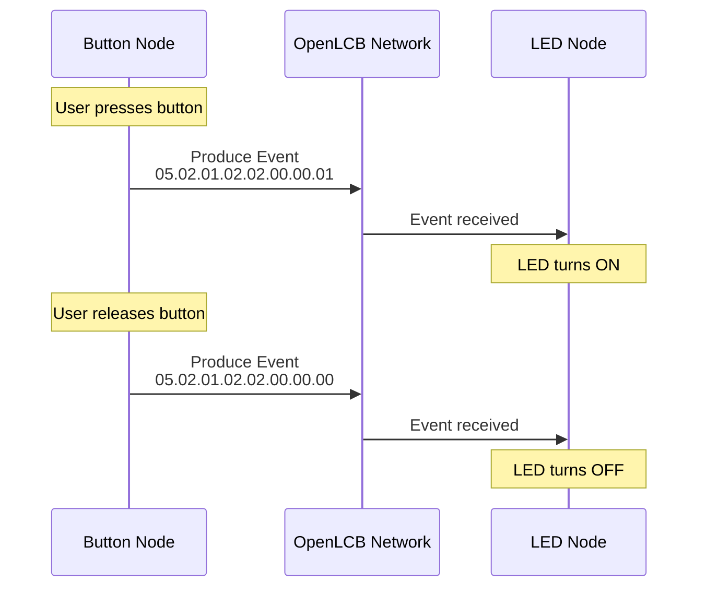

# Events and Run Mode

After a node completes its startup sequence, it enters "run mode" where it actively participates in the network by producing and consuming events.

## What is Run Mode?

Once a node is initialized and online, it:
- **Produces events** in response to physical inputs or internal state changes
- **Consumes events** from other nodes to control outputs or change behavior
- **Responds to queries** from other nodes about its capabilities and status
- **Maintains its network presence** by keeping its alias active

This is the normal operating state where your node does useful work on the layout.

## Event Flow Example

Here's a simple example of how events flow between nodes in run mode:



In this example:
1. The button node monitors a physical button
2. When pressed, it produces an event with ID `05.02.01.02.02.00.00.01`
3. The LED node is configured to consume this event
4. When it sees this event on the network, it turns on its LED
5. A different event ID (`...00.00.00`) controls the LED turning off

## Producer/Consumer Model

OpenLCB uses a **producer/consumer event model**:

- **Producers** send events when something happens (button press, sensor trigger, timer expiration)
- **Consumers** listen for specific events and react to them (turn on LED, throw turnout, sound horn)
- **A single node can be both** a producer and consumer of different (or even the same) events

This decoupling is powerful: producers don't need to know who's listening, and consumers don't need to know where events come from. You can reconfigure your layout by just changing which nodes consume which events.

## Event Identification Messages

Part of the startup process includes announcing what events a node produces and consumes. The `async_blink` example sends these messages after completing initialization:

```
Producer Identified Valid:   Event 05.02.01.02.02.00.00.01
Producer Identified Valid:   Event 05.02.01.02.02.00.00.00
Consumer Identified Valid:   Event 05.02.01.02.02.00.00.01
Consumer Identified Valid:   Event 05.02.01.02.02.00.00.00
```

This tells the network: "I can produce these two events, and I can also consume the same two events."

The "Valid" state means the node is actively configured to use these events. "Invalid" would mean the event is known but not currently in use.

## Async Blink Events

Let's look at what the `async_blink` example does in run mode. It's intentionally simple to demonstrate the concepts:

**Every second, it alternates:**
1. Produce event `05.02.01.02.02.00.00.01` (the "1" event)
2. Because it also consumes this event, its own LED turns ON
3. Produce event `05.02.01.02.02.00.00.00` (the "0" event)
4. Because it consumes this event too, its own LED turns OFF

This creates a blinking LED controlled entirely through OpenLCB events, demonstrating the producer/consumer model in a single node.

In a real layout, you'd typically have separate nodes for inputs (buttons, sensors) and outputs (LEDs, turnouts), but the event flow works exactly the same way.

For detailed event protocol specifications, see:
- [S-9.7.3.1 Event Transport](https://www.nmra.org/sites/default/files/standards/sandrp/OpenLCB/s-9.7.3.1-eventtransport-2016-02-06.pdf)
- [TN-9.7.3.1 Event Transport](https://www.nmra.org/sites/default/files/standards/sandrp/OpenLCB/tn-9.7.3.1-eventtransport-2016-02-06.pdf)

> **Note**: Future chapters will show you how to create your own nodes with real button inputs and LED outputs on an ESP32 microcontroller.