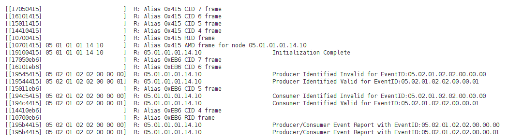

# Async Blink Events

## Blink Events

Let's take a look at the OpenLCB trace again from JMRI:



The last two messages are what we've buildig toward. These are the events that were sent by the `async_blink` node. It sends one of these events every second, alternating between the "0" and "1" events.

Let's take a closer look at the message itself, starting with the header:

```
195b4415
```

The right three characters, `415`, are the Node ID alias that we talked about already. The middle two characters, `5b4`, you'll find listed in section 4.1 of [S-9.7.3.1](https://www.nmra.org/sites/default/files/standards/sandrp/OpenLCB/s-9.7.3.1-eventtransport-2016-02-06.pdf) as the Producer/Consumer Event Report (PCER). The data for this message is the Event ID.