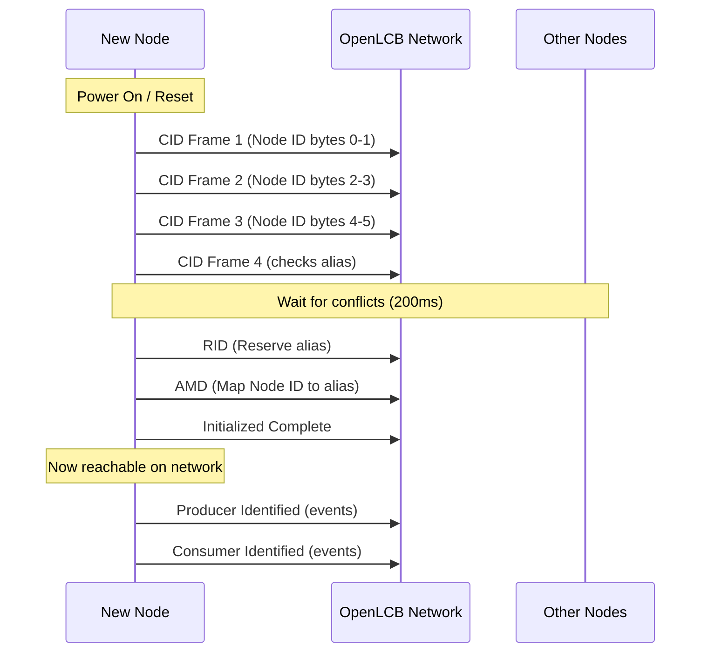
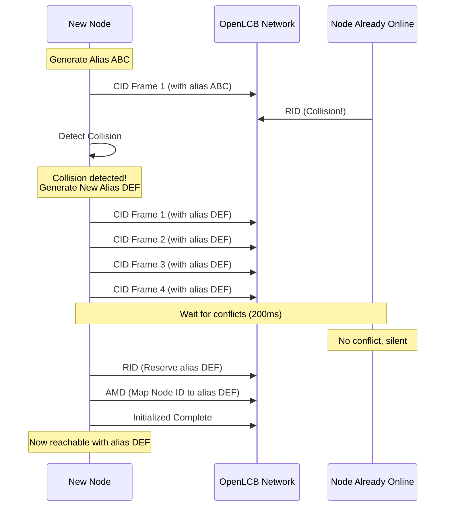

# Node Startup Sequence

When an OpenLCB node powers up or resets, it goes through a defined startup sequence to join the network. Understanding this sequence is essential to building your own nodes.

> **Note for Library Users**: If you're using OpenMRNLite or other OpenLCB libraries, all of the mechanics described in this chapter are handled automatically for you. You don't need to implement alias reservation, collision detection, or recovery—the library does it all in the background. 
>
> This chapter exists to help you **understand how it works**, which is valuable knowledge when debugging network issues or designing advanced features. However, if you just want to build a working node with async_blink_esp32, you can skip straight to Chapter 3 without missing anything essential. The library takes care of it.

## What Happens During Startup

Every node follows this sequence:

1. **Check ID (CID)**: The node sends four CID frames containing its 6-byte unique Node ID, spread across the frames. This allows the node to check if anyone else is using its desired alias.

2. **Reserve ID (RID)**: If no other node objects, the node sends an RID frame to reserve its chosen 12-bit alias for the Node ID.

3. **Alias Map Definition (AMD)**: The node announces the mapping between its full 6-byte Node ID and the 12-bit alias it just reserved.

4. **Initialized (Init Complete)**: The node sends an "Initialized" message telling the network it's now fully online and reachable.

## Why Use Aliases?

OpenLCB uses 6-byte Node IDs to ensure every device in the world has a unique identifier. However, CAN bus headers only have 29 bits available. To fit the sender information plus message type, OpenLCB uses temporary 12-bit aliases that represent the full Node ID during a session.

This alias negotiation happens every time a node starts up. The aliases are not permanent—they're regenerated each time the node powers on.

## Node Participation

Other nodes on the network listen during this startup sequence. If another node is already using the alias the new node wants, it will send a conflict message, forcing the new node to pick a different alias. This ensures all active nodes have unique aliases.

## Multi-Node Network Behavior

The startup sequence isn't just about a single node announcing itself—it's a conversation with the entire network:

**Other nodes participate by:**
- **Listening** to all CID frames to check for alias conflicts
- **Responding** with conflict messages if their alias is being claimed
- **Recording** the Node ID to alias mapping from AMD frames
- **Acknowledging** new nodes with responses to queries

This cooperative behavior ensures:
- No two nodes ever use the same alias simultaneously
- Nodes can discover each other's capabilities
- Gateways and bridges can manage routing efficiently
- Network monitoring tools (like JMRI) can track all active nodes

When your node starts up, it's not alone—the entire network is watching and ready to help it join successfully.

## What Happens When Things Go Wrong

The startup sequence above describes the happy path—when everything works perfectly on the first try. In practice, nodes must be prepared to handle conflicts and retries.

### Alias Collision Detection

If another node on the network is already using the alias your node wants to reserve, that other node will respond to your CID frames with a Reserve ID (RID) frame. This signals a collision:

- **During CID phase**: If you receive an RID while sending your CID frames, your chosen alias is already in use. Your node must:
  - Abandon the current alias
  - Generate a new tentative alias
  - Start the entire CID → wait → RID sequence over from the beginning

- **During the 200ms wait**: If another node transmits any non-CID frame using your tentative alias, you know there's a collision and must restart.

Here's what the collision and recovery process looks like:

Your node's alias generation algorithm (described in section 6.3 of S-9.7.2.1) ensures that each collision produces a different alias candidate, so nodes won't get stuck in a loop trying the same alias repeatedly.

### AMD and Alias Validation

Once you've successfully reserved an alias and sent your AMD (Alias Map Definition) frame, the alias mapping is established. However, your node must remain vigilant:

- **Alias Mapping Enquiry (AME)**: Other nodes can query your alias at any time using an AME frame. Your node is expected to respond with another AMD frame confirming the mapping.

- **Duplicate Node ID Detection**: If your node receives an AMD frame from another node claiming to have the same 6-byte Node ID as you, this indicates a serious problem—two nodes with identical IDs exist on the network. Your node should:
  - Signal this condition to the user (LED blink pattern, log message, etc.)
  - Optionally transition back to the Inhibited state
  - Restart the alias reservation process with error handling

### Collision Recovery in Your Code

When implementing your node:

1. **Always expect CID collisions** - Your initial alias choice might conflict; be prepared to generate alternatives
2. **Implement retry logic** - After detecting a collision during the CID phase, generate a new alias and restart
3. **Validate on receipt** - When receiving AMD frames from other nodes, check for duplicate Node IDs
4. **Handle AME queries** - Always respond to AME frames with AMD frames to maintain alias mappings

Most of this is handled transparently by OpenMRNLite, but understanding these scenarios helps when debugging network startup issues.

> **Note**: For implementation details on alias collision handling and retry algorithms, see the async_blink_esp32 example code in Chapter 3, which demonstrates how OpenMRNLite handles these scenarios automatically.

## References

For detailed protocol specifications, see:

**CAN Frame Transfer (Node Startup Sequence)**
- [S-9.7.2.1 CAN Frame Transfer Standard](https://www.nmra.org/sites/default/files/standards/sandrp/LCC/S/s-9.7.2.1-canframetransfer-2024-07-22.pdf) - Normative specification for CID, RID, AMD frames and the 200ms wait requirement (section 6.2.1)
- [TN-9.7.2.1 CAN Frame Transfer Technical Note](https://www.nmra.org/sites/default/files/standards/sandrp/LCC/TN/tn-9.7.2.1-canframetransfer-2024-07-22.pdf) - Background and examples

**Message Network (Initialization Complete)**
- [S-9.7.3 Message Network Standard](https://www.nmra.org/sites/default/files/standards/sandrp/LCC/S/s-9.7.3-messagenetwork-2024-07-22.pdf) - Normative specification for Initialization Complete message (section 3.3.1) and message network protocol

> **Note**: Future chapters will dive deeper into how the alias generation algorithm works and how to handle collisions in your code.