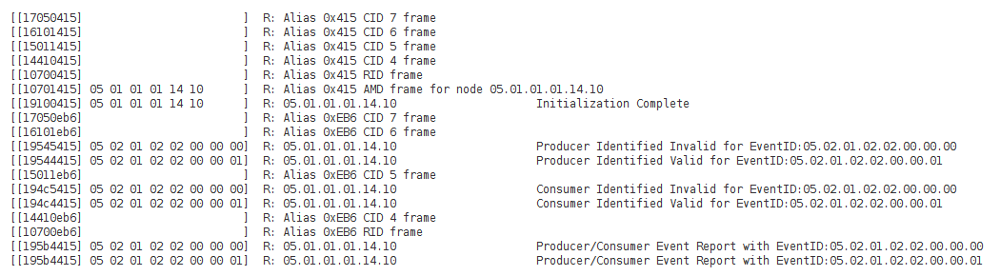

# Example Messages

[OpenMRN](https://github.com/bakerstu/openmrn) is a C++ library that implements the entire LCC stack with some OpenLCB extensions. The GIT repository hosting OpenMRN also contains some sample applications that can be run as desktop applications to join an LCC network.

## Async Blink

We won't go into details on how to build or run this application, as that is covered in the OpenMRN documentation. Instead, we'll use it to give you an idea of what actual messages look like.

The async_blink application can be run without a layout or a CAN LCC network. You can run it entirely on a single computer.

The async_blink application sends an event every second, alternating between 0 and 1.

Here is the output from running the application under Linux:


This probably looks a little overwhelming. Let's start with the message format. Each line is a seperate message sent or received on the LCC network. In this case of OpemMRN and the async_blink application, we're using TCP/IP rather than CAN as the transport mechanism. The current code uses a text rather than binary for the messages, using a format based the GridConnect protocol:

```
:X <identifier> <N> <Data-0><Data-1>...<Data-7>;
```

As an example, the first message `:X17050415N;` has the ID `17050415` and no data. The ID and all other data are in HEX. 

There are some log messages in the output that will help us get an idea of what's going on. However, these messages may not make a lot of sense without both understanding the application and a little more about the LCC standards.

How do you map these messages back into the LCC standards to understand what you're seeing?

## Decoded Messages

JMRI displays decoded messages. So for this example we connected JMRI to the same TCP/IP LCC bus (all running on the same computer). We'll cover how to use JMRI later. For now we're just going to focus on the messages being sent.



You'll notice the first set of messages all say "CID." This is a _Check ID_ frame that is used as part of allocating an _alias_ for the Node ID.

## Node Aliases

The 29-bit headers for CAN messages need to be different for messages sent from different nodes to avoid collisions. The 6-byte Node ID is too long to fit into the header and leave room for more information. So instead, LCC defines a 12-bit alias for Node IDs that are used in the header. By including the alias of the sender in most messages, we avoid collisions.

These aliases are negotiated between the nodes. The CID messages are part of this process. If you're interested in the details, you can find them in section 6 of the specifications (with more information in the technical note):

* [S-9.7.2.1 CAN Frame Transfer](https://www.nmra.org/sites/default/files/standards/sandrp/OpenLCB/s-9.7.2.1-canframetransfer-2015-02-17.pdf)
* [TN-9.7.2.1 CAN Frame Transfer](https://www.nmra.org/sites/default/files/standards/sandrp/OpenLCB/tn-9.7.2.1-canframetransfer-2016-02-06.pdf)


### Check ID (CID)

There is one interesting detail here. The first four messages actually include the full node ID. The async_blink application has the following Node ID defined:

```cpp
const openlcb::NodeID NODE_ID = 0x050101011410ULL;
```

If you divide this ID into four parts, you'll get `050`, `101`, `011`, and `410`. Now look at the first four messages:

```
17050415
16101415
15011415
14410415
```

Look the "middle" hex values: 17`050`415, 16`101`415, 15`011`415, and 144`104`15. In other words, the full Node ID is present in these four messages. That's the case because each of these messages by itself might not be unique when sent from each node in a segment, but the four messages together will be. Why is this important?

These messages are basically saying that this node wants to use `415` as it's alias and is asking if anyone else is currently using that alias. In this example, there were no replies, which means this node is free to use this alias.

> **Note:** The recommended algorithm for generating aliases in case there are collisions is based on a specific pseudo-random number generator that is dependent on the full Node ID.

### Reserve ID (RID)

The fifth message, `10700415`, is the Reserve ID (RID) frame. Since the node didn't get any arguments from other nodes, it's now declaring that it's reserved the alias `415`.

### Alias Map Definition (AMD)

The sixth message reports the full Node ID associated with the alias that was just reserved:

```
10701415 05 01 01 01 14 10
```

### Initialize Complete

The messages above are part of the node's initialization phase. During this time it's not _"_reachable_ on the network. In other words, it won't respond events or messages addressed to it. Once it's negotiated a Node Alias, it sends out an Initialize Complete message telling anyone who cares that it's not online:

```
19100415 05 01 01 01 14 10
```

This is documented in section 3.3.1 (with the CAD ID defined in 7.3.3.1):

* [S-9.7.3 Message Network](https://www.nmra.org/sites/default/files/standards/sandrp/OpenLCB/s-9.7.3-messagenetwork-2016-02-06.pdf)

## Producer/Consumer Events

At this point there is another node that starts the Node Alias negotiation. You should be able to spot and read those messages now. We'll ignore them here.
