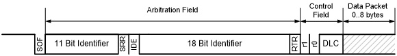

# Introduction to CAN

Controller Area Network (CAN) is a standard that was initially created in 1981 by Bosch, and has since been used for factory automation and communication networks in cars, to name just a few uses. Today there are hundreds of billions of devices using CAN bus in daily use. 

As a result, there are a number of relatively inexpensive ICs available that fully implement the CAN specifications out of the box. By using CAN controllers and drivers, you do not have to write highly time-sensitive code. Instead, you can focus on implementing support for the messages in the application layers, which is a "relatively" simple task compared with implementing a transport layer.

## CAN Messages

CAN transmits messages, called _frames_ on the bus. Every other device (node) on the bus can (and must) listen to all of the traffic on the bus. One of the interesting and useful aspects of CAN is how it handles collisions, which is through arbitration.

CAN frames, in the form used by OpenLCB, consist of a 29-bit header followed by zero or more bytes of data. This is using the _extended frame format_, also know as CAN 2.0 B.

### Arbitration

Arbitration is the process used to ensure that only one message is being transmitted at one time. If two nodes are trying to transmit different messages at the same time, one of those two will pass through the bus unharmed, while the other node will realize it lost the arbitration and attempt to re-transmit right after the first message is completed. This allows nearly 100% utilization of the bandwidth, because the node(s) that lost the arbitration will immediately stop, thereby not corrupting the frame that is being transmitted by the winner of the arbitration. This guarantees forward progress. In contrast, old style Ethernet (and LocoNet, btw.) uses a more complex scheme, where a collision destroys the frame, then nodes have to back off, wait a random period, then attempt to transmit again, thus wasting bandwidth.

The arbitration phase relies on drivers only pulling the bus low. If two nodes attempt to put different bit values on the bus at the same time, the 0 will always win. Here is a chart that shows how this works:

| Node 1    | Node 2    | Bus Value
| ------    | ------    | ---------
| 0         | 0         | 0
| 0         | 1         | 0
| 1         | 0         | 0
| 1         | 1         | 1

> Dominant and recessive are the normal terms used because a '1' bit (recessive) does NOT drive the bus. It allows the terminators to 'drive' the bus by pulling the two bus lines to a common voltage. (2.5V) On the other hand a '0' bit (dominant) drives the bus to both high and low. (CANH goes to 5V and CANL goes to 0V) The bus drivers can always over power the terminators, and that is how the zero bit always dominates over the one bit. It also explains why at least some termination is required. The termination values are also chosen to suppress cable reflections, but that is actually only an issue on long lines. Also note that this explains the complexity of our RR-CirKits terminators. You can attach a logic analyzer to one of our terminators because it creates a logic level image of the bus (to drive the activity LED). You cannot connect a logic analyzer directly to the CAN bus, because it does not contain a logic level signal on either line.

> Normally two nodes will happily send identical data until one node or the other transmits a zero bit during the other node's one bit. At that point the recessive node notices that it transmitted a one bit,but received a zero bit back from the bus. This tells the recessive node that it is in conflict and must immediately stop transmitting. No other nodes can observe that this happened. This requirement for an immediate (within a fraction of the bit time) response is what limits the CAN bus segment lengths.

> -- Dick Bronson, RR Cirkits

Arbitration uses the 29-bit header value as a priority value to gain access to the bus, where lower values have higher priority. This mechanism provides very high utilization of the bus’ bandwidth because one node will always win a collision and keep transmitting. In contrast, Ethernet uses a more complex scheme where nodes have to back off, wait a random period, then attempt to transmit again, thus wasting bandwidth.

For arbitration to work sucessfully, each message sent by a node needs to use a unique 29-bit ID. The details for this are handled by the OpenLCB specifications, and are different for different types of messages.