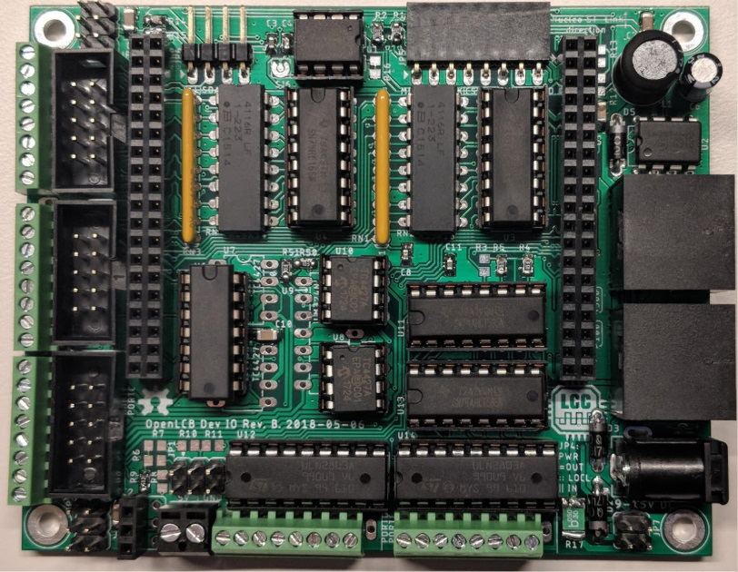
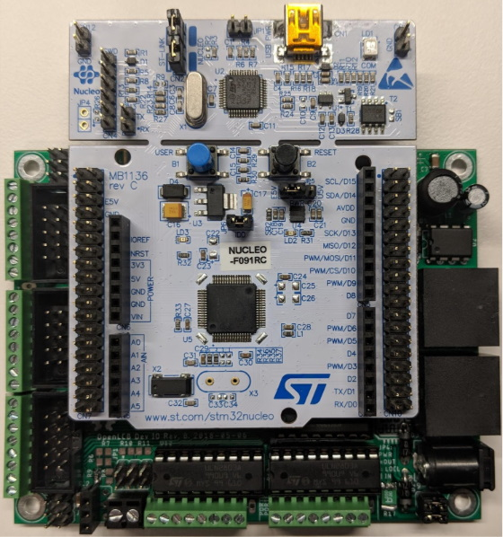

# Getting Started

What we've covered so far is a very small part of OpenLCB—there is a lot more. So how do you get started?

We'll cover prototype solutions here as this is a good way to get started.

## Dev Kit

One of the OpenLCB members, Balazs Racz, has put together a _daughter_ board for the Nucleo family of development boards. Here is a photo of the Rev. B version of this developer kit:

It uses all through-hole components for two reasons. First, because it doesn't require experience soldering surface-mounted parts. And second, parhaps more importantly, the components can be replaced easily if you happen to destroy them as part of testing.

The next photo shows a Nucleo F091RC board, which has an ARM Coretex-M0 processor.

The DevKit has the following features:

* 16 inputs
* 16 outputs
* 4 Tortoises or 8 series LEDs on 12V
* 8 servos
* Expansion ports for daughter boards with additional features like I/O

### Supported Nucleo Boards

This board currently supports the following Nucleo borads (in order of increasing price and features):

* Nucleo-F091RC
* Nucleo-F303RE

Here is a discussion form Balazs about how they picked the boards:

> It took us several months just to select which Nucleos we should be targeting. The nucleo ecosystem is immensely huge. There are three form factors (mini, 64-pin and 144-pin), four different price tags ($10.99, $13, $15, $22), and at least four dozen different combinations.
> There were some easy choices to reduce the selection. For example I immediately excluded all boards that did not have CAN controller. Then I looked at what kind of compatibility exists between the different boards. The mini has a very different form factor, but the 64-pin and 144-pin Nucleos seemed to have a set of compatible headers. So I focused on those. Then I wanted to select a variety of boards that span a range or performance and cost:
> * I definitely wanted to include the board that has the cheapest CAN microcontroller that is big enough that I believe is useful for LCC—the F091RC. This is also in the cheapest cost bucket.
> * Then I picked one that is the largest performance/memory but is still in the cheapest bucket—the F303RE.
>
> Then I wanted to go up in features:
> * Picked the cheapest that has two CAN bus ports, intending to build a DevKit that can be a CAN-to-CAN gateway. That's the F446. Unfortunately this is not in the cheapest bucket, so does not deprecate the F303RE.
> * Then picked one board that has three CAN ports AND ethernet, with a lot of RAM and flash; aiming to eventually build a super-gateway, or a simple USB-CAN. This was in the form factor of a 144 pin nucleo, the F767ZI.
>
> I was looking at a couple of other options for the 144-pin, but failed to identify a meaningful difference that would make it worth the effort. Unfortunately there is a huge cost in supporting the variety, because each series (F0, F1, F2, F3, F4, F7) needs a different middleware package, and each chip has a different number of peripherals and a different pinout of the logical peripherals. When designing the DevKit I needed to find usage of pins that has the matching peripherals on each of the supported Nucleo boards. This proved to be an impossible task. It does not help that PB13 is on the same mechanical pin on each board that can be plugged in, if the F091 anf F767 has a hardware PWM on PB13 but the F303 does not have a hardware PWM there, I cannot use that as a servo output pin. Finding matching SPI and I2C ports were similarly hard.

### Source of Boards

Balazs has a blog post on his [Nucleo IO Board](https://sites.google.com/site/balazsracz/nucleo-io-board) (later renamed DevKit) that contains more information about the board, how to order the board, and how to order parts for the board. He doesn't sell these, but rather has provided links to where you can have boards made (PCBWay), and purchase the parts (DigiKey).
