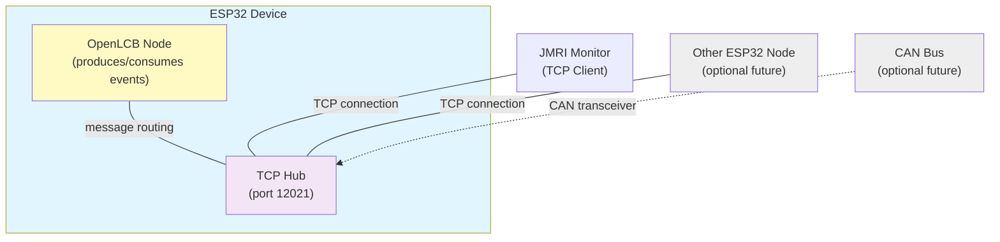

# Getting Started

In the previous chapter, you learned about OpenLCB concepts: nodes, transport layers, startup sequences, and the producer/consumer event model. Now it's time to build something real.

This chapter will guide you through the choices we've made for this book and prepare you for hands-on work in the next chapter.

## What We're Building

We're going to build a simple but complete OpenLCB node that demonstrates the core concepts:

**Hardware**: An ESP32 microcontroller with:
- A push button (input) - produces an OpenLCB event when pressed
- An LED (output) - consumes OpenLCB events to turn on/off
- WiFi connectivity - connects to your home network

**Software**: 
- OpenMRNLite library - provides the complete OpenLCB protocol stack
- Arduino framework - familiar development environment
- PlatformIO - modern build system and IDE integration

**Network Integration**:
- JMRI monitoring tool - see OpenLCB messages in real-time
- TCP/GridConnect protocol - network-based communication
- Multi-node capable - your node can interact with other OpenLCB devices

This example is intentionally simple to focus on learning. Real layout nodes can have dozens of inputs/outputs, configuration systems, and specialized protocols—we'll cover those in future chapters.

## Why WiFi/TCP First?

As mentioned in Chapter 1, OpenLCB works over multiple physical transports. We're starting with WiFi and TCP for several practical reasons:

**For Learning**:
- **No special hardware required** - ESP32 boards have WiFi built-in, no CAN transceivers needed
- **Easy monitoring** - standard network tools and JMRI can capture all traffic
- **Faster iteration** - wireless upload and debugging without physical bus connections
- **Lower barrier to entry** - get started with just a microcontroller and breadboard

**Same Protocols**: The OpenLCB message formats, node startup, and event handling work identically over WiFi/TCP and CAN. Everything you learn here transfers directly to CAN-based implementations.

**CAN Is Still Important**: Traditional LCC installations use CAN bus, and for good reason:
- Excellent noise immunity for layout environments
- Built-in collision handling and arbitration
- Two-wire bus with simple termination
- Industry-proven reliability

We'll cover adding CAN hardware in future chapters. For now, WiFi/TCP lets you focus on understanding OpenLCB without hardware complexity.

## Platform Choice: ESP32

We've chosen the ESP32 microcontroller platform for this book:

**Why ESP32?**
- **Affordable** - Development boards are $5-15 USD
- **WiFi built-in** - Dual-mode WiFi and Bluetooth
- **CAN capable** - Built-in CAN controller for future expansion
- **Powerful** - Dual-core processor, plenty of memory for OpenLCB
- **Well-supported** - Mature Arduino ecosystem and libraries
- **GPIO-rich** - Enough pins for inputs, outputs, and expansion

**Alternative Platforms**: OpenLCB and OpenMRNLite support many other microcontrollers:
- STM32 family (Nucleo boards, custom designs)
- Arduino variants (Mega, Due)
- Raspberry Pi Pico
- ESP8266 (limited, but usable)

Future chapters will discuss platform trade-offs and migration paths. For now, ESP32 gives you the best learning experience.

## Prerequisites & Assumptions

Before diving into the next chapter, make sure you have:

**Knowledge**:
- Basic embedded programming (C/C++)
- Microcontroller I/O concepts (GPIO, digital read/write)
- Familiarity with breadboards and simple circuits
- Producer/consumer model understanding (from using LCC products)

**Hardware** (needed for Chapter 3):
- ESP32 development board (ESP32 DevKit v1 or similar)
- USB cable for programming
- Breadboard and jumper wires
- Push button (momentary, normally open)
- LED (any color)
- 220Ω resistor (for LED current limiting)
- Computer with WiFi (for network connection)

**Software** (installation covered in Chapter 3):
- VS Code or similar editor
- PlatformIO extension
- JMRI (for monitoring OpenLCB traffic)

If you're missing any hardware, most items can be purchased as a kit from electronics suppliers (Adafruit, SparkFun, Amazon, AliExpress) for under $20 USD total.

## Development Environment Overview

We'll be using modern, cross-platform tools:

**PlatformIO**: A professional build system and IDE extension that handles:
- Automatic toolchain installation
- Library dependency management
- Serial monitoring and debugging
- Support for hundreds of boards and frameworks

**Arduino Framework**: Provides:
- Familiar `setup()` and `loop()` structure
- Standard GPIO functions (`pinMode`, `digitalWrite`, etc.)
- WiFi libraries for ESP32
- Large ecosystem of compatible libraries

**OpenMRNLite Library**: The core OpenLCB implementation:
- Complete protocol stack (startup, events, datagrams, streams)
- SimpleStack API for easy setup
- Event producers and consumers
- TCP and CAN transport support
- Memory-efficient design for microcontrollers

Chapter 3 will walk through installation and configuration step-by-step. No prior PlatformIO experience required.

## Monitoring with JMRI (TCP)

JMRI (Java Model Railroad Interface) is an essential tool for working with OpenLCB:

**Why JMRI?**
- **Message decoder** - Translates raw hex into readable OpenLCB messages
- **Network monitor** - See all CID, RID, AMD, event messages in real-time
- **Testing tool** - Send events to your node and verify responses
- **Layout integration** - Connect your node to a larger LCC network

**TCP/GridConnect Protocol**: JMRI connects to your ESP32 node over WiFi using:
- TCP socket connection (default port 12021)
- GridConnect ASCII format: `:X<header>N<data>;`
- Human-readable message traces
- Standard format used by many OpenLCB tools

**What You'll See**: When your node starts up, JMRI shows:
1. Four CID frames (checking alias availability)
2. RID frame (reserving alias)
3. AMD frame (mapping Node ID to alias)
4. Initialized message (node is online)
5. Producer/Consumer Identified messages (node capabilities)
6. Event reports (button presses, LED changes)

Chapter 3 includes detailed JMRI setup and verification steps. You'll see your first OpenLCB messages within minutes of uploading code.

## Network Architecture: Hubs and Nodes

Now that we've introduced JMRI, it's important to understand the architecture that makes this all work. An OpenLCB network consists of two types of participants working together:

**Nodes** are devices that produce and consume events—like your ESP32 with a button and LED. Each node has a unique 6-byte identifier and announces itself when joining the network.

**Hubs** are central coordinators that route messages between nodes. In a WiFi/TCP network, the hub is a TCP server listening on port 12021. When JMRI or other tools connect to the hub, they can see all network traffic and send commands to any node.

The clever part: your ESP32 can be **both a node and a hub simultaneously**. It runs the OpenLCB protocol stack (making it a node), and it also runs a TCP Hub service (making it a network coordinator). This is exactly what we'll do in Chapter 3—create a single device that acts as both.

Here's how the architecture works:

**What You See in This Architecture**:

- **ESP32 Node**: Produces events (button presses) and consumes events (LED changes). It announces itself to the network during startup with the CID/RID/AMD sequence.
- **TCP Hub**: Listens on port 12021, accepts connections from JMRI and other TCP clients, and forwards all OpenLCB messages between connected participants.
- **JMRI Monitor**: Connects as a TCP client to see all network traffic. Can send test events to your node and observe responses.
- **Future Expansion**: You can add more ESP32 nodes (all connecting to the same hub), or add CAN hardware to bridge between TCP and CAN participants.

**Why This Design?** OpenMRNLite makes it easy to add a TCP Hub service to any node. The hub needs just a few lines of code—we'll see this in Chapter 3. This approach is perfect for learning because:

1. **No extra hardware** - The hub runs on the same ESP32 as your node
2. **Scalable** - Add more nodes just by connecting them to port 12021
3. **Transport-agnostic** - Whether using TCP, CAN, or both, the message format stays the same
4. **Future-proof** - Later chapters will add CAN hardware and integrate it seamlessly with the existing TCP hub

We're starting with **TCP because it requires no special hardware**. In later chapters, we'll add CAN transceivers to support traditional LCC installations—but the hub concept remains identical.

## What's Next

Now that you understand the platform choices and tools, Chapter 3 will guide you through:

1. **Installing PlatformIO** - Step-by-step setup in VS Code
2. **Installing OpenMRNLite** - Adding the library to your project
3. **Building async_blink_esp32** - Complete walkthrough of the example code
4. **Deploying to ESP32** - Upload and run your first OpenLCB node
5. **Verification with JMRI** - See your node join the network and exchange events over WiFi
6. **Troubleshooting** - Common issues and solutions

By the end of Chapter 3, you'll have a working OpenLCB node that you built yourself. You'll understand the code, see the messages, and be ready to create your own custom nodes.

Chapter 4 will then cover adding physical buttons and LEDs to interact with the real world.

Let's get started!

